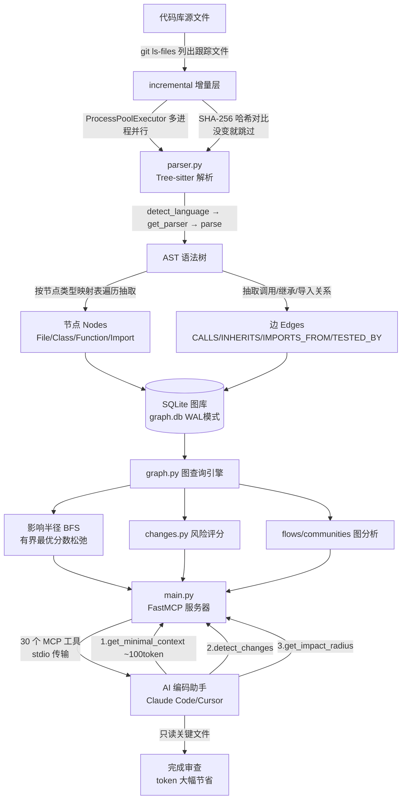

# code-review-graph · 面试准备

> 目标岗位：Coding Agent 研发工程师（以通用软件工程师能力为基础）
> 生成时间：2026-09-04
> 说明：本资料由 interview-prep 技能自动生成，全部内容基于对真实源码的研读。**这是一个开源项目（作者 Tirth，GitHub: tirth8205/code-review-graph），你是「研读学习」它的机制，不是原创作者。** 面试时请如实按「我研读了这个项目、理解了它的 X 机制」来讲，绝不要包装成自己写的。凡标了「⚠️需确认」的地方，面试前请自己再核对一遍真实代码。

---

## 〇、先说清楚：这份资料怎么用

因为你是**研读**这个项目、不是它的作者，所以面试里的定位应该是：

> 「我为了理解 Coding Agent 是怎么给大模型做上下文工程的，深入研读了一个开源项目 code-review-graph。它用 Tree-sitter 把代码建成一张结构图，再通过 MCP 协议按需喂给 AI，我把它的建图机制、影响半径分析、MCP 上下文裁剪这几块都读透了。」

- 板块②的题，重点是「**它是怎么实现的 / 你研读后理解了什么**」，而不是「你为什么这么设计」。参考答案里我会用「这个项目的做法是……」这种口吻，你照着背即可。
- 板块③是这个项目牵出来的通用知识点（Tree-sitter/AST、MCP 协议、给 LLM 做上下文工程、图算法、SQLite），**这些正是 Coding Agent 岗最想考的**，务必吃透。
- 全程会尽量把术语用大白话解释一遍，不假设你已经懂。

---

## 一、项目概览

- **一句话定位**：`code-review-graph` 是一个**本地优先（local-first）的代码知识图谱工具**。它用 [Tree-sitter](https://tree-sitter.github.io/tree-sitter/) 把整个代码库解析成一张「结构图」（谁调用谁、谁继承谁、谁测试谁），存进本地 SQLite 数据库，然后通过 [MCP 协议](https://modelcontextprotocol.io/)，在 AI 做代码审查时**只把真正相关的一小撮上下文喂给大模型**，而不是让 AI 反复把整个代码库读一遍。

- **它到底解决什么痛点**：AI 编码工具（Claude Code、Cursor 等）审查代码时，为了搞清楚「改了这个函数会影响谁」，往往会把大量文件塞进上下文，**token 消耗巨大且很多是无用信息**。这个项目的卖点就是：预先把代码结构图建好，审查时用图查询算出「最小必读文件集」，README 里宣称在 6 个真实仓库上实现了 **38 倍到 528 倍的 token 削减**（⚠️这是项目自己的基准数据，面试引用时要说明「这是项目 README 宣称的」）。

- **核心功能列表**（都读到了对应代码）：
  1. **多语言建图**：Tree-sitter 解析 40+ 种语言，抽取「节点」（文件/类/函数/导入）和「边」（调用/继承/导入/测试覆盖）。
  2. **影响半径分析（blast radius）**：从改动的文件出发，双向 BFS 找出所有可能受影响的调用者、依赖、测试。
  3. **增量更新**：靠 git diff + SHA-256 哈希，只重新解析变了的文件，其余跳过。
  4. **风险评分的变更分析**：给每个改动的函数打一个 0~1 的风险分（是否有测试、是否跨模块、是否安全敏感等）。
  5. **30 个 MCP 工具 + 5 个 Prompt 模板**：对外暴露给 AI 助手调用。
  6. **一堆图分析**：社区检测（Leiden 算法）、执行流追踪、Hub/Bridge 节点、语义搜索（向量嵌入 + 全文检索）、可视化（D3.js）、多种导出格式。

- **最主要的一条执行链路**（一句话串起来）：
  `代码库 → Tree-sitter 解析成 AST → 抽取节点/边 → 存进 SQLite 图库 → MCP 服务器把图查询结果按 token 预算裁剪后喂给 AI → AI 只读关键文件完成审查`

- **我在其中的角色 / 主要工作**：**研读学习者**。我没有写这个项目，我是为了理解「Coding Agent 的上下文工程」这个课题，把它的核心机制（Tree-sitter 建图、影响半径 BFS、MCP 上下文裁剪、增量更新）读懂了。面试时请务必如实这样讲。

---

## 二、架构与技术栈讲解【板块①】

### 2.1 目录 / 模块结构

项目主体是一个 Python 包 `code_review_graph/`（约 4.2 万行 Python，另有一个 TypeScript 写的 VS Code 插件子项目）。核心模块：

```
code_review_graph/
├── parser.py          # 【核心】Tree-sitter 多语言解析器，14000+ 行，抽取节点和边
├── graph.py           # 【核心】SQLite 图存储：建表、增删改查、影响半径 BFS
├── main.py            # 【核心】FastMCP 服务器入口，注册 30 个 MCP 工具 + 5 个 Prompt
├── cli.py             # 命令行入口（build/update/serve/watch/visualize...）
├── incremental.py     # 增量更新：git diff 找变更 + SHA-256 判断 + 多进程解析 + 文件监听
├── changes.py         # 风险评分的变更影响分析（detect-changes）
├── flows.py           # 执行流检测：找入口点 + BFS 追调用链 + 关键度打分
├── communities.py     # 社区检测（Leiden 算法）+ 架构概览
├── embeddings.py      # 可选的向量嵌入（本地 sentence-transformers / OpenAI / Gemini / MiniMax）
├── search.py          # FTS5 全文检索 + 向量的混合搜索
├── refactor.py        # 重命名预览、死代码检测、重构建议
├── visualization.py   # D3.js 交互式 HTML 图生成
├── exports.py         # 导出 GraphML / Neo4j Cypher / Obsidian
├── migrations.py      # SQLite 数据库 schema 版本迁移（v1~v9）
├── constants.py       # 各种可配置常量（影响半径深度、边权重等）
└── tools/             # 30 个 MCP 工具的具体实现，按领域拆分
    ├── context.py     #   get_minimal_context —— 约 100 token 的超紧凑上下文
    ├── query.py       #   query_graph —— 查调用者/被调者/导入/测试等
    ├── build.py       #   build_or_update_graph
    ├── review.py      #   get_review_context —— token 优化的审查上下文
    ├── _common.py     #   compact_response、_sanitize_name、_get_store 等公共件
    └── ...
```

**记忆抓手**：整个项目就三层——
1. **底层（parser.py + graph.py）**：把代码变成图，存起来。
2. **中层（changes/flows/communities/embeddings...）**：在图上做各种分析。
3. **上层（main.py + tools/）**：把分析能力包装成 MCP 工具，喂给 AI。

### 2.2 核心数据流 / 执行链路

**链路 A：建图（build）**
1. `incremental.full_build()` 用 `git ls-files` 拿到所有被 git 跟踪的文件（这样自动跳过 gitignore 的东西）。
2. 用 `ProcessPoolExecutor`（多进程）并行地对每个文件调 `parser.parse_file()`。
3. `parse_file` 先 `read_bytes()` 读字节 → `detect_language()` 按扩展名/shebang 判断语言 → `_get_parser(language)` 拿到对应的 Tree-sitter 解析器 → `parser.parse(source)` 得到一棵 AST（语法树）→ 遍历这棵树，按预定义的「节点类型映射表」抽取出节点（类/函数/导入）和边（调用/继承等）。
4. 把 nodes/edges `upsert` 进 SQLite（`graph.py`），每个文件同时存一个 SHA-256 哈希。

**链路 B：AI 审查（serve 之后 AI 主动调用）**
1. AI 先调 `get_minimal_context(task="review PR")`——约 100 token，回一个「全局速览」：多少节点多少边、当前改动的风险等级、最关键的几个社区和执行流、**并给出建议的下一步该调哪个工具**。
2. 顺着建议调 `detect_changes`——对改动的函数做风险评分。
3. 调 `get_impact_radius`——从改动文件 BFS 出「影响半径」，算出最小必读文件集。
4. AI 只读这几个关键文件，完成审查。目标是「≤5 次工具调用、≤800 token 图上下文」（这写在项目的 CLAUDE.md 里）。



### 2.3 技术栈

| 技术 | 在本项目里干嘛 | 为什么用它（选型理由） |
|---|---|---|
| **Python 3.10+** | 主开发语言 | 生态好、Tree-sitter/MCP 都有成熟 Python 绑定、AI 工具链首选 |
| **Tree-sitter** + `tree-sitter-language-pack` | 把源码解析成 AST，抽取结构 | 增量解析、多语言用同一套 API、容错强（语法有错也能解析出大部分），是做代码结构分析的事实标准 |
| **SQLite**（WAL 模式） | 存节点、边、社区、执行流等所有图数据 | 本地优先、零配置、单文件、无需外部数据库或云服务；WAL 模式让「读」和「写」能并发 |
| `mcp` + `fastmcp` | 实现 MCP 服务器，把工具暴露给 AI | MCP 是让 AI 助手调用外部工具的标准协议；FastMCP 是它的高层封装，注册工具只需一个装饰器 |
| `networkx` | 图算法（可选的 BFS 引擎、介数中心性算 Bridge 节点） | Python 里最成熟的图算法库 |
| `watchdog` | 监听文件保存，自动增量更新图 | 跨平台文件系统事件监听的标准库 |
| `sentence-transformers` / OpenAI / Gemini / MiniMax（可选） | 计算函数签名的向量嵌入，支持语义搜索 | 多 provider 可选：本地离线用 sentence-transformers，要效果好用云端 API |
| `igraph`（可选） | Leiden 算法做社区检测 | Leiden 是比 Louvain 更稳的社区发现算法，igraph 有高效实现 |
| `jedi`（可选） | 增强 Python 的调用关系解析 | Tree-sitter 只能看语法、不懂语义；Jedi 能做类型推断，把「调用谁」解析得更准 |
| `pytest` + `ruff` + `mypy` + `bandit` | 测试 / 代码风格 / 类型检查 / 安全扫描 | 工程质量四件套；CI 里跑 3.10~3.13 四个版本、要求 65% 覆盖率 |

> **给初学者补一句**：
> - **AST（Abstract Syntax Tree，抽象语法树）**：把一段代码按语法结构拆成一棵树。比如 `def foo(): bar()` 会被拆成「函数定义 foo，它体内有一个调用 bar」。有了这棵树，程序就能「读懂」代码结构，而不用自己写正则去猜。
> - **MCP（Model Context Protocol，模型上下文协议）**：Anthropic 提出的开放标准，规定了「AI 助手」和「外部工具/数据源」之间怎么通信。你把能力实现成 MCP 工具，任何支持 MCP 的 AI（Claude、Cursor 等）都能调用它。可以理解成「给 AI 用的 USB 接口标准」。

---

## 三、针对本项目的面试题 + 参考答案【板块②】

> 每题标：难度（基础/进阶/深挖）· 考察点。因为你是研读者，答案口吻都是「这个项目的做法是……我研读后理解到……」。

### 3.1 项目整体类

**Q1.（基础 · 表达能力）请介绍一下你研读的这个 code-review-graph 项目。**

参考答案：
> 这是一个开源项目，我是为了搞懂 Coding Agent 怎么给大模型做上下文工程，去深入研读了它的机制。它要解决的痛点是：AI 审查代码时，为了搞清楚一处改动会牵连到哪些地方，往往把一大堆文件塞进上下文，token 浪费严重。
> 它的做法是：先用 Tree-sitter 把整个代码库解析成一张「结构图」——节点是文件、类、函数，边是调用、继承、测试覆盖这些关系，存进本地 SQLite。之后 AI 审查时，不再全量读文件，而是通过 MCP 协议查这张图，比如「改了这个函数会影响谁」，图直接返回受影响的最小文件集，AI 只读这几个文件就够了。
> 我重点读透了四块：一是它怎么用 Tree-sitter 建图，二是影响半径的 BFS 算法，三是增量更新怎么靠哈希省事，四是它通过 MCP 怎么把上下文裁剪到极小再喂给 AI。

**Q2.（基础 · 表达能力）它最核心解决的问题是什么？为什么这个问题重要？**

参考答案：
> 核心是「token 效率」。大模型的上下文窗口有限、而且按 token 收费，AI 审查代码时如果每次都全量读代码库，既慢又贵，还容易被无关信息干扰。这个项目把「代码结构」这种确定性的东西，预先用程序算好存成图；到了审查时，用图查询精确算出「必读的那一小撮」，把大模型从「大海捞针」变成「按图索骥」。对 Coding Agent 来说这很关键，因为 Agent 要在有限上下文里做多步推理，喂给它的每个 token 都得是高价值的。

**Q3.（进阶 · 全局理解）你研读下来，觉得这个项目最巧妙 / 最难的一点是什么？**

参考答案：
> 我觉得最巧妙的是「影响半径」的那个 BFS 算法在 SQLite 里的实现。代码图里经常有环（A 调 B、B 又调 A），如果老老实实枚举所有路径，密集环形图的路径数会指数爆炸。它的做法是用「有界的最优分数松弛」——每个节点只保留「到它的最佳一条路径分数」，用几张临时表迭代，每轮只扫一遍边表。这样既避免了路径爆炸，又把计算下沉到 SQLite 里做（比在 Python 里加载整张图再算快）。这个设计我觉得最能体现作者的工程功力。（细节见 Q9）

### 3.2 技术选型类

**Q4.（进阶 · 选型理解）为什么用 Tree-sitter 而不是每种语言各自的 AST 库（比如 Python 的 `ast`）？**

参考答案：
> 三个原因。第一，**统一 API**：Tree-sitter 对 40 多种语言用同一套接口，不用为每种语言学一套解析库，`parser.py` 里只要维护「每种语言的节点类型映射表」就行。第二，**增量解析**：Tree-sitter 天生支持只重新解析改动的部分，契合这个项目「增量更新」的核心诉求。第三，**容错强**：代码写到一半有语法错误时，Tree-sitter 仍能解析出大部分结构，而很多语言自带的解析器遇到语法错误直接抛异常。
> 不过我也注意到，它对 Python 的调用解析额外用了 `ast` 和可选的 `jedi`——因为 Tree-sitter 只看语法、不懂语义，`jedi` 能做类型推断，把「到底调的是哪个函数」解析得更准。所以它是「Tree-sitter 打底 + 针对性增强/回退」的混合策略。

**Q5.（进阶 · 选型理解）为什么用 SQLite 存图，而不用专门的图数据库比如 Neo4j？**

参考答案：
> 因为项目的定位是「local-first（本地优先）」——它要跟着你的代码库跑在你本机上，不能要求用户先装个 Neo4j 或连云服务。SQLite 是零配置、单文件、Python 自带的，`.code-review-graph/graph.db` 一个文件就是全部。
> 图查询它是自己用 SQL 实现的：节点一张表、边一张表，加了一堆索引（比如 `idx_edges_source`、`idx_edges_target_kind`）。BFS 也是用临时表迭代做的，不依赖图数据库的原生图遍历。它还开了 WAL 模式，让「文件监听在后台写图」和「MCP 在前台读图」能并发不打架。
> 代价是：真要做很复杂的多跳图查询，SQL 写起来比 Cypher 累。但对这个项目「影响半径最多 2 跳」的场景，SQLite 完全够，而且它还提供了导出成 Neo4j Cypher / GraphML 的功能，需要重型分析时可以导出去。

**Q6.（基础 · 选型理解）为什么要做成 MCP 工具，而不是一个普通的命令行工具？**

参考答案：
> 它其实两者都有——`cli.py` 提供了完整的命令行（build/update/status 等）。但做成 MCP 工具是为了让 **AI 助手能自主调用**。MCP 是个标准协议，实现成 MCP 服务器后，Claude Code、Cursor、Windsurf 这些支持 MCP 的工具都能直接用，不用为每家单独适配。审查时 AI 自己决定「先查全局速览，再查影响半径」，这种多步自主决策正是 CLI 做不到的。这也是它对接 Coding Agent 生态的关键。

### 3.3 实现细节类

**Q7.（进阶 · 建图机制）它具体怎么用 Tree-sitter 把一个文件变成图的节点和边？**

参考答案：
> 核心在 `parser.py` 的 `parse_bytes` 方法。流程是：
> 1. **判断语言**：靠 `EXTENSION_TO_LANGUAGE` 这张扩展名→语言的映射表（`.py`→python、`.ts`→typescript……40 多种），没有扩展名的脚本还会读文件头的 shebang（`#!/usr/bin/env python3`）来判断。
> 2. **拿解析器**：`_get_parser(language)` 从 `tree-sitter-language-pack` 里取对应语言的解析器。
> 3. **解析成 AST**：`parser.parse(source)` 返回一棵语法树。
> 4. **遍历抽取**：它预定义了四张映射表——`_CLASS_TYPES`、`_FUNCTION_TYPES`、`_IMPORT_TYPES`、`_CALL_TYPES`，key 是语言，value 是「在这门语言的 AST 里，哪些节点类型代表类/函数/导入/调用」。比如 Python 里 `class_definition` 是类、`call` 是调用；Java 里类是 `class_declaration`。遍历 AST 时碰到这些类型的节点，就抽成对应的图节点或图边。
> 5. **特殊语言回退**：Vue/Svelte 这种单文件组件会先拆出 `<script>` 块再当 JS/TS 解析；Jupyter notebook 拆出代码 cell 当 Python 解析；ReScript、VB.NET 因为语言包没带语法，用正则做「有界回退解析」。
> 每个函数节点还会存 `qualified_name`（限定名，全局唯一，用来做边的两端指向）、行号、参数、文件哈希等。

**Q8.（进阶 · 图模型）图里的节点和边具体长什么样？边有哪些类型？**

参考答案：
> 数据库就两张核心表（在 `graph.py` 的 schema 里）：
> - **nodes 表**：`kind`（File/Class/Function/Type/Test）、`name`、`qualified_name`（唯一限定名）、`file_path`、`line_start/end`、`language`、`params`、`file_hash` 等。
> - **edges 表**：`kind`、`source_qualified`、`target_qualified`（用限定名指向两端）、`confidence`（置信度浮点分）、`confidence_tier`（三档：EXTRACTED 直接抽出的 / INFERRED 推断的 / AMBIGUOUS 有歧义的）。
> 边的类型有：`CALLS`（调用）、`IMPORTS_FROM`（导入）、`INHERITS`（继承）、`IMPLEMENTS`（实现接口）、`CONTAINS`（包含，比如类包含方法）、`TESTED_BY`（被测试覆盖）、`DEPENDS_ON`、`REFERENCES` 等。
> 我觉得**置信度分级**这个设计挺聪明：因为 Tree-sitter 只看语法，有些调用它没法 100% 确定指向谁（比如多态、动态调用），就标成 INFERRED 或 AMBIGUOUS 并给个较低的分数，而不是假装很确定——这样上层做影响半径时可以按置信度加权。

**Q9.（深挖 · 核心算法）影响半径（blast radius）具体是怎么算的？为什么不用递归 CTE 直接枚举路径？**

参考答案：
> 在 `graph.py` 的 `get_impact_radius_sql`。目标是：从改动文件里的节点出发，找出所有可能受影响的节点，并按「影响强度」排序。
> 算法是**双向、有界的最优分数松弛**：
> 1. **种子**：把改动文件里的所有节点作为起点，初始分数 1.0。
> 2. **双向扩散**：每一轮，从当前「前沿」节点出发，既沿边的正向（我调用的人）也沿反向（调用我的人）扩散一跳。
> 3. **打分**：新分数 = 前沿分数 × 这条边的权重 × 深度衰减。边权重是预设的（`CALLS`=1.0、`INHERITS`=0.9、`IMPORTS_FROM`=0.5、`CONTAINS`=0.3……强耦合的边权重高），深度衰减默认 0.6（每远一跳就打六折）。
> 4. **只留最优**：**关键点**——每个节点只保留「到它的最高分」（`GROUP BY node_qn, MAX(score)`），而不是记录每一条到它的路径。
> 5. **剪枝**：分数低于 floor（默认 0.05）就不再扩散；总深度默认最多 2 跳、总节点数默认最多 500。
>
> **为什么不用递归 CTE 枚举路径**：代码图里环很常见（A→B→A），如果用递归 CTE 把所有路径都列出来，密集环形图的路径数会指数爆炸，可能直接把内存/时间撑爆。而「每个节点只记最优分数」把复杂度压到「每轮扫一遍边表」，最多迭代 max_depth 轮，是有界的。它还专门用了几张临时表（`_impact_best`/`_impact_frontier`/`_impact_next`）在 SQLite 内部迭代，避免把整张图搬进 Python。它也保留了一个基于 NetworkX 的老引擎，靠环境变量 `CRG_BFS_ENGINE` 切换，默认用 SQL 版因为大图更快。

**Q10.（进阶 · 增量机制）增量更新是怎么做到「只重新解析变了的文件」的？**

参考答案：
> 两步（在 `incremental.py`）：
> 1. **找出哪些文件变了**：`get_changed_files` 跑 `git diff --name-only <base>`（默认跟 `HEAD~1` 比），拿到变更文件列表。也兼容 SVN。
> 2. **哈希二次确认**：对每个「疑似变了」的文件，读出字节算 `SHA-256`，跟数据库里存的旧哈希比。**如果哈希一样，说明内容没实质变化，直接跳过重新解析**（`if existing_nodes[0].file_hash == fhash: 跳过`）。只有哈希不同才重新走 parser。
> 这样一个几千文件的项目，改了 5 个文件，就只解析这 5 个，其余全跳过，README 说 2900 文件的项目重新索引不到 2 秒。另外还有 `watchdog` 监听文件保存事件，工作时后台自动触发增量更新。

**Q11.（进阶 · 上下文工程）AI 是怎么用这些工具的？为什么第一个要调 `get_minimal_context`？**

参考答案：
> 项目在 CLAUDE.md 里给 AI 定了「使用纪律」：第一次一定先调 `get_minimal_context`，之后所有调用尽量用 `detail_level="minimal"`，目标「≤5 次调用、≤800 token」。
> `get_minimal_context`（在 `tools/context.py`）约 100 token，一次性给 AI 一个「全局速览」：图有多少节点边、当前 git 改动的风险等级和分数、最大的 3 个社区、最关键的 3 条执行流，**最重要的是 `next_tool_suggestions`——根据任务关键词（review/debug/refactor/onboard）建议接下来该调哪几个工具**。
> 这是很典型的上下文工程手法：先花极少 token 给 AI 一张「地图」和「路标」，让它别盲目乱查、别一上来就读一堆文件，而是顺着路标少走弯路。它还有个 `compact_response` 统一把工具输出压缩，`_sanitize_name` 把返回给 AI 的名字里的控制字符清掉、截断到 256 字符（既省 token 也防 prompt 注入）。

### 3.4 难点 / 踩坑类

**Q12.（进阶 · 工程细节）多语言解析里有哪些坑？它怎么处理语言包没带的语法？**

参考答案：
> 主要坑是「不是每种语言 Tree-sitter 都有现成语法」。它的处理是分层回退：
> - 有 Tree-sitter 语法的（大多数语言）：直接用。
> - 单文件组件（Vue/Svelte/Astro）：先切出脚本块，再交给 JS/TS 解析器。
> - Jupyter/Databricks notebook：先按 JSON/标记拆出代码 cell，再当 Python 解析。
> - 语言包完全没带语法的（ReScript、VB.NET）：退化成**正则表达式**做「有界结构解析」，只抽最关键的函数/类，不追求完整。
> - SQL：Tree-sitter 抽表/视图/函数，再用正则补 `CREATE PROCEDURE`（语法不支持的部分）。
> 还有些细节坑，比如 Databricks 导出的 `.py` 文件第一行是特殊注释、Windows 上是 CRLF 换行，它专门 `rstrip(b"\r")` 兼容两个平台。这类「回退 + 针对性打补丁」的写法在 `parser.py` 里非常多，也是它为什么单文件有一万四千行。

**Q13.（进阶 · 安全）这个项目在安全上做了哪些防护？**

参考答案：
> 它的 CLAUDE.md 里列了「安全铁律」，我读代码也印证了：
> - **SQL 全部用参数化查询**（`?` 占位符），绝不把值拼进 f-string，防 SQL 注入。（有几处动态拼表名的地方用了 `# nosec` 注释说明是安全的，因为拼的是固定标识符不是用户输入。）
> - **不用 `eval`/`exec`/`pickle`/`yaml.unsafe_load`**，subprocess 调用绝不用 `shell=True`（都传列表参数）。
> - **`_validate_repo_root()`** 防路径穿越（防止有人用 `../../` 跳出仓库目录）。
> - **`_sanitize_name()`** 清控制字符、截断长度——因为这些名字最终会进大模型的上下文，这是**防 prompt 注入**（有人在函数名里塞恶意指令）。
> - 可视化生成的 HTML 里 `escH()` 转义 HTML 实体，D3.js 的 CDN 脚本加了 SRI 完整性哈希。
> - API key 只从环境变量读，绝不硬编码。
> CI 里还跑 `bandit` 做安全静态扫描。对一个要被 AI 自动调用、还要解析别人代码的工具，这些防护是必需的。

**Q14.（深挖 · 风险评分）它给一个改动的函数打「风险分」，这个分是怎么算出来的？**

参考答案：
> 在 `changes.py` 的 `compute_risk_score`，输出 0~1，由几个因子累加（每个都有上限，防止某一项刷爆）：
> - **执行流参与度**（上限 0.25）：这个函数在越多、越关键的执行流里，越危险。
> - **跨社区调用**（上限 0.15）：调用它的人来自不同「社区」（模块群）越多，说明它是耦合枢纽，改它牵连广。
> - **测试覆盖**：完全没测试加 0.30，有 5 个以上测试覆盖降到 0.05——**没测试的改动最危险**，这项权重最高。
> - **安全敏感**（0.20）：函数名/限定名里命中安全关键词（如 auth、password 之类）就加分。
> - **调用者数量**（上限 0.10）：被越多地方调用越危险。
> - **变更频率**（可选，上限 0.15）：git 历史里这个文件被改得越频繁，越是「高危热点」。
> 最后 clamp 到 [0,1]。`analyze_changes` 再把 high(>0.7)/medium(>0.4)/low 三档标出来，并列出「测试缺口」和「审查优先级 top10」。这套评分本质是把「代码审查经验」量化成规则，好处是可解释（每一分都知道为什么），坏处是权重是拍脑袋定的（⚠️如果被追问「0.30 这些数怎么定的」，就如实说这是项目里的经验性权重、可调参）。

### 3.5 延伸拷打类（往底层钻，接板块③）

**Q15.（深挖 · AST）Tree-sitter 说的「增量解析」到底是什么意思？它凭什么比重新解析快？**
（详见板块③ 4.1）

**Q16.（深挖 · MCP）MCP 协议底层是怎么通信的？stdio 传输是什么？**
（详见板块③ 4.2）

**Q17.（深挖 · 上下文工程）如果让你评价，这个项目的「上下文工程」思路能迁移到别的 Coding Agent 场景吗？**

参考答案：
> 能，而且它体现的是一个很通用的思路：**把确定性的、可预计算的知识，从大模型的上下文里「卸载」到外部结构化存储，运行时按需精准取用**。代码结构（谁调谁）是完全确定的，没必要每次让大模型现读现推，预先建成图，用便宜的图查询替代昂贵的 LLM 读文件。
> 这个思路能迁移到很多地方：比如让 Agent 查大型文档时先建目录/知识图谱、查数据库 schema 时先建表关系图。核心都是「用一次性的预计算，换每次查询的 token 节省和准确性」。它还有几个可复用的细节：`next_tool_suggestions` 主动给 AI 铺路（减少 Agent 的试错步数）、`detail_level` 分级返回（先给摘要，要细节再展开）、置信度分级（让 AI 知道哪些信息可信）。这些都是给 Agent 做工具时值得抄的模式。

### 3.6 改进 / 反思类

**Q18.（进阶 · 反思）你研读下来，觉得这个项目有什么局限或可以改进的地方？**

参考答案：
> 我看到几点：
> 1. **调用解析的准确性天花板**：Tree-sitter 只看语法，对动态语言（Python/JS）的多态、动态调用、猴子补丁，它没法 100% 确定调用指向谁。项目已经用 `jedi` 缓解，但这是根本性限制，所以它才引入了「置信度分级」诚实标注。
> 2. **风险评分的权重是经验值**：那些 0.25、0.30 是拍脑袋定的，没有数据驱动地学出来。可以考虑用历史「哪些改动真的引入了 bug」来训练权重。
> 3. **语义搜索目前只嵌入函数签名**：README 里作者自己也说了，现在只对函数签名（约 10 token）做向量嵌入，不嵌入函数体，所以那些靠长上下文理解函数体的强模型在这里优势发挥不出来，函数体嵌入被列为后续任务。
> 4. **`parser.py` 单文件 1.4 万行**：所有语言的特殊处理堆在一个文件里，可维护性有隐患，但这是「多语言 + 大量回退补丁」的现实代价。

**Q19.（进阶 · 反思）如果这个图要支撑一个超大 monorepo（几十万文件），会先出什么问题？怎么改？**

参考答案：
> 首先撑不住的可能是**建图的时间和内存**——虽然有多进程并行和增量，但首次全量建图要解析所有文件。其次是**图查询的规模**，虽然影响半径已经有 max_nodes/max_depth 上限做保护。
> 改进方向：建图可以做成分片/按子项目懒加载（它已经有「多仓库注册」的雏形）；SQLite 单文件在超大规模下可能要考虑分库；社区检测的 Leiden 算法在超大图上也要调分辨率（项目里已经有「社区太大就用 Leiden 递归分割」的处理）。不过要老实说，我是研读者，这块是我根据代码推断的改进方向，没有实测过百万级仓库（⚠️需说明是推断）。

---

## 四、通用知识点深挖【板块③】

> 只覆盖这个项目真实用到、且 Coding Agent 岗高频考的技术。每点：是什么 → 为什么 → 常见陷阱 → 会被怎么追问。

### 4.1 AST 与 Tree-sitter（本项目建图的根基，务必吃透）

- **是什么**：
  - **AST（抽象语法树）**：编译器/解析器把源代码按语法规则拆成的一棵树。`a = f(1) + 2` 会变成「赋值节点：左边是变量 a，右边是加法节点（左：调用 f(1)，右：常量 2）」。有了树，程序就能结构化地「读懂」代码，而不是拿正则去瞎猜。
  - **Tree-sitter**：一个通用的**增量解析器生成框架**。你给它一门语言的语法定义，它就能生成这门语言的解析器。它的三大特点：多语言统一 API、增量解析、错误容忍。

- **为什么用它做代码工具**：传统编译器的 AST 库（如 Python `ast`）只服务单一语言、且要求代码语法完全正确。而代码编辑器/AI 工具面对的是「多语言 + 经常写到一半有语法错」的现实，Tree-sitter 正是为这个场景设计的（它最早就是 GitHub 为 Atom 编辑器做语法高亮而生的）。

- **「增量解析」到底快在哪**（高频追问）：普通解析是「改一个字符，整个文件从头再解析一遍」。Tree-sitter 保留上一棵语法树，你告诉它「哪几个字节被编辑了」，它只**重新解析受影响的子树**，其余子树直接复用。所以在编辑器里每敲一个键都能实时更新语法树而不卡。本项目虽然是文件级增量（靠哈希跳过没变的文件），但底层 Tree-sitter 的增量能力是它能做到「保存即更新」的基础。

- **常见陷阱**：
  - Tree-sitter 给的是**具体语法树/语法结构**，它**不做语义分析**——它知道「这里有个叫 `foo` 的调用」，但不知道「这个 `foo` 到底是哪个模块的哪个函数」（这叫符号解析/名称绑定，是另一回事）。本项目就是因为这个限制，才要额外上 `jedi` 做 Python 的语义增强，并对不确定的边打「置信度」。
  - 不同语言的 AST 节点类型名千差万别（Python 的类是 `class_definition`，Java 是 `class_declaration`），所以本项目必须维护那几张「语言→节点类型」的映射表。

- **会被怎么追问到底**：「AST 和 CST（具体语法树）什么区别」→「Tree-sitter 属于哪种」→「语法分析和语义分析的分界在哪」→「你怎么解决跨文件的符号解析（一个调用到底指向哪个定义）」。**准备好答**：本项目跨文件解析靠 `qualified_name`（限定名）匹配 + 导入表 + 可选 jedi 类型推断，且对拿不准的用置信度分级兜底。

### 4.2 MCP 协议（Coding Agent 岗的核心考点，必背）

- **是什么**：MCP（Model Context Protocol，模型上下文协议）是 Anthropic 2024 年底开源的标准，规定了「AI 助手（客户端）」和「外部工具/数据源（服务器）」之间怎么对话。你把能力写成一个 MCP Server，暴露若干 **Tools（工具）**、**Resources（资源）**、**Prompts（提示模板）**；任何 MCP 客户端（Claude Code、Cursor 等）都能连上来调用。类比「给 AI 用的统一外设接口标准」。

- **为什么需要它**：没有它之前，每个 AI 工具想接一个外部能力，都得单独写适配。有了 MCP，工具方只实现一次，所有支持 MCP 的 AI 都能用；AI 方也只实现一次协议，就能接入整个 MCP 生态。本项目正是靠这个，一份实现同时服务 Claude Code / Cursor / Windsurf / Zed 等十几个平台。

- **底层怎么通信**（高频追问）：
  - MCP 基于 **JSON-RPC 2.0**（一种用 JSON 表示「调用哪个方法、传什么参数、返回什么」的远程调用格式）。
  - 传输方式主要两种：**stdio**（标准输入输出——AI 客户端把 MCP 服务器当子进程拉起来，通过进程的 stdin/stdout 用 JSON-RPC 收发消息，本地工具最常用，本项目默认就是它）和 **Streamable HTTP**（走 HTTP，用于远程/网络服务，本项目 `serve --http` 支持）。
  - 一次交互：客户端先 `initialize` 握手 → 客户端问 `tools/list` 拿到工具清单和参数 schema → AI 决定调某个工具，客户端发 `tools/call` → 服务器执行返回结果。

- **本项目的用法**：`main.py` 里 `mcp = FastMCP("code-review-graph")`，每个工具就是一个带 `@mcp.tool()` 装饰器的异步函数，函数的 docstring 和类型注解会自动变成给 AI 看的「工具说明书」。它还注册了 5 个 Prompt 模板（review_changes、architecture_map 等），是预设的工作流引导语。

- **常见陷阱 / 追问**：
  - 「工具太多 AI 会怎样」→ 工具一多，光工具清单就占很多上下文，AI 也容易选错。本项目 30 个工具，所以特别强调「先调 get_minimal_context 拿路标」，并用 `next_tool_suggestions` 主动收窄选择。
  - 「stdio 传输有什么限制」→ 单机、AI 客户端得能启动子进程；并发上，本项目注释里说明 stdio 是单线程的，若改 HTTP 并发要换成 `contextvars` 存 repo_root。
  - 「MCP 和普通 function calling / tool use 什么关系」→ function calling 是「模型层」能调工具的能力；MCP 是「协议层」规定工具怎么被发现和调用的标准。二者配合：MCP 把工具描述喂给模型，模型用 tool use 决定调哪个。

### 4.3 给 LLM 做上下文工程 / Token 效率（本项目的灵魂，Coding Agent 岗必考）

- **是什么**：上下文工程（context engineering）就是「决定往大模型的上下文窗口里放什么、放多少、怎么组织」，让模型用最少的 token 拿到最相关的信息。它比「prompt 工程」更宽——不只是写好提示词，还包括检索、裁剪、排序、分级返回。

- **为什么关键**：大模型上下文窗口有限、按 token 收费、且「上下文越长越容易被无关信息带偏（注意力稀释 / lost in the middle）」。对 Coding Agent 这种要多步推理的场景，每一步都省 token、且信息越精准，Agent 越稳越省钱。

- **本项目的具体手法**（可直接当「上下文工程实践案例」讲）：
  1. **预计算 + 外部存储**：把「代码结构」这种确定性知识预先算成图存 SQLite，运行时用便宜的图查询替代昂贵的 LLM 读文件。
  2. **最小上下文优先**：`get_minimal_context` 约 100 token 先给全局地图，避免 AI 盲目全量读。
  3. **分级返回**：`detail_level="minimal"/"standard"`，先给摘要，要细节再展开，别一次性倒给模型。
  4. **主动铺路**：`next_tool_suggestions` 直接告诉 AI 下一步调什么，减少试错步数（每次试错都费 token）。
  5. **精准裁剪**：影响半径算出「最小必读文件集」，只喂真正相关的。
  6. **可信度标注**：边的置信度分级，让 AI 知道哪些关系可靠。
  7. **输出压缩与净化**：`compact_response` 压缩、`_sanitize_name` 截断——既省 token 又防注入。

- **常见陷阱 / 追问**：
  - 「怎么衡量省了多少 token」→ 本项目有专门的 token 基准测试（`eval`），对比「朴素全量读的 token」vs「图查询的 token」，逐题算比率。**但引用 38~528 倍时要说明是项目自测数据。**
  - 「RAG 和这个什么关系」→ 都是「外部检索 + 喂给模型」。区别是传统 RAG 靠向量语义相似度检索文本块；本项目主要靠**结构化图查询**（确定性的调用关系）检索，更精准，另外还叠加了可选的向量语义搜索作为补充。
  - 「上下文放太多有什么坏处」→ 贵、慢、注意力稀释、可能触发上下文窗口上限。这正是本项目存在的理由。

### 4.4 图与 BFS / 图算法（影响半径、社区、执行流都用到）

- **是什么**：
  - **图（Graph）**：由节点和边组成的结构。本项目里节点是代码实体、边是它们的关系。
  - **BFS（广度优先搜索）**：从起点出发，先访问所有一跳邻居、再访问两跳，一层层往外扩。本项目用它算影响半径（从改动节点向外扩，看能波及谁）。

- **本项目里的图算法**：
  - **影响半径**：有界的双向 BFS + 最优分数松弛（见 Q9）。它其实更接近「带权最短路的松弛」思想——每个节点只保留最优分数，类似 Dijkstra 里的「松弛」。
  - **社区检测（Leiden 算法）**：把联系紧密的代码聚成「社区」（近似于自动识别模块）。Leiden 是 Louvain 的改进版，能避免 Louvain 产生的「内部不连通的坏社区」。社区太大（超过全图 25%）就递归再分。
  - **Bridge 节点（介数中心性）**：用 NetworkX 算 betweenness centrality，找出「很多最短路都要经过的节点」——这些是架构瓶颈，改它风险大。
  - **执行流检测**：先找「入口点」（没有被调用的函数、或匹配框架入口模式如 main/路由处理器的函数），从入口正向 BFS 追调用链，再给每条流打「关键度」分。

- **常见陷阱 / 追问**：
  - 「有环怎么办」→ BFS 要记「访问过的节点」防止无限循环；本项目用「每节点只留最优分数」天然去重。
  - 「BFS 和 DFS 区别、什么时候用哪个」→ BFS 用队列、按层扩、适合找最短路径/最近影响；DFS 用栈/递归、一条路走到底、适合遍历全部路径。本项目遍历工具 `traverse_graph` 两种都支持。
  - 「介数中心性复杂度多高」→ 精确算是 O(V·E)，大图很贵，所以这类分析放在「后处理」阶段离线算、缓存起来，不放在每次查询里。

### 4.5 SQLite 与本地存储（图的落地方式）

- **是什么**：SQLite 是一个「嵌入式」关系数据库——不是独立服务进程，而是一个库直接链进你的程序，数据就是本地一个 `.db` 文件。Python 标准库 `sqlite3` 自带。

- **本项目为什么用它**：见 Q5——本地优先、零配置、单文件。

- **该会的知识点**：
  - **WAL 模式（Write-Ahead Logging）**：默认 SQLite 写的时候会锁住整库、读写不能并发。开了 WAL 后，写操作先追加到一个 WAL 日志文件，**读操作可以和写操作并发**（读的是旧快照）。本项目「后台监听写图 + 前台 MCP 读图」同时进行，所以必须开 WAL。
  - **参数化查询防注入**：永远用 `?` 占位符传值，不要把变量拼进 SQL 字符串。本项目安全铁律之一。
  - **索引**：本项目在 edges 的 source/target/kind 上建了复合索引，让「查某节点的所有出边/入边」很快——这是 BFS 每轮扫边表能扛得住的前提。
  - **`check_same_thread=False`**：SQLite 连接默认只能创建它的线程用；本项目多线程访问，所以关掉这个检查（同时自己用锁保证安全）。
  - **Schema 迁移**：`migrations.py` 管数据库结构版本（v1~v9），老用户升级时自动把旧库结构迁到新版，不用重建。

- **常见追问**：「SQLite 适合高并发写吗」→ 不适合，它是单写者模型（同一时刻只能一个写），WAL 只是让读写并发、不是让多写并发。本项目写主要是后台单点更新图，读多写少，正好匹配。

### 4.6 Python 工程要点（本项目用到的，可能被顺带问）

- **多进程 vs 多线程 / GIL**：本项目建图用 `ProcessPoolExecutor`（多**进程**）而不是多线程解析文件。**为什么**——Python 有 GIL（全局解释器锁），同一进程里多线程无法真正并行跑 CPU 密集任务；解析代码是 CPU 密集的，所以用多进程绕开 GIL 实现真并行。而文件监听、IO 那种用线程就够。这是个高频考点：**CPU 密集用多进程，IO 密集用多线程/异步**。
- **`asyncio.to_thread`**：MCP 服务器是异步的（stdio 事件循环），但建图是同步阻塞的重活。项目用 `asyncio.to_thread` 把阻塞活儿丢到线程里跑，避免堵住事件循环让服务器失去响应（代码注释里提到不这么做在 Windows 上会死锁）。
- **`lru_cache`**：`parser.py` 里用它缓存「解析过的 Cargo 清单」「证明为死代码的调用位置」等，避免重复计算。
- **`dataclass`**：`GraphNode`/`GraphEdge` 等用 `@dataclass` 定义，省去手写 `__init__`。
- **可选依赖 / extras**：`pyproject.toml` 里把 embeddings、communities、eval 等做成可选依赖组（`pip install "code-review-graph[embeddings]"`），核心装机极简、要高级功能再按需装。这是库设计的好实践。

---

## 五、亮点与话术包装【板块④】

> 再次强调：你是**研读者**。所有话术围绕「我读懂了什么、理解了什么设计思想」，而不是「我做了什么」。

### 5.1 一句话项目介绍（电梯稿，30 秒）

> 为了搞懂 Coding Agent 到底怎么给大模型做上下文工程，我深入研读了一个开源项目 code-review-graph。它的核心思路是：用 Tree-sitter 把整个代码库预先解析成一张「结构图」——节点是函数、类，边是调用、继承、测试关系——存进本地 SQLite；之后 AI 审查代码时，不再全量读文件，而是通过 MCP 协议查这张图，用一个双向 BFS 算出「这处改动会影响到的最小文件集」，只把这一小撮喂给模型。我把它的建图机制、影响半径算法、增量更新和 MCP 上下文裁剪这几块都读透了，这正好覆盖了 Coding Agent 研发里「用便宜的预计算换 token 效率」这个核心命题。

### 5.2 项目亮点（STAR 话术，研读版）

**亮点1：吃透了「Tree-sitter 建代码结构图」的完整机制**
- S（情境）：我想理解 AI 编码工具是怎么「读懂」多语言代码结构的。
- T（任务）：搞清楚从源码到一张可查询的图，中间每一步怎么做。
- A（行动）：我读了 `parser.py`，理清了它「扩展名/shebang 判语言 → 取 Tree-sitter 解析器 → 解析成 AST → 按每种语言的节点类型映射表遍历抽取节点和边」的完整链路，也搞懂了它对 Vue/notebook/无语法语言的分层回退策略，以及它用 `qualified_name` + 置信度分级解决跨文件调用解析不确定性的做法。
- R（结果）：我现在能讲清楚 AST 和语义分析的边界、Tree-sitter 为什么适合代码工具、以及「语法能抽出但语义要靠额外手段兜底」这个本质限制——这是做任何代码智能工具都绕不开的地基。

**亮点2：读懂了影响半径 BFS 里「避免路径爆炸」的算法设计**
- S：代码图里到处是环，天真地算「一处改动影响谁」会指数爆炸。
- T：理解它是怎么在有环图上高效算影响范围的。
- A：我逐行读了 `get_impact_radius_sql`，理解到它用「有界的双向 BFS + 每节点只保留最优分数」，把复杂度从「枚举所有路径」压成「每轮扫一遍边表、最多迭代 max_depth 轮」，还把计算下沉进 SQLite 临时表而不是在 Python 里加载全图。
- R：这让我对「带权图松弛」「用剪枝和上界控制搜索规模」这类算法工程手法有了具体的理解，而不只是背 BFS 定义。

**亮点3：总结出一套可复用的「给 Agent 做上下文工程」的模式**
- S：Coding Agent 岗最关心怎么让 Agent 少费 token、少走弯路。
- T：从这个项目里提炼可迁移的上下文工程手法。
- A：我梳理出它的七个手法——预计算卸载、最小上下文优先、分级返回、`next_tool_suggestions` 主动铺路、精准裁剪、置信度标注、输出压缩净化——并理解了每个手法省 token / 提准确率的原理。
- R：这套模式不止用于代码审查，能迁移到任何「Agent 要在有限上下文里查大规模确定性知识」的场景，是我读这个项目最大的收获。

**亮点4：理解了 MCP 协议如何做到「一份实现、多平台通用」**
- S：这个工具能同时服务 Claude Code、Cursor、Windsurf 等十几个平台。
- T：搞清楚这靠什么实现。
- A：我读了 `main.py` 的 FastMCP 用法，理解了 MCP 基于 JSON-RPC + stdio/HTTP 传输、用装饰器把函数注册成工具、docstring 自动变成工具说明书的机制，以及为什么 30 个工具要配「使用纪律」和工具建议来防止 AI 选择困难。
- R：我现在能讲清 MCP 的通信底层和它在 Coding Agent 生态里的定位，这是这个岗位的核心知识点。

### 5.3 难点应对话术（预判面试官的质疑）

| 面试官可能的质疑 | 应对话术 |
|---|---|
| **「这不是你写的，你能讲多深？」** | 坦诚：「对，这是开源项目，我是研读学习。但我不是只看了 README，我逐行读了它的建图、BFS、增量、风险评分这些核心实现，能讲清每一步的原理和权衡。我选择研读它，就是因为它的机制正好覆盖 Coding Agent 上下文工程的核心命题。」——诚实 + 展示深度，比硬装原创安全得多。 |
| **「38~528 倍 token 削减，真有这么夸张？」** | 「这是项目 README 里它自己的基准测试数据，用 `eval` 命令在 6 个开源仓库上跑出来的，对比的是『朴素全量读』vs『图查询』。倍数这么大主要是因为 monorepo 里绝大多数文件跟一处改动无关，图能精准排除掉。具体数字我会说明是项目自测、没有独立复现。」 |
| **「Tree-sitter 不就是个语法解析器，有啥技术含量？」** | 「解析本身是 Tree-sitter 做的，项目的技术含量在解析之后——40 多种语言的节点类型映射、对无语法语言的回退策略、跨文件调用的解析和置信度分级、以及把结果建成可高效查询的图。语法只是原料，把它变成『可查影响半径的结构图』才是难点。」 |
| **「风险评分那些权重不就是拍脑袋定的？」** | 「对，这些是经验性权重（比如没测试加 0.30、跨社区调用加分），是把人工审查经验规则化。好处是完全可解释——每一分都知道为什么。局限是没做数据驱动调优，我在反思里也提了可以用历史 bug 数据来学权重。」 |
| **「你读这个项目对我们岗位有什么用？」** | 「Coding Agent 的核心难题之一就是在有限上下文里高效工作。这个项目是一个把『用预计算和结构化检索换 token 效率』做到极致的活案例，我从中提炼的那套上下文工程模式（最小上下文、分级返回、主动铺路、精准裁剪），可以直接指导怎么给 Agent 设计工具和上下文策略。」 |

### 5.4 面试前自测清单

- [ ] 能用 30 秒讲清这个项目是干嘛的、解决什么痛点（电梯稿）
- [ ] 能讲清「源码 → AST → 节点/边 → SQLite 图」的完整建图链路（Q7）
- [ ] 能讲清影响半径 BFS 为什么不用递归 CTE、怎么避免路径爆炸（Q9）
- [ ] 能讲清增量更新靠 git diff + SHA-256 哈希（Q10）
- [ ] 能讲清 AI 用工具的顺序、为什么先调 get_minimal_context（Q11）
- [ ] 能讲清 AST 和语义分析的边界、Tree-sitter 的限制（板块③ 4.1）
- [ ] 能讲清 MCP 是什么、基于 JSON-RPC + stdio、怎么做到多平台通用（4.2）
- [ ] 能讲清这个项目的 7 个上下文工程手法（4.3）
- [ ] 能讲清 CPU 密集为什么用多进程绕 GIL（4.6）
- [ ] 始终把自己定位成「研读者」，不冒充原创作者
- [ ] ⚠️需确认的点都已核对真实代码

---

## 附：待你确认 / 补充的点

> 这些是自动生成时基于代码推断、或引用了项目自述数据的地方，面试前务必自己核对，被追问时才不会露怯：

- ⚠️ **「38~528 倍 token 削减」「100% 影响分析召回率」「平均 F1 0.71」等基准数字**，全部来自项目 README 的自测（`eval` 命令跑出来的），不是独立第三方验证。引用时一律说明「这是项目自己的基准数据」。
- ⚠️ **风险评分的具体权重数值**（0.25、0.30、0.20 等）我从 `changes.py` 的 `compute_risk_score` 读到的是当前版本；如果被问「这些数怎么定的」，如实答「项目里的经验性权重、可调」。
- ⚠️ **影响半径的默认参数**（max_depth=2、max_nodes=500、深度衰减 0.6、边权重 CALLS=1.0 等）读自 `constants.py`，都可用环境变量覆盖（`CRG_MAX_IMPACT_DEPTH` 等）。这些是默认值，实际部署可能被调。
- ⚠️ **「支持 40+ 种语言」**：我核对了 `EXTENSION_TO_LANGUAGE` 映射表确实列了 40 多种扩展名，但其中若干（ReScript、VB.NET）是正则回退、不是完整 Tree-sitter 解析，讲的时候可以区分「完整支持」和「回退支持」。
- ⚠️ **超大 monorepo（百万文件）的表现**（Q19）是我根据代码结构推断的改进方向，没有实测，被追问时说明是推断。
- ⚠️ **版本**：我读的是 `pyproject.toml` 里的 **2.3.7** 版；README 的中文版开头自己声明「翻译对应较早版本，基准数据可能落后于英文 README」，若你要引用最精确的数据，以英文 README 为准。
- ⚠️ 项目里还有很多我没深读的模块（VS Code 插件、wiki 生成、多仓库注册、导出格式等），如果面试时你想聊这些，建议先自己补读对应文件，别答自己没把握的部分——**只讲你真读懂了的那几块**，这也是研读型项目最安全的策略。
