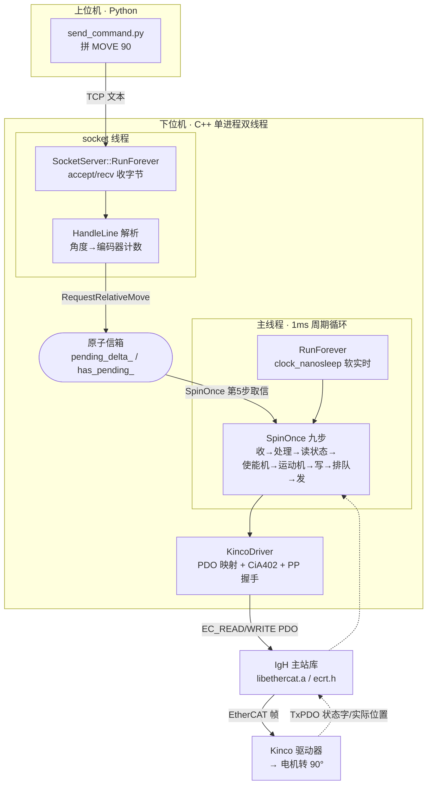

# kinco-ethercat-demo · 面试准备

> 目标岗位：Coding Agent 研发工程师（以通用软件工程师能力为基础）
> 生成时间：2026-09-04
> 说明：本资料由 interview-prep 自动生成，基于对项目真实代码的逐文件阅读整理。面试前请自己过一遍，尤其注意标了"⚠️需确认"的地方——那些是最可能被追问、也最容易和真实经历对不上的点。

---

## 一、项目概览

- **一句话定位**：把工作中"理料台控制主干链路"提纯出来的一个**最小可编译学习 demo**——Python 上位机通过 TCP socket 发一条文本命令 `MOVE 90`，C++ 下位机跑一个 1ms 周期循环，经 IgH EtherCAT 主站库把指令下发给一个 Kinco（禾川）伺服驱动器，最终让电机相对转动 90 度。

- **核心功能**：
  - **上位机命令输入**：Python 脚本 `send_command.py`，把角度拼成一行文本，用 socket 发给下位机；支持 `MOVE <角度>` 和 `STATUS` 两条命令。
  - **TCP 通信 + 文本协议**：C++ 下位机用原生 POSIX socket 监听端口 5051，按 `\n` 逐行切分、解析命令（自己处理粘包/半包）。
  - **EtherCAT 主站生命周期管理**：请求主站 → 建 domain → 配从站 PDO → 激活 → 每周期收发。
  - **1ms 周期循环（软实时）**：用 `clock_nanosleep` 的绝对时间递推做一个抖动可控的软实时循环。
  - **CiA402 伺服使能状态机**：按国际标准把驱动器从"没使能"一步步推到"运行使能"。
  - **PP（轮廓位置）模式运动控制**：包含"新设点(new set-point)"上升沿握手，让驱动器自己规划加减速轨迹走到目标位置。
  - **跨线程无锁通信**：socket 线程用两个 `std::atomic` 变量当"信箱"，把运动请求投给周期循环线程。

- **最主要的一条执行链路**：
  `send_command.py`（拼 `MOVE 90\n` 发 TCP）→ `socket_server.cpp::HandleLine`（解析、角度换算成编码器计数、投进信箱）→ `ecat_master.cpp::SpinOnce`（周期循环取信、推进状态机、收发 PDO）→ `kinco_driver.cpp`（PDO 映射 + CiA402 使能握手 + PP 新设点握手）→ EtherCAT 总线 → Kinco 驱动器 → 电机相对转 90 度。

- **我在其中的角色 / 主要工作**：这是**原创的学习项目**，由你从公司真实的"理料台（xyz-box-aligner）"项目里把控制主干链路**提纯**出来的——保留真实的 IgH 主站库和真实的 Kinco PDO 定义/CiA402 握手，剔除掉 Xenomai 硬实时、环形缓冲多线程 FSM、二进制协议、多从站、CSP/CSV 模式、glog/conan/just 等一切非主线的复杂度，并配了一份中文教学文档 `学习文档.md`。⚠️需你确认：面试里讲这个项目时，务必区分"哪些是原项目里你真正参与/写过的"和"哪些是这次为学习而提纯重写的"，别把整个原项目都揽成自己独立完成，被追细节容易露怯。

---

## 二、架构与技术栈讲解【板块①】

### 2.1 目录 / 模块结构

```
kinco-ethercat-demo/
├── 学习文档.md                      # 中文教学文档：概念、调用链、诚实的"省略清单"
├── build.sh                         # 一键编译脚本（cmake -B build && cmake --build）
├── CMakeLists.txt                   # 纯 CMake 构建，手动链接 libethercat.a + pthread + rt
├── upper_computer/
│   └── send_command.py              # 【上位机】Python，argparse + socket，发文本命令
├── controller/                      # 【下位机】C++ 实时控制器
│   ├── include/
│   │   ├── config.h                 # 所有可调常量：端口、周期、从站身份、角度换算、运动参数
│   │   ├── log.h                    # 极简流式日志宏（十几行模仿 glog 的 LOG(INFO)<<...）
│   │   ├── socket_server.h          # TCP 服务端类声明
│   │   ├── ecat_master.h            # EtherCAT 主站类声明（含 atomic 信箱）
│   │   └── kinco_driver.h           # Kinco 驱动器类：PDO 结构体 + CiA402 位定义
│   └── source/
│       ├── main.cpp                 # 入口：注册信号 → 起主站 → 起 socket 线程 → 跑周期循环
│       ├── socket_server.cpp        # POSIX socket 监听 + 逐行命令解析
│       ├── ecat_master.cpp          # 主站四步初始化 + SpinOnce 九步 + RunForever 软实时循环
│       └── kinco_driver.cpp         # PDO 映射表 + 读写共享内存 + 两个状态机
└── third_party/etherlab/            # 【真实依赖，不 mock】IgH EtherCAT 主站库
    ├── include/ecrt.h               # 用户态 API 头文件
    └── lib/libethercat.a            # 静态库
```

**每个模块一句话职责：**
- `send_command.py`：把人给的角度变成一行文本命令，通过网络"管子"塞给下位机，再打印应答。
- `socket_server.*`：下位机的"耳朵"，跑在独立线程上收命令、翻译成对主站的调用。
- `ecat_master.*`：下位机的"心脏"，管理 EtherCAT 主站的生老病死，每 1ms 跳一次（收发一轮 PDO）。
- `kinco_driver.*`：把"让电机转"翻译成 EtherCAT 总线上的字节，封装了 Kinco 的 PDO 布局和 CiA402/PP 两套握手。
- `config.h`：全项目参数集中营（原项目用 yaml，这里为极简改成一堆 `constexpr`）。
- `main.cpp`：把上面这些串起来的启动器。

### 2.2 核心数据流 / 执行链路

**跨线程分工是这个项目的架构关键**：下位机进程里有两条线程——
1. **socket 线程**（跑 `SocketServer::RunForever`）：长时间阻塞在 `accept`/`recv` 上等命令，收到就解析、投信箱，绝不碰硬件。
2. **主线程 / 周期循环**（跑 `EcatMaster::RunForever`）：每 1ms 独占 EtherCAT 硬件跑一轮 `SpinOnce`。

两条线程之间**只通过两个原子变量交接**（`pending_delta_` 存"要转多少计数"、`has_pending_` 当"旗子"），不加锁。这样设计的原因：socket 的 `recv` 会长时间阻塞，如果让它直接操作共享内存，既会和周期循环数据竞争，又会把 1ms 的节拍拖垮。

**一个周期 `SpinOnce` 做的九件事（顺序照搬原项目）：**
1. `ecrt_master_receive` 收上一周期总线回来的帧
2. `ecrt_domain_process` 把收到的数据搬进 domain 共享内存
3. `kinco_.ReadInputs` 从共享内存解析出"状态字、实际位置"
4. `UpdateEnableStateMachine` 推进 CiA402 使能状态机
5. 若已使能 + 空闲 + 信箱有请求 → 取出增量 → `StartRelativeMove`
6. `UpdateMotion` 推进 PP 新设点握手 / 判断是否到位
7. `kinco_.WriteOutputs` 把"目标位置、控制字"写进共享内存
8. `ecrt_domain_queue` 排入发送队列
9. `ecrt_master_send` 真正把这一周期的帧发到总线



### 2.3 技术栈

| 技术 | 在本项目里干嘛 | 为什么用它（选型理由） |
|---|---|---|
| **C++17** | 下位机全部逻辑：主站管理、周期循环、状态机、socket | 实时控制要求贴近硬件、无 GC 停顿、可精确管理内存和时序；`std::atomic`/`std::thread` 是 C++11 起的标准并发设施，够用又无需第三方库 |
| **Python 3** | 上位机：发命令、收应答的小工具 | 上位机不需要实时性，Python 写命令行工具（argparse + socket）快、可读、方便手调 |
| **EtherCAT（现场总线协议）** | 主站与 Kinco 从站之间的实时通信 | 工业实时以太网，一帧扫过所有从站、微秒级同步，是伺服/IO 现场总线的事实标准 |
| **IgH EtherCAT Master（etherlab）** | 开源的 EtherCAT 主站实现（内核模块 + 用户态库） | Linux 上最主流的开源 EtherCAT 主站；`libethercat.a`+`ecrt.h` 提供 domain/PDO/slave 配置 API。本项目**保留真实库**不 mock，保证学到的是真接口 |
| **PDO / SDO** | 全靠 PDO：每周期高速交换目标位置/控制字（下）和状态字/实际位置（回） | PDO 是周期性实时数据，延迟低、无需寻址；本 demo PP 模式靠驱动器 EEPROM 参数，不需要 SDO 慢速配置 |
| **CiA402 伺服状态机** | 用控制字 0x6040 驱动、状态字 0x6041 回报，把驱动器使能起来 | 伺服驱动器的国际标准（CANopen over EtherCAT 的设备子协议），换品牌驱动器状态机流程一致 |
| **PP（Profile Position）模式** | 给目标位置，驱动器自己规划加减速轨迹 | 轨迹由驱动器内部算，主站不必逐周期硬喂位置，所以**软实时够用、不需要 Xenomai** |
| **POSIX socket（TCP）** | 上位机↔下位机通信 | 最基础、无依赖、可靠有序；用原生 API 而非第三方库是为了"看清一条命令怎么进程序" |
| **std::thread + std::atomic** | 双线程架构 + 无锁信箱 | 标准库自带，无锁 atomic 避免锁开销和死锁，适合"生产者投请求、消费者取请求"的单向交接 |
| **clock_nanosleep（软实时）** | 用绝对时间递推唤醒点跑 1ms 循环 | 绝对时间(TIMER_ABSTIME)避免累积漂移；PP 模式对抖动不敏感，软实时够用（原项目是 Xenomai 硬实时） |
| **CMake + bash** | 构建：把四个 cpp 编成 `controller_node`，链接静态库 | 纯 CMake 最小依赖，剔除原项目的 just/conan 三层构建 |

---

## 三、针对本项目的面试题 + 参考答案【板块②】

> 每题标：难度（基础/进阶/深挖）· 考察点。参考答案结合本项目真实代码，尽量口语化、能背能复述。

### 3.1 项目整体类

**Q1.（基础 · 表达能力）请用一分钟介绍一下这个项目。**
参考答案：这是我从公司的理料台控制项目里，把"控制主干链路"提纯出来做的一个最小可编译学习 demo。它完整跑通了这样一条链路：Python 上位机通过 TCP 发一条文本命令 `MOVE 90`，C++ 下位机在一个 1ms 的周期循环里，通过 IgH 这个开源的 EtherCAT 主站库，把指令下发给一个 Kinco 伺服驱动器，最终让电机相对转 90 度。它保留了真实的 EtherCAT 主站库和真实的 Kinco PDO 定义、CiA402 使能握手，只是把原项目里 Xenomai 硬实时、多线程环形缓冲、多从站这些复杂度砍掉了，让整条主线一眼能看全。我做这个是为了自己彻底吃透"一条命令从上位机怎么一层层落到电机"的完整工作流，并配了一份中文教学文档。

**Q2.（基础 · 架构理解）这个项目一共有几个进程、几条线程？它们怎么分工？**
参考答案：两个程序：上位机 Python 是一个独立进程，下位机 C++ 是另一个进程（真机上分别跑在不同机器）。下位机进程内部有**两条线程**：一条是 socket 线程，负责监听端口、收上位机命令；一条是主线程，跑 1ms 的 EtherCAT 周期循环、真正驱动电机。分开是因为 socket 的 `recv` 会长时间阻塞等数据，不能让它拖累必须准时跳动的周期循环。两条线程之间只通过两个原子变量当"信箱"传递运动请求，不加锁。

**Q3.（进阶 · 抓重点）这个项目里你觉得最核心、最难的是哪一部分？**
参考答案：最核心的是**下位机那条 1ms 周期循环里对驱动器的两套握手**。伺服电机不是你写一个"转 90 度"它就转的——你得先按 CiA402 标准，一个周期一个周期地把驱动器从"没上电"推进到"运行使能"（Shutdown→Switch on→Enable operation），这中间每一步都要看驱动器回来的状态字确认到了哪一步再发下一条控制字；使能好之后，PP 模式发起运动还要做一次"新设点"的上升沿握手——把控制字 bit4 抬起来告诉驱动器"有新目标"，等它状态字 bit12 确认，再把 bit4 落回去，它才真正开始走。这两套握手都是状态机、都跨多个周期，是最需要理解协议、也最容易出错的地方。

### 3.2 技术选型类

**Q4.（进阶 · 选型理解）为什么下位机用 C++ 而上位机用 Python？**
参考答案：因为两边的需求完全不同。下位机是实时控制器，要每 1ms 准时收发一轮总线数据、直接操作共享内存、贴着硬件跑，容不得垃圾回收带来的不确定停顿，所以用 C++——能精确管内存、控时序、零开销抽象。上位机只是"发个命令、看个应答"，没有实时要求，用 Python 写命令行工具最快、最好读、还能直接用 nc/telnet 手调，开发效率高。这其实也是工业控制里很典型的分层：实时控制层 C/C++，上层人机交互/逻辑编排层用脚本语言。

**Q5.（进阶 · 协议选型）为什么用 EtherCAT，而不是普通以太网 TCP 或者 CAN 总线来驱动电机？**
参考答案：普通 TCP 以太网延迟不确定、没有周期同步保证，做不了伺服这种需要微秒级确定性的实时控制。CAN 总线实时性好但带宽低（1Mbps 级）、接的设备一多就不够用。EtherCAT 是工业实时以太网：它的一帧数据"飞掠"过总线上所有从站，每个从站在帧经过时就地读写自己那段数据，所以一帧就能和几十个从站交换数据，微秒级、还能做分布式时钟同步。对理料台这种一条总线上挂 IO、滚筒、夹爪、多个电机的场景，EtherCAT 是事实标准。⚠️需你确认：CAN 的具体带宽数字、以及原项目为什么最初选 EtherCAT，建议你按实际情况补充。

**Q6.（进阶 · 库选型）为什么用 IgH EtherCAT Master？它是怎么工作的？**
参考答案：IgH（也叫 etherlab）是 Linux 上最主流的开源 EtherCAT 主站实现，社区成熟、文档全、Kinco 这类国产驱动器都能配。它分两部分：一个**内核模块** `ec_master`，真正去操作网卡收发 EtherCAT 帧；一个**用户态库** `libethercat.a` + `ecrt.h`，给我们程序调用，提供请求主站、建 domain、配从站 PDO、激活、每周期收发这些 API。所以真机上必须先加载内核模块、有 `/dev/EtherCAT` 设备，我的程序才能 `ecrt_request_master(0)` 请求到主站——在没装内核模块的开发机上跑，就会在这一步优雅报错退出，这是正常的。

**Q7.（进阶 · 协议细节）PDO 和 SDO 有什么区别？你这个项目为什么只用 PDO 不用 SDO？**
参考答案：PDO（过程数据对象）是每个总线周期都高速交换的实时数据，比如我下发的目标位置、控制字，驱动器回读的状态字、实际位置，走的是预先映射好的固定内存布局，延迟低、不用每次寻址。SDO（服务数据对象）是偶尔用一次的参数配置通道，比如开机设一堆整定参数，可以随机访问任意对象字典项，但慢。我这个 demo 只用 PDO：因为 PP 模式下驱动器需要的参数都存在它自己的 EEPROM 里，原项目在 PP 模式下也是故意不发 SDO 的，所以我提纯时把 SDO 整条去掉了，主线更清爽。

### 3.3 实现细节类

**Q8.（进阶 · 核心链路）一条 `MOVE 90` 命令从进程序到电机转动，中间都经过了什么？**
参考答案：分五层。①上位机把角度拼成 `MOVE 90\n` 通过 socket 发出。②下位机 socket 线程 `recv` 收到字节，按 `\n` 切出一整行，`HandleLine` 用字符串流取出命令名和角度，调 `DegreeToCounts` 把 90 度换算成编码器计数（每圈 10000 计数时是 2500），然后调 `RequestRelativeMove` 把这个计数投进原子信箱。③主线程周期循环在某一周期的第 5 步，发现已使能、空闲、信箱有请求，就取出增量调 `StartRelativeMove`：把目标位置设成"当前实际位置 + 增量"，填好速度/加减速参数，进入运动子状态机。④接下来几个周期做 PP 新设点握手（抬 bit4、等 ack、落 bit4）。⑤驱动器收到后按内部规划的加减速轨迹把电机转过去，到位后状态字 bit10 置 1，本次运动结束。

**Q9.（深挖 · 状态机）CiA402 使能握手具体是怎么做的？为什么不能一步到位直接发使能？**
参考答案：CiA402 规定驱动器有一串状态：Not ready→Ready to switch on→Switched on→Operation enabled，必须一级级走，不能跳。我的做法是每个周期读一次状态字 `0x6041`，看它现在到哪一步了，就发对应的控制字 `0x6040` 推它进下一步：如果有故障(bit3)就先发 `0x86` 复位；如果已经"运行使能"(bit2)就保持 `0x0F`、返回 true 表示可以接运动了；如果只是"已上电"(bit1)就发 `0x0F` 使能运行；如果只是"已准备好"(bit0)就发 `0x07` 上电；其它情况发 `0x06` 从头 Shutdown。不能一步到位，是因为每一步驱动器内部要做实际动作（比如上电、抱闸松开），需要时间，主站必须等它的状态字确认到位了再推下一步，否则命令会被驱动器忽略。这就是为什么它天然是个"每周期推进一格"的状态机。

**Q10.（深挖 · 握手时序）PP 模式的"新设点握手"为什么要抬 bit4 再落 bit4？直接把目标位置写进去不行吗？**
参考答案：不行，因为驱动器需要知道"这是一个**新**目标、请开始一段新轨迹"。PP 模式用控制字 bit4（new set-point）做一次上升沿握手来通知：①我先写好目标位置，②把 bit4 从 0 抬到 1（`0x0F`→`0x1F`），相当于按一下"确认"按钮，③驱动器收到后把状态字 bit12（set-point ack）置 1 回我"我收到了"，④我再把 bit4 落回 0（`0x1F`→`0x0F`），这个下降沿完成握手，驱动器才真正开始走这段轨迹，⑤走到后 bit10（target reached）置 1。用"边沿"而不是"电平"，是为了能区分"连续两次相同目标"——每次都要一个完整的抬起-落下，驱动器才认为是新的一次运动，否则你写同样的位置它分不清是不是要重走。

**Q11.（进阶 · 内存/PDO）你代码里的 `off_1601_`、`off_1a01_` 这些偏移量是干嘛的？为什么不直接用结构体？**
参考答案：EtherCAT 的 domain 是一整块共享内存，所有 PDO 字段紧凑地排在里面，但每个字段具体排在第几个字节，是主站在 `ecrt_master_activate` 激活后才最终确定的。所以我在配置阶段用 `ecrt_domain_reg_pdo_entry_list` 注册每个字段（用对象索引比如 `0x607a` 标识），让主站把每个字段的字节偏移**回填**到 `off_1601_`/`off_1a01_` 这些结构体里。之后每周期读写就靠 `domain_data + 偏移` 加 `EC_READ_S32`/`EC_WRITE_U16` 这类宏，按小端、按位宽精确读写那个字段。不能直接拿个 C 结构体去 memcpy，是因为总线上的字节布局由从站的 PDO 映射决定、还涉及字节序和对齐，必须用主站给的偏移和官方读写宏，才能保证跨平台正确。

### 3.4 难点 / 踩坑类

**Q12.（进阶 · 并发）socket 线程和周期循环线程之间是怎么安全传数据的？为什么不用锁？**
参考答案：用两个原子变量当"单向信箱"：`pending_delta_`（int32，存这次要转多少计数）和 `has_pending_`（bool，旗子）。socket 线程是生产者，`RequestRelativeMove` 里**先写数据 `pending_delta_.store()`，再竖旗 `has_pending_.store(true)`**；周期循环是消费者，看到旗子才去读数据、`exchange(0)` 取走并清零。不用锁是因为：①周期循环是 1ms 硬节拍，绝不能被锁阻塞；②这里是简单的单向交接，`std::atomic` 保证每次读写不会读到"写一半"的脏值就够了。这里有个**关键的顺序陷阱**：写数据和竖旗的顺序不能颠倒——如果先竖旗再写数据，会留一个"旗已立、数据还是旧值"的窗口，消费者恰好这时来取就会执行上一次的角度。

**Q13.（深挖 · 实时性）你用普通线程 + nanosleep 跑 1ms 循环，凭什么保证够准？原项目为什么要用 Xenomai？**
参考答案：我用 `clock_nanosleep` 配 `TIMER_ABSTIME`（绝对时间）来递推每个周期的唤醒点——每次唤醒后把下一个唤醒时刻设成"上一个唤醒点 + 1ms"，而不是"现在 + 1ms"，这样即使某次醒晚了一点也不会累积漂移，长期平均节拍是准的。但普通 Linux 是分时系统，调度抖动可能有几十上百微秒甚至更多，做不到硬实时。原项目用 Xenomai（一个实时内核补丁 + alchemy 实时任务）就是为了把抖动压到微秒级、保证 1ms 硬实时。我这个 demo 之所以敢用软实时，是因为只用 PP 模式——轨迹是驱动器自己算的，主站晚几十微秒发一帧也不影响结果；但如果是 CSP/CSV（周期同步位置/速度）模式，主站要逐周期硬喂位置，那就必须上硬实时，软循环会导致电机抖动。

**Q14.（进阶 · 网络）你的 socket 是怎么处理"粘包/半包"的？**
参考答案：TCP 是字节流，没有消息边界，一次 `recv` 可能收到半条命令，也可能一次收到好几条。我用一个 `std::string buffer` 累积所有收到的字节，每次 recv 完就在 buffer 里找 `\n`：只要找得到换行符，就说明攒够了至少一整行，用 `substr` 切出这一行、`erase` 从缓冲区删掉，然后处理；找不到换行符就继续等下次 recv。这样半包会被缓冲着等后续字节，粘包会被循环切成多行，都能正确处理。我还顺手去掉了行尾可能的 `\r`（应对 Windows 的 `\r\n`），空行直接跳过。

**Q15.（进阶 · 健壮性）如果驱动器一直不使能、或者一直不到位，你的程序会怎样？会死循环卡住吗？**
参考答案：不会卡住。因为使能和运动都是在 1ms 周期循环里**非阻塞地推进**的——每个周期只看一眼状态字、发一次对应控制字就返回，没到位就下个周期再看，主循环照常 1ms 跳。所以即使驱动器迟迟不使能，程序也只是"停留在使能状态机的某一步"，socket 依然能收命令、STATUS 依然能查状态。⚠️需你确认：不过我这个 demo **没有做超时/重试/报警**——真机上如果驱动器卡在某状态永远上不去，代码不会主动报错，只会一直重试。原项目应该有超时和故障上报，这点是我提纯时简化掉的，面试被问"异常怎么处理"时要诚实说明。

### 3.5 延伸拷打类（往底层钻）

**Q16.（深挖 · C++）你用了 `std::atomic`，它和加锁（mutex）有什么区别？atomic 底层是怎么实现"原子"的？**
参考答案：mutex 是"锁一段临界区"，同一时刻只有一个线程能进，进不去的线程会被操作系统挂起、切走，开销大但能保护任意复杂的操作。atomic 是"单个变量的读/写/读改写不可分割"，靠 CPU 提供的原子指令（比如 x86 的 `lock` 前缀指令、`cmpxchg`）在硬件层面保证，不需要陷入内核、不会挂起线程，非常轻。我这里只是单个 int/bool 的读写，用 atomic 正好；如果要保护"一组变量的一致性"或者复杂逻辑，就得用 mutex。追问常会到"内存序(memory order)"：atomic 默认是 `seq_cst`（顺序一致），最安全但稍慢，我这个场景默认就够。⚠️需你确认：如果被追问"你有没有考虑用更宽松的 memory order 优化"，据实说——本 demo 用的是默认 seq_cst，没做进一步放宽。

**Q17.（深挖 · C++）`config.h` 里为什么用 `constexpr`？和 `#define` 宏、`const` 有什么区别？**
参考答案：`constexpr` 是"编译期常量"，比如 `constexpr int kListenPort = 5051;`，编译时就确定值、有明确类型、受命名空间和作用域管理。跟 `#define` 宏比：宏是纯文本替换，没有类型、不受作用域约束、出错时报错信息难懂，还容易有副作用；`constexpr` 有类型检查、能被调试器看到、能进 `namespace`，安全得多。跟普通 `const` 比：`const` 保证"运行期不改"，但不一定是编译期常量；`constexpr` 更强，保证编译期就能算出来，可以用在需要编译期常量的地方（比如数组大小、模板参数）。我这里端口、周期、齿轮比这些都是编译期就定死的参数，用 `constexpr` 最合适。

**Q18.（深挖 · C++）你的 `log.h` 里 `LOG(INFO) << "x" << 123` 是怎么实现的？为什么日志是在语句结束时才打印？**
参考答案：`LOG(INFO)` 展开成构造一个临时的 `LogLine` 对象，它内部有个 `stringstream`。`LogLine` 重载了模板 `operator<<`，你每 `<<` 一个东西就转发拼进那个 stringstream。关键在于：这个临时对象的**生命周期就是这一整条语句**，语句结束（分号处）时它析构，我把"真正打印到 cerr"的动作放在**析构函数**里——所以一整条 `LOG(INFO) << a << b << c` 会被攒成一行、在语句末尾一次性打印出来，还自动加换行。这就是 glog 那种流式日志的最小实现原理，用到的是 C++ 的"临时对象析构时机确定"和"运算符重载"两个特性。

**Q19.（深挖 · 网络）你 socket 里的 `htons(kListenPort)` 是干嘛的？不加会怎样？**
参考答案：`htons` 是 host-to-network-short，把 16 位端口号从"主机字节序"转成"网络字节序"。网络上统一规定多字节整数用大端序传输，但 x86 CPU 是小端序，两者不一致。如果不转，比如端口 5051 在小端机器上直接塞进去，对端按大端解读就会变成另一个端口号，连不上。同理 `htonl` 处理 32 位的 IP。这是网络编程一个经典坑，凡是往 sockaddr 里填端口、IP 都要转。

### 3.6 改进 / 反思类

**Q20.（进阶 · 成长性）如果让你把这个 demo 往"更接近真实产品"改，你会先补哪些东西？**
参考答案：按优先级：①**异常与超时处理**——给使能、运动加超时和故障上报，驱动器卡住或报错时能感知并告警，而不是闷头重试；②**多从站支持**——把 KincoDriver 抽象成通用从站接口，支持一条总线挂多个电机/IO；③**硬实时**——如果要上 CSP/CSV 这种周期同步模式，得引入 Xenomai 或 PREEMPT_RT，把周期抖动压下去；④**更结构化的协议**——文本协议好调试但效率低、易出错，产品里可以换成带长度头的二进制协议或加校验；⑤**参数外部化**——把 `config.h` 的编译期常量改回 yaml/配置文件，改参数不用重编。这几点其实正好对应原项目里我提纯时砍掉的复杂度。

**Q21.（进阶 · 反思）这个 demo 你觉得有什么明显的局限？**
参考答案：最大的局限是它是"教学最小化"的，牺牲了健壮性：没有超时/重试/故障恢复，只支持单从站单命令，软实时只够 PP 模式，参数写死要重编，socket 只服务单客户端。但这些局限是**刻意的**——我做它的目标是把"上位机命令→EtherCAT→电机"这条主线抽干净、看透，而不是复刻整个产品。我在 `学习文档.md` 里专门写了一节"诚实清单"列出所有被简化的地方，就是提醒自己（和读的人）别把这个 demo 当成真实系统的全部复杂度。

**Q22.（深挖 · 迁移）如果换一个别的品牌的伺服驱动器（不是 Kinco），你的代码要改哪些地方？**
参考答案：改动主要集中在 `kinco_driver.cpp/.h` 和 `config.h`：①从站身份——`config.h` 里的 vendor id、product code 要换成新驱动器的；②PDO 映射——不同厂商的 PDO 布局（哪些对象、什么顺序、位宽）可能不同，`pp_pdo_entries`、`pp_pdos`、sync manager 配置要按新驱动器手册改；③编码器分辨率/齿轮比——`kCountsPerRev` 要按新驱动器实际设置改，否则角度不准。**好消息是 CiA402 使能状态机和 PP 握手基本不用改**——因为 0x6040 控制字、0x6041 状态字、各状态位都是 CiA402 国际标准，各家遵循同一套，这也正是当初为什么伺服要搞标准状态机：换驱动器时上层逻辑能复用。

---

## 四、通用知识点深挖【板块③】

> 只覆盖本项目真实用到的技术。每点：是什么 → 为什么 → 常见陷阱 → 面试官会怎么追问。

### 4.1 EtherCAT 现场总线协议

**是什么**：EtherCAT（Ethernet for Control Automation Technology）是德国倍福提出的工业实时以太网协议。核心机制叫"飞掠处理(processing on the fly)"：主站发一帧数据，这帧**依次穿过总线上每一个从站**，每个从站在帧经过自己时，就地把该读的读走、该写的写进这一帧对应的段，然后帧继续往下传，最后回到主站。所以**一帧就能和一整串从站交换数据**，不用给每个从站单独发包。

**为什么快/为什么用它**：普通以太网是"一次一个包、一收一发"，做实时控制延迟不可控；EtherCAT 一帧扫全网、微秒级、还有分布式时钟(DC)做各从站的纳秒级同步。工业上一条总线挂几十个 IO/伺服还要 1ms 同步刷新，只有这类实时以太网扛得住。

**常见陷阱**：①主站/从站概念别搞反——主站是发起者（我们的程序），从站是设备（驱动器、IO）；②EtherCAT 不是普通 TCP/IP，它直接在以太网帧上跑自己的协议，网卡得被主站独占；③从站在总线上有"位置(position)"和"别名(alias)"两种寻址方式。

**会怎么被追问**：EtherCAT 和 Profinet/CANopen/Modbus 的区别 → 分布式时钟怎么做同步 → 一帧最多带多少从站数据 → CoE(CANopen over EtherCAT)是什么（答：EtherCAT 借用 CANopen 的对象字典和 CiA402 设备协议，PDO/SDO 都来自 CANopen 概念）。

### 4.2 主站 / 从站 与 PDO / SDO

**是什么**：主站(master)是总线的"大脑"，负责发起每个周期的通信、配置从站；从站(slave)是被控设备。数据分两类：**PDO**（过程数据对象）是每周期周期性交换的实时数据，走预先映射好的固定内存位置，快；**SDO**（服务数据对象）是按需访问"对象字典"里任意参数的通道，能随机读写任意对象，但慢，一般用来开机配置。

**为什么这么分**：实时数据（位置、状态）每周期都要，用 PDO 固定布局最快；配置参数偶尔用一次，用 SDO 灵活寻址就行。两者分开，实时通道不被配置流量干扰。

**常见陷阱**：①RxPDO/TxPDO 的方向是**站在从站视角**——RxPDO 是从站"接收"的（主站→从站，我们下发的指令），TxPDO 是从站"发送"的（从站→主站，回读的状态），别按主站视角理解反了；②PDO 映射必须在主站激活前配好，激活后布局就固定了；③本项目里 PDO 字段的字节偏移是激活后才回填的，读写要用偏移+官方宏。

**会怎么被追问**：为什么你只用 PDO 不用 SDO → 对象字典是什么 → 0x607a/0x6040 这些索引是什么（答：CANopen 对象字典里的标准索引，0x6040 控制字、0x6041 状态字、0x607a 目标位置、0x6064 实际位置，CiA402 规定的）→ PDO 一个周期能传多大。

### 4.3 CiA402 伺服驱动器状态机

**是什么**：CiA402 是 CANopen 定义的"运动控制设备"子协议（CiA = CAN in Automation）。它规定所有遵循标准的伺服驱动器都有同一套状态机：Not ready to switch on → Switch on disabled → Ready to switch on → Switched on → Operation enabled，还有 Fault 等。主站用**控制字 0x6040**（写)驱动状态转移，从站用**状态字 0x6041**（读）回报当前状态。让电机能动，必须先把它一步步推到 Operation enabled。

**为什么要标准状态机**：这样换任何品牌的 CiA402 驱动器，上层使能/运动逻辑都能复用，不用为每家重写——本项目 Q22 讲的迁移能复用状态机就是这个道理。

**常见陷阱**：①状态不能跳级，必须一级级走、每步等状态字确认；②有故障(Fault)时必须先发故障复位 0x86 才能重新使能；③控制字是"位"有含义，比如 bit0~3 组合成不同命令值(0x06/0x07/0x0F)，bit4 是 PP 新设点、别和使能位混。

**会怎么被追问**：0x06/0x07/0x0F 分别对应哪一步 → 状态字各位含义（bit0 ready、bit1 switched on、bit2 op enabled、bit3 fault、bit10 target reached、bit12 setpoint ack）→ 故障了怎么恢复 → PP/PV/PT/CSP/CSV/HM 这些运行模式(0x6060)的区别。

### 4.4 PP（轮廓位置）模式与实时性

**是什么**：PP(Profile Position) 是 CiA402 的一种运行模式（0x6060=1）——主站只给一个"目标位置"，驱动器**内部自己算一条带加减速的轨迹**走过去。对比 CSP(周期同步位置，0x6060=8)：CSP 要主站每个周期都硬喂一个新的插补位置点，轨迹在主站算。

**为什么本项目软实时够用**：因为 PP 模式轨迹由驱动器算，主站发完目标就不用管了，晚几十微秒发帧也不影响结果——所以普通 `clock_nanosleep` 软循环够。CSP/CSV 就必须硬实时，因为主站逐周期喂点，抖动会直接变成电机抖动。

**常见陷阱**：①PP 模式发起运动要做 bit4 新设点上升沿握手，不是写完位置就动；②"相对运动"和"绝对运动"由控制字里的模式位区分，本项目是"当前实际位置+增量"手动实现相对；③软实时的 `clock_nanosleep` 一定要用 `TIMER_ABSTIME` 绝对时间递推，用相对睡眠会累积漂移。

**会怎么被追问**：PP 和 CSP 的本质区别 → 为什么 CSP 必须硬实时 → 什么是硬实时/软实时 → Xenomai / PREEMPT_RT 是什么、怎么保证实时 → 你的 1ms 循环实测抖动多大（⚠️需你确认：如果没实测过，据实说"demo 阶段没量化抖动"）。

### 4.5 C++ 多线程与 std::atomic 无锁通信

**是什么**：`std::thread` 开线程，`std::atomic<T>` 是原子类型——对它的读、写、读改写(exchange/CAS)是不可分割的，多线程同时访问不会读到"写一半"的中间态，靠 CPU 原子指令实现，不用加锁。

**为什么用无锁**：实时周期循环不能被锁阻塞挂起；这里是"一个生产者投请求、一个消费者取请求"的单向简单交接，atomic 就够，避免了 mutex 的内核陷入和潜在死锁。

**常见陷阱**：①**写数据和竖旗子的顺序**——必须先写数据再竖旗，反了会有"旗立数据旧"的竞态窗口（本项目 `RequestRelativeMove` 里专门注释了这点）；②atomic 只保证"单个变量"原子，保护"多个变量的一致性"要用锁或更复杂的手段；③内存序(memory order)——默认 `seq_cst` 最安全，放宽到 acquire/release 能提速但要想清楚。

**会怎么被追问**：atomic 和 mutex 区别、各自开销 → 什么是内存序、为什么需要 → CAS 是什么、ABA 问题 → 你这个信箱如果有多个生产者还安全吗（答：单生产者单消费者才安全，多生产者要重新设计）→ volatile 和 atomic 的区别（答：volatile 不保证原子性也不保证跨线程可见性，不能拿来做线程同步）。

### 4.6 POSIX Socket 与 TCP 字节流

**是什么**：POSIX socket 是 Unix/Linux 的网络编程系统调用。服务端流程：`socket()` 建套接字 → `bind()` 绑端口 → `listen()` 挂起监听 → `accept()` 接一个连接 → `recv()/send()` 收发。TCP(SOCK_STREAM) 是面向连接、可靠、有序的**字节流**。

**为什么**：TCP 保证按顺序、不丢、不重，适合命令这种不能乱序的场景；用原生 API 而非库是为了透明可控。

**常见陷阱**：①**TCP 是字节流没有消息边界**——会粘包/半包，必须自己按分隔符（本项目用 `\n`）或长度头切分；②端口/IP 要 `htons/htonl` 转网络字节序；③`recv` 返回 0 表示对端正常关闭、返回负数表示出错，要区分处理；④`SO_REUSEADDR` 避免重启时端口 TIME_WAIT 占用报错。

**会怎么被追问**：TCP 和 UDP 区别 → 粘包怎么解决 → 三次握手四次挥手 → TIME_WAIT 是什么、为什么要 SO_REUSEADDR → 阻塞 IO vs 非阻塞/IO 多路复用(select/epoll)（本项目是阻塞式单连接，追问"高并发怎么办"就答"要上 epoll 或多线程/线程池"）。

### 4.7 Python 上位机（argparse + socket）

**是什么**：上位机用 `argparse` 做命令行参数解析（支持 `move`/`status` 子命令），用标准库 `socket` 连下位机发文本。

**常见陷阱/要点**：①`sock.sendall` 保证整块发完（`send` 可能只发一部分）；②发命令一定要加 `\n`，因为下位机按行切；③设 `settimeout` 避免连不上时死等；④`recv(1024)` 一次不一定收全，命令小够用，但严格说也该循环收。

**会怎么被追问**：Python 的 GIL 对这个上位机有没有影响（答：这是纯 IO、单线程小工具，GIL 无所谓）→ 为什么上位机不用实时 → 如果要做 GUI 上位机你会怎么架构。

### 4.8 CMake 构建与静态库链接

**是什么**：CMake 是跨平台构建系统，写 `CMakeLists.txt` 描述"哪些源文件编成什么目标、链接哪些库"。本项目把四个 cpp 编成 `controller_node`，链接真实的 `libethercat.a`（静态库）+ `pthread`（因为用了 std::thread）+ `rt`（clock_nanosleep 部分系统需要）。

**常见陷阱**：①`.a` 是静态库，编译时把用到的代码直接打进可执行文件，不像 `.so` 运行时才加载；②链接顺序、`target_include_directories` 找头文件路径；③用了 `std::thread` 必须链 pthread，否则运行时报错。

**会怎么被追问**：静态库 vs 动态库区别 → 为什么要链 pthread → CMake 和 Makefile 区别 → 原项目为什么用 conan/just（答：管理更复杂的第三方依赖和任务编排，demo 为极简去掉了）。

---

## 五、亮点与话术包装【板块④】

### 5.1 一句话项目介绍（电梯稿）

"我把公司理料台控制项目里最核心的一条主干链路，提纯成了一个最小可编译的学习 demo：Python 上位机发一条命令，C++ 下位机在 1ms 周期循环里通过 IgH 这个开源 EtherCAT 主站库，按 CiA402 标准把一个 Kinco 伺服驱动器使能起来、用 PP 模式让电机精确转到目标角度。它保留了真实的主站库、真实的 PDO 协议和使能握手，只砍掉了 Xenomai 硬实时、多从站、二进制协议这些非主线复杂度，还配了一份中文教学文档——目的是把'一条命令从上位机怎么一层层落到电机'这条工业实时控制的完整工作流彻底吃透。"

### 5.2 项目亮点（STAR 话术）

**亮点1：把复杂工作项目提纯成最小可运行 demo（抽象与化繁为简能力）**
- S（情境）：公司理料台控制系统很庞大——多从站、Xenomai 硬实时、环形缓冲多线程状态机、二进制协议、多种运动模式，新人（包括我自己）很难一眼看清"一条命令到底怎么驱动电机"。
- T（任务）：我想彻底搞懂这条主干链路，于是决定把它单独抽出来，做成一个能独立编译、结构完整、任何人顺着就能看懂的最小 demo。
- A（行动）：我识别出主干只需要"一条命令、一个电机、转一个角度"，据此保留真实的 IgH 主站库和真实的 Kinco PDO/CiA402 握手，把 Xenomai、多线程环形缓冲、多从站、SDO、CSP/CSV、glog/conan 全部剔除，用"一个原子信箱 + 单周期循环"替代原来一大套并发机制，并写了一份逐层讲解 + 诚实列出所有简化项的中文文档。
- R（结果）：形成一个本机就能编译、真实库链接成功、结构完整的学习项目；顺着它能在十几分钟内讲清整条链路，也能作为回原项目精读的"地图"。⚠️可量化的话补一句：原项目相关代码约 N 千行，提纯到约 700 行核心代码（这个数字请你按实际核对）。

**亮点2：吃透并复刻了两套工业标准状态机（协议理解深度）**
- S：伺服电机不是"发个转 90 度"就转的，必须先按 CiA402 标准使能、再用 PP 模式做新设点握手。
- T：要在 demo 里正确复刻这两套跨周期的握手，任何一步错了电机都不动。
- A：我实现了 CiA402 使能状态机（读状态字→发对应控制字，Shutdown→Switch on→Enable operation，含故障复位），和 PP 新设点子状态机（抬 bit4→等 setpoint-ack→落 bit4→等 target-reached）；两套都做成"每周期非阻塞推进一格"，不卡主循环。
- R：demo 在真机上能完整走通"使能→发起运动→到位"全流程，并且我能讲清每一位、每一步握手的时序和原因。

**亮点3：双线程 + 无锁原子信箱的并发设计（并发与实时权衡）**
- S：socket 收命令会长时间阻塞，而周期循环必须 1ms 准时跳，两者不能互相拖累。
- T：要让"收命令"和"驱动硬件"解耦，又不能因为加锁破坏实时性。
- A：拆成两条线程，中间只用两个 `std::atomic`（数据 + 旗子）做单向信箱；周期循环在固定的第 5 步取信；并特意保证"先写数据再竖旗"的顺序，规避竞态窗口。
- R：周期循环全程不被锁阻塞、节拍稳定，socket 线程独立收命令，职责清晰、无数据竞争。

**亮点4：软实时循环的正确姿势（实时系统基础）**
- S：剔除了 Xenomai 后，得用普通 Linux 线程跑 1ms 循环。
- T：既要节拍不漂移，又要说清"为什么 PP 模式软实时够用、CSP 就不行"。
- A：用 `clock_nanosleep` + `TIMER_ABSTIME` 绝对时间递推唤醒点，避免累积漂移；在文档里讲清 PP（驱动器算轨迹，主站抖动不敏感）和 CSP（主站逐周期喂点，必须硬实时）的本质区别。
- R：demo 用最简手段实现了节拍稳定的软实时，并把实时性的取舍讲成了一个能对面试官说清楚的知识点。

### 5.3 难点应对话术

| 面试官可能的质疑 | 应对话术 |
|---|---|
| "这不就是调 IgH 库吗，有啥技术含量？" | 调库只是表层。难点在于**理解协议**：EtherCAT 的 PDO 内存布局、CiA402 的使能状态机、PP 的新设点握手，这些库不会替你做，得看懂手册、按状态字一步步握手。库给的是收发通道，怎么把电机安全使能、怎么发起一次运动，全是我基于协议实现的状态机。 |
| "这个 demo 太简单了，就转一个电机。" | 它**刻意**简单——目标是把主干抽干净看透，不是复刻产品。我在文档里诚实列了所有被简化的点（Xenomai、多从站、二进制协议、CSP/CSV、超时容错…），也能讲清每一项在真实系统里怎么做、为什么这里省掉。能把复杂系统提纯到最小可运行、还讲得清取舍，本身就是工程能力。 |
| "你实时性怎么保证的，普通线程也敢叫实时？" | 我很清楚软实时和硬实时的边界：PP 模式轨迹由驱动器算，主站抖动不敏感，`clock_nanosleep` 绝对时间递推的软循环够用；但 CSP/CSV 逐周期喂点就必须上 Xenomai/PREEMPT_RT 硬实时。我不是不知道区别才用软实时，而是**基于运动模式做的合理取舍**。 |
| "异常处理呢？驱动器卡住怎么办？" | 诚实说：这个 demo 为教学最小化，没做超时/重试/告警，驱动器卡住会一直重试。这是我提纯时明确砍掉的复杂度之一，原项目有故障上报。如果要产品化，我会优先补使能/运动超时和故障恢复——这也是我 reflection 里排第一的改进项。 |
| "这是你写的还是原项目就有的？" | 要分清：原项目的理料台控制链路和真实的 PDO/CiA402 定义是团队/我在工作中接触的；这个 demo 是我为了吃透它、**重新提纯组织**出来的独立项目。真实库和协议定义我保真保留，架构（单信箱+单循环+软实时）是我为教学重新设计的。⚠️（这条务必按你自己的真实参与度如实调整措辞。） |

### 5.4 面试前自测清单
- [ ] 能 30 秒讲清项目定位，也能 3 分钟讲清完整链路
- [ ] 能画出双线程 + 原子信箱 + 九步 SpinOnce 的架构图
- [ ] 能背 CiA402 使能状态机每一步（状态字判断 → 发哪个控制字）
- [ ] 能讲清 PP 新设点握手为什么要抬 bit4 再落 bit4
- [ ] 能说清 PDO/SDO 区别、以及为什么本项目只用 PDO
- [ ] 能解释软实时 vs 硬实时、为什么 PP 够用 CSP 不够
- [ ] 能讲 atomic 无锁信箱的"先写数据再竖旗"顺序陷阱
- [ ] 能答 TCP 粘包怎么处理、htons 为什么要转字节序
- [ ] 每个技术栈都能答出"为什么用它"
- [ ] 所有 ⚠️需确认 的点都已核对真实经历/代码

---

## 附：待你确认 / 补充的点

> 这些是自动生成时拿不准、或需要结合你的真实经历补全的地方，面试前务必处理：

- ⚠️ **你在原项目里的真实参与度**：这个 demo 是原创提纯项目，但面试讲的时候一定要分清"原项目里哪些是你真正写过/参与的""哪些是这次为学习重新组织的"，别把整个理料台系统都揽成个人独立成果，被追细节最伤。
- ⚠️ **代码行数/提纯比例的量化**：亮点1里"原项目 N 千行 → demo 约 700 行"这个对比很有说服力，但具体数字请你按实际核对后再用。
- ⚠️ **1ms 循环的实测抖动**：文档只说"软实时够用"，没有实测抖动数据。如果被问"实测多少微秒"，据实回答"demo 阶段没量化"，别编数字。
- ⚠️ **kCountsPerRev（每圈计数）的真实值**：代码默认 10000（Kinco FD 常见值），真机上取决于驱动器齿轮比/编码器分辨率设置（对象 0x6091 等）。如果面试聊到"角度怎么算准"，说清这个值要按实际驱动器改。
- ⚠️ **异常/超时/故障处理**：demo 没做超时重试告警，原项目应该有。被问健壮性时诚实说明这是提纯时简化掉的。
- ⚠️ **CAN 带宽等具体数字**（Q5）、**原项目最初为什么选 EtherCAT**：如涉及，按你了解的实际情况补充，别用记忆里的近似值当确定结论。
- ⚠️ **memory order**：本 demo 用默认 seq_cst，没做放宽优化。被追问时据实说，别假装做过更细的内存序调优。
