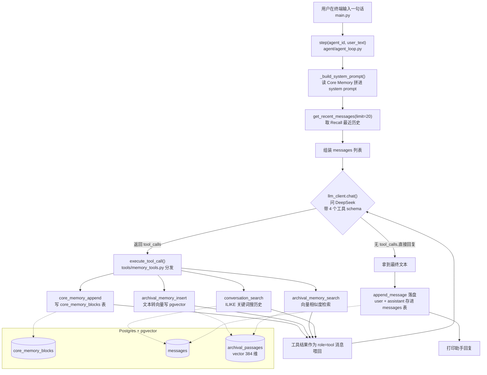

# letta-memory-learn · 面试准备

> 目标岗位：Coding Agent 研发工程师（以通用软件工程师能力为基础）
> 生成时间：2026-09-04
> 说明：本资料由 interview-prep 自动生成，全部内容基于对 `~/Repos/letta-memory-learn` 真实源码的阅读。面试前请自己过一遍，尤其注意标了"⚠️需确认"的地方——那些是最可能被追问、也最容易和真实代码对不上的点。

---

## 一、项目概览

- **一句话定位**：这是我**原创**的一个学习型开源复刻项目——研读开源记忆型 Agent 框架 Letta（原名 MemGPT）后，把它最核心的"三层记忆管理机制"从庞大的原项目里提纯出来，用最少的代码重写成一个独立、能跑通的最小 Agent。它演示了一个大模型如何"不改一个参数"就获得长期记忆：靠模型自己在对话里主动调用工具函数，把信息读写进外部数据库。

- **核心功能**：
  - **完整的 agent loop（智能体循环）**：一次用户输入 → 拼装 prompt → 问模型 → 模型自主决定是否调工具 → 执行工具 → 把结果喂回模型 → 循环，直到模型给出面向用户的最终回复。
  - **三层记忆**：
    - **Core Memory（核心记忆）**：永远拼进 system prompt 的少量常驻信息（类比 CPU 寄存器/常驻内存）。
    - **Recall Memory（回忆记忆）**：完整对话历史全量落库，靠关键词搜索找回（类比硬盘上的完整记录）。
    - **Archival Memory（归档记忆）**：长期知识库，文本转向量后存进 pgvector，按语义相似度检索（类比冷存储/长期知识库）。
  - **Tool use（模型自主调用工具）**：4 个记忆工具以 function calling 的 JSON schema 形式交给模型，由模型基于工具描述**自己判断**该不该调、调哪个。
  - **一个核心认知的落地演示**："记忆增强 ≠ 权重级持续学习"——全程 DeepSeek 模型参数一个数字都没变，"记忆"完全发生在外部数据库里。

- **最主要的一条执行链路**：
  `main.py`（命令行读一句话）→ `agent/agent_loop.py::step()`（拼 core memory + 最近历史 → 调 `llm_client.chat()` 问 DeepSeek，带上 4 个工具 schema）→ 模型若返回 tool_calls，就走 `tools/memory_tools.py::execute_tool_call()` 分发到 `memory/` 下的具体函数读写 Postgres/pgvector → 结果作为 `role="tool"` 消息喂回模型再问一轮 → 模型给出最终文本 → 把这轮 user/assistant 消息落进 recall memory 的 `messages` 表。

- **我在其中的角色 / 主要工作**：这是我从零写的原创项目，从读原项目源码、设计三层记忆的表结构、写 agent loop、定义工具 schema，到配 Docker + pgvector、写中文教学文档，都是我自己做的。⚠️需你补充：如果面试时想给出投入时间/迭代次数等细节，自己想好一个真实的说法。

---

## 二、架构与技术栈讲解【板块①】

### 2.1 目录 / 模块结构

```
letta-memory-learn/
├── main.py                  # 命令行入口：一个 while 循环读用户输入，调 step() 拿回复
├── agent/
│   ├── agent_loop.py        # ★心脏：拼 prompt → 问模型 → 执行工具 → 循环，直到出最终回复
│   └── llm_client.py        # 调 DeepSeek Chat API（用 openai SDK，只换 base_url）
├── tools/
│   └── memory_tools.py      # 4 个记忆工具的 JSON schema 定义 + 分发执行（DISPATCH 表）
├── memory/
│   ├── db.py                # 统一的 Postgres 连接（psycopg + 注册 pgvector 类型）
│   ├── core_memory.py       # Core memory 的增删改查（常驻 prompt 的记忆块）
│   ├── recall_memory.py     # 历史消息落库 + 关键词 ILIKE 搜索
│   └── archival_memory.py   # 文本转向量(sentence-transformers) + pgvector 语义检索
├── db/schema.sql            # 三张表建表语句 + pgvector 扩展 + ivfflat 向量索引
├── compose.yaml            # 一键起带 pgvector 的 Postgres 容器
├── requirements.txt         # 依赖清单
└── 学习文档.md              # 我写的中文教学文档（讲清整条调用链和取舍）
```

一句话职责：`main.py` 负责"读用户输入"，`agent/` 负责"循环和问模型"，`tools/` 负责"把记忆函数包装成模型能看懂的工具并分发"，`memory/` 是三层记忆各自的读写实现，`db/` 和 `compose.yaml` 负责数据落地。

### 2.2 核心数据流 / 执行链路

一次 `step()` 的完整流程（对着 `agent/agent_loop.py` 看）：

1. **拼 system prompt**：`_build_system_prompt()` 读出该 agent 的全部 core memory 块，拼成一段"这部分永远可见"的提示词。
2. **取历史**：`recall_memory.get_recent_messages(limit=20)` 取最近 20 条历史消息当上下文。
3. **组装 messages**：`[system] + [历史] + [这条新的 user 消息]`。
4. **进入循环（最多 `MAX_TOOL_ROUNDS=5` 轮）**：调 `llm_client.chat(messages, TOOL_SCHEMAS)` 问模型。
   - 若模型**没有** tool_calls：拿到最终文本，把 user 和 assistant 消息落进 recall memory，返回，结束。
   - 若模型**有** tool_calls：把模型这条带 tool_calls 的消息原样放回 messages，逐个执行工具（`execute_tool_call`），每个结果作为 `role="tool"` 消息接上去，回到循环顶端再问一次模型。
5. 循环 5 轮还没收敛，返回兜底提示"已达到工具调用轮数上限"。



### 2.3 技术栈

| 技术 | 在本项目里干嘛 | 为什么用它（选型理由） |
|---|---|---|
| **Python** | 全项目实现语言 | AI/LLM 生态最全，openai、sentence-transformers、psycopg、pgvector 都有成熟库；原项目 Letta 本身就是 Python，复刻起来能一一对照 |
| **DeepSeek（deepseek-chat）** | 充当会"自主调工具"的大脑，做对话推理和 function calling | 国内可直接申请、便宜；接口与 OpenAI **完全兼容**，可以直接用官方 `openai` SDK 只换 `base_url`，迁移成本几乎为零 |
| **openai SDK** | 调 DeepSeek 的 HTTP 客户端 | DeepSeek 兼容 OpenAI 协议，用官方 SDK 最省事、最稳定 |
| **PostgreSQL + pgvector** | 三层记忆的统一落地存储；pgvector 提供 `vector` 类型和余弦距离 `<=>` 运算符，是 archival 语义检索的基础 | 一个数据库同时装普通表和向量，不用再引入专门的向量数据库；原项目也用 pgvector，忠实复刻 |
| **sentence-transformers（all-MiniLM-L6-v2）** | 把文本转成 384 维向量（embedding），供 archival memory 存储和检索 | 本地开源小模型（约 80MB），CPU 能跑，不依赖额外的云端 embedding 账号，学习项目零成本。⚠️注意：**embedding 用的是这个本地模型，不是 DeepSeek**——DeepSeek 只负责对话推理 |
| **psycopg (v3)** | Python 连接 Postgres 的驱动 | psycopg 3 是当前主流版本，配合 `pgvector.psycopg.register_vector` 能让 Python 的 list 和 pg 的 vector 类型自动互转 |
| **Docker Compose** | 一键起带 pgvector 插件的 Postgres，并自动执行 `schema.sql` 建表 | 免去手动装 Postgres + 编译 pgvector 插件的麻烦，`compose up` 就有干净环境 |
| **python-dotenv** | 从 `.env` 读 `DEEPSEEK_API_KEY`、`DATABASE_URL` | 把密钥/配置和代码分离，不写死在代码里 |

---

## 三、针对本项目的面试题 + 参考答案【板块②】

> 每题标：难度（基础/进阶/深挖）· 考察点。参考答案结合本项目真实代码，能背能复述。

### 3.1 项目整体类

**Q1.（基础 · 表达能力）请用一分钟介绍一下这个项目。**
参考答案：这是我研读开源记忆型 Agent 框架 Letta（原名 MemGPT）之后做的一个原创复刻项目。Letta 解决的核心问题是：大模型的上下文窗口是固定大小的，聊得久了早期信息就被截断、模型"忘"了。它的思路是模仿操作系统的虚拟内存分页——把信息分成三层记忆存在模型外部，模型靠自己主动调用工具去读写这些记忆。我把这个机制从庞大的原项目里提纯出来，用大概十个文件重写成一个能跑通的最小 Agent：以对话为输入，由 DeepSeek 模型自主决定调用哪个记忆工具，复刻了 Core / Recall / Archival 三层记忆和完整的 agent loop，记忆全部落在 Postgres + pgvector 里。做这个项目最大的收获是想清楚了一件事——**记忆增强并不等于让模型持续学习、改权重**，模型参数全程没变，"记忆"只是每轮动态拼进 prompt 的外部数据。

**Q2.（基础 · 动机）你为什么要做这个项目？直接用 Letta 不行吗？**
参考答案：直接用当然行，但我的目标是**搞懂它的机制**而不是当个调包用户。Letta 原项目很大，掺杂了多模型适配、鉴权多租户、数据库迁移、可观测性、多智能体协作等一大堆工程细节，第一次读很难看清"记忆管理"这条主线。所以我把非核心的东西全部剥掉，只保留记忆机制这一条链路重写一遍，每个文件都标注了对应原项目的哪个文件。这样我既真正读懂了原项目，又留下一份能自己从头讲清楚的最小实现。

**Q3.（进阶 · 主线理解）这个项目最核心的一条链路是什么？**
参考答案：就是 `agent/agent_loop.py` 里的 `step()` 函数。它把一次对话拆成这么几步：先把 core memory 读出来拼进 system prompt，再取最近 20 条历史，加上用户这句新消息，一起发给 DeepSeek，同时把 4 个记忆工具的 schema 也发过去。模型看到这些工具后自己决定：要么直接回复用户，要么先调某个工具。如果它选择调工具，我就执行对应的记忆读写函数，把结果作为一条 `role="tool"` 的消息喂回去再问它一次，这样循环，最多 5 轮，直到模型不再调工具、给出面向用户的最终回复。最后把这轮的 user 和 assistant 消息落进 recall memory 供以后回忆。这条链路就是所谓 "agent loop"。

### 3.2 技术选型类

**Q4.（进阶 · 选型）为什么用 DeepSeek？换成别的模型要改多少代码？**
参考答案：选 DeepSeek 主要三个原因：国内能直接申请、便宜、而且它的 API **完全兼容 OpenAI 协议**。因为兼容，我在 `llm_client.py` 里直接用官方 `openai` SDK，只把 `base_url` 换成 `https://api.deepseek.com`、模型名写 `deepseek-chat` 就行。换成别的兼容 OpenAI 的模型，基本只改这两行；换成协议完全不同的（比如 Anthropic），才需要改请求/响应的解析。这也正好对应原项目——Letta 为每个厂商写了一个 client，我这里只保留了 DeepSeek 一家。

**Q5.（进阶 · 选型）为什么用 Postgres + pgvector，而不是专门的向量数据库（比如 Milvus、Faiss）？**
参考答案：因为我需要的不只是"存向量"。三层记忆里，core memory 是普通的键值表、recall memory 是普通的消息表、只有 archival memory 需要向量检索。如果引入一个专门的向量库，就变成"普通数据 + 向量数据"两套存储，要维护两份连接、两套一致性。pgvector 让我在**同一个 Postgres 里**既存普通表又存向量列，用同一个连接、同一套 SQL，复杂度低很多。而且原项目 Letta 本身也用 pgvector，我复刻它就顺理成章。数据量真的很大、要极致检索性能时，才需要考虑上专门的向量库。

**Q6.（进阶 · 选型）embedding（把文本转向量）为什么用本地的 sentence-transformers，而不是调 DeepSeek 或 OpenAI 的 embedding 接口？**
参考答案：纯粹是为了让这个学习项目**零门槛、零额外成本**能跑起来。原项目用的是云端 embedding API，需要额外的账号和花钱。我换成本地开源的 `all-MiniLM-L6-v2` 小模型，才 80MB 左右，CPU 就能跑，不用再申请一个 embedding 服务。**关键点是：pgvector 的存储和检索机制本身是真实的，我只是把"向量从哪来"这一步换成了免费的本地方案。**所以在这个项目里，DeepSeek 只负责对话推理，向量是本地模型生成的——这两件事是分开的，面试如果问"你的向量哪来的"，别答成 DeepSeek。

### 3.3 实现细节类

**Q7.（进阶 · 核心设计）Core / Recall / Archival 三层记忆分别是什么、有什么区别？模型怎么知道该用哪层？**
参考答案：用操作系统内存来类比最好懂：
- **Core Memory**：像 CPU 寄存器/常驻内存。容量很小，但**永远拼在 system prompt 里、零延迟可见**。适合存"必须一直记住"的少量信息，比如用户偏好、人设。存在 `core_memory_blocks` 表，每个 agent 的每个 label 一行。
- **Recall Memory**：像硬盘上的完整流水记录。它是**全部对话历史**，不受上下文窗口限制，但模型默认看不到，得**主动用关键词搜索**（`conversation_search`）才能翻回来。存在 `messages` 表。
- **Archival Memory**：像长期知识库/冷存储。理论上无限大，存进去时文本被转成向量，检索时按**语义相似度**找回（`archival_memory_search`）。存在 `archival_passages` 表，带一个 384 维的 vector 列。

模型怎么选：靠**工具描述**。我在每个工具的 `description` 里写清了用途——比如 core memory 的描述说"会永远出现在 system prompt 里，适合存少量、需要一直记住的信息"，archival 的描述说"适合存不需要一直挂在眼前、但以后可能用得上的信息"。模型读了这些描述，基于当前对话内容**自己判断**该调哪个。这个"自主判断"正是 Agent 和死板存档程序的本质区别。

**Q8.（深挖 · function calling）模型"调用工具"这件事，代码里到底是怎么发生的？模型真的执行了我的 Python 函数吗？**
参考答案：模型**并没有**真的执行我的函数——它只是"请求"我执行。流程是这样：我在请求里把工具的 JSON schema（名字、描述、参数）通过 `tools` 参数发给模型。模型如果决定用某个工具，它返回的 message 里 `tool_calls` 字段会有内容，里面是**它想调的函数名和一串 JSON 格式的参数**（注意参数是字符串，得 `json.loads` 解析）。真正执行的是**我的代码**：`agent_loop` 拿到 name 和 arguments，丢进 `execute_tool_call`，我这边用一张 `DISPATCH` 字典把函数名映射到真实的 Python 函数去跑，跑完拿到字符串结果，再作为一条 `role="tool"` 消息（带上对应的 `tool_call_id`）放回 messages，重新发给模型。模型看到工具结果后，才继续推理。所以本质是：**模型负责"决定调什么"，我的程序负责"真正执行"，两边靠 tool_calls / tool 消息这套协议来回传。**

**Q9.（进阶 · 实现）"记住用户喜欢简洁回答"这句话，在你的系统里数据是怎么流动的？**
参考答案：一步步说：①用户说"以后回答简洁点"；②模型推理后决定调 `core_memory_append(label="human", content="用户喜欢简洁的回答")`；③`memory_tools.py` 的 DISPATCH 把它分发到 `_core_memory_append`，这个函数先查该 label 的块存不存在，不存在就 `create_block` 新建、存在就把新内容拼到旧值后面用 `str_replace` 更新；④SQL 写进 `core_memory_blocks` 表 `label='human'` 那行；⑤工具返回"已更新记忆块"作为 tool 消息喂回模型，模型给用户一句确认；⑥**下一轮对话**，`_build_system_prompt` 会重新读 `core_memory_blocks`，这句偏好就**永远出现**在 system prompt 里了——模型从此"记住"了。如果换成"帮我记一下昨天开会的三个要点"这种不用一直挂眼前、以后才可能用的信息，模型会倾向调 `archival_memory_insert` 存进归档记忆，这个判断是模型自己做的。

**Q10.（深挖 · 向量检索）archival_memory_search 具体怎么做语义检索的？那个 `<=>` 和 `::vector` 是什么？**
参考答案：分两步。①先把用户的查询文本用同一个 sentence-transformers 模型转成 384 维向量（`_embed`），注意存和查用的是**同一个模型**，维度必须一致才能比。②执行一条 SQL：`SELECT content, embedding <=> %s::vector AS distance ... ORDER BY distance ASC LIMIT top_k`。这里 `<=>` 是 pgvector 提供的**余弦距离运算符**，算查询向量和每条记录向量的距离，**值越小越相似**，所以 `ORDER BY distance ASC` 取最相似的前 top_k 条。`::vector` 是显式类型转换——因为 `embedding <=> %s` 是个计算表达式，不像 INSERT 那样有列类型可以自动推断参数类型，得手动告诉 Postgres "这个 %s 是个 vector"。这就是"语义检索"：不靠字面关键词匹配，而是靠向量距离找意思相近的内容。

**Q11.（进阶 · 实现）Recall memory 的搜索和 Archival 的搜索有什么不一样？**
参考答案：Recall 用的是**纯关键词匹配**——`conversation_search` 里就是一句 SQL 的 `content ILIKE '%关键词%'`（ILIKE 是 Postgres 里不区分大小写的模糊匹配）。Archival 用的是**语义向量检索**。为什么这么分工：我在文档里特意说明了，原项目其实对 recall 也做"文本+向量"的混合搜索，但我为了突出学习重点、避免两层做一样的事把人搞晕，就让 recall 只演示关键词搜索、把语义检索的能力集中放在 archival 里演示。所以这是我**有意的教学取舍**，不是漏做。⚠️需确认：如果面试官追问"生产上 recall 也该上语义检索吧"，可以大方承认这是简化，并说明原项目确实是混合检索。

### 3.4 难点 / 踩坑类

**Q12.（进阶 · 循环控制）agent loop 里为什么要有 `MAX_TOOL_ROUNDS=5`？不加会怎样？**
参考答案：这是**防死循环的保护**。模型有可能陷入反复调工具却始终不给最终回复的状态（比如一直搜、搜完又搜），如果不设上限，`for` 循环就成了死循环，一直烧 token、一直请求 API。我设了最多 5 轮，超过就返回一个兜底提示"已达到工具调用轮数上限"。原项目里也有类似的 step 上限保护。这其实是 Agent 类系统的一个通用工程点——**凡是让模型自主循环的地方，都得有个硬性的步数/预算上限兜底**。

**Q13.（深挖 · 一致性）你把带 tool_calls 的模型消息 append 回 messages，这一步能省吗？**
参考答案：不能省。OpenAI/DeepSeek 的这套协议要求：一条 `role="tool"` 的消息，必须能通过 `tool_call_id` **对应上前面某条 assistant 消息里的某个 tool_call**。所以我必须先把模型那条**带 tool_calls 的 assistant 消息原样放回** messages（`messages.append(reply)`），再把每个工具结果作为带相同 `tool_call_id` 的 tool 消息接上去，模型下一轮才能把"请求"和"结果"配对上。如果我只塞 tool 结果、不塞那条 assistant 消息，请求就会因为 tool 消息找不到对应的 tool_call 而**报错**。这是刚开始写 agent loop 最容易踩的坑。

**Q14.（深挖 · 落盘细节）你落盘 recall memory 时，只存了 user 和 assistant 的最终消息，中间那些 tool_calls 和 tool 结果消息没存，这会有问题吗？**
参考答案：（先诚实说现状）对，看 `step()` 的代码，我只在拿到最终回复时 `append_message` 存了这轮的 user 文本和 assistant 最终文本，**中间带 tool_calls 的 assistant 消息和 role=tool 的结果消息没有落进 `messages` 表**。带来的影响是：下一轮 `get_recent_messages` 取历史时，只能看到"干净的"一问一答，看不到中间的工具调用细节。对这个学习项目来说这样其实更清爽——历史上下文不被工具噪音污染。⚠️需确认：这是我读代码得出的结论，如果面试深挖"那模型还原不了当时为什么调工具啊"，可以承认这是简化，生产系统里是否要完整存工具轨迹取决于需求。这也是一个能体现"我真读过自己代码"的诚实回答。

**Q15.（进阶 · 工程）为什么数据库连接用 `autocommit=True`？事务呢？**
参考答案：`db.py` 里我特意开了 `autocommit=True`，意思是每条 SQL 执行完立刻提交、不显式开事务。原因是这是个教学项目，每次记忆操作基本就是单条 INSERT/UPDATE，不存在"要么全成功要么全失败"的多步组合操作，不用事务能减少心智负担。⚠️需确认：如果面试官问"那生产上呢"，可以说：生产里如果一次工具调用要改多张表、或要保证并发下的一致性，就该显式用事务把它们包起来；这里是刻意简化。

### 3.5 延伸拷打类（往底层钻，接八股）

**Q16.（深挖 · LLM 本质）"记忆增强 ≠ 权重级持续学习"，这两个到底差在哪？** ← 面试官很可能重点追问
参考答案：这是这个项目我最想讲清的一点。**权重级持续学习**是指真的去改模型的参数（权重）——比如微调、继续训练，让"知识"沉淀进模型本身，模型变了。**记忆增强**（我这个项目做的）**完全没碰模型参数**：DeepSeek 从头到尾是同一个、冻结的模型，所谓"记住了"只是我每一轮把外部数据库里的相关内容**动态拼进 prompt**，让模型"当场看到"。打个比方：权重级学习是让学生把知识背进脑子，记忆增强是给学生一本可以随时翻的笔记本，学生脑子没变，只是允许他考试时翻笔记。好处是：便宜、即时（写完立刻生效，不用重新训练）、可控可删（记错了直接删数据库那条）、不同用户的记忆天然隔离。代价是：受上下文窗口限制（笔记太多也塞不进 prompt，所以才需要分层和检索），而且模型的"能力/推理方式"不会因为记忆变强。搞懂这点，就理解了为什么现在绝大多数"有记忆的 AI 助手"走的都是记忆增强这条路，而不是给每个用户单独微调一个模型。

**Q17.（深挖 · embedding）什么是 embedding（向量化）？为什么语义相近的文本向量距离就近？**
参考答案：embedding 就是把一段文本"翻译"成一串固定长度的数字（这里是 384 个数），这串数字是文本在一个高维空间里的坐标。这个映射是用大量语料训练出来的模型算的，训练目标就是让**意思相近的文本落在空间里相近的位置**。所以判断两段文本语义像不像，就变成算它们两个向量的距离——距离近就语义近。这跟关键词匹配的根本区别是：关键词匹配只认字面，"番茄"和"西红柿"匹配不上；embedding 认意思，它俩向量会很近。我这里用 `all-MiniLM-L6-v2` 生成向量，用 pgvector 的余弦距离 `<=>` 算相似度。

**Q18.（深挖 · 向量索引）schema 里那个 ivfflat 索引是干嘛的？没有它能查吗？**
参考答案：`ivfflat` 是 pgvector 提供的一种**近似最近邻（ANN）索引**。没有它也能查——直接全表扫描，把查询向量和每一行都算一遍距离再排序，数据量小时完全够用。但数据量一大，全表逐个算就慢了。ivfflat 的思路是先把所有向量聚成若干个簇（我这里 `lists=10` 就是 10 个簇），查询时只在最接近的几个簇里找，不用扫全表，用一点点精度换很大的速度。我在注释里也写了：这个项目数据量小其实全表扫也行，保留索引是为了**忠实还原原项目的检索机制**。⚠️需确认：面试如果深挖 ivfflat vs hnsw 的区别，可以说 hnsw 是另一种基于图的向量索引，通常召回和速度更好但建索引更慢占内存更多；这个项目没用到 hnsw。

**Q19.（深挖 · Python）`_get_embedder` 上面那个 `@lru_cache(maxsize=1)` 是干嘛的？为什么要"延迟加载"模型？**
参考答案：`lru_cache` 是 Python 标准库的缓存装饰器，`maxsize=1` 意思是这个函数的结果只缓存一份——第一次调用真正去加载 sentence-transformers 模型，之后每次调用都直接返回**同一个已加载的模型对象**，不会重复加载。配合它的还有"延迟加载"：`SentenceTransformer` 的 import 写在函数**内部**而不是文件顶部，这样只有真正用到 archival memory 时才去加载那个 80MB 的模型。好处是：如果这轮对话只用 core memory、根本没碰归档记忆，就不用白白花几秒加载模型，项目启动更快。这是一个很实用的性能小技巧。

**Q20.（深挖 · function calling 协议）模型返回的 tool_calls 里，参数为什么是字符串还要 json.loads？**
参考答案：因为 function calling 协议里，模型生成的参数是以 **JSON 字符串**形式放在 `call["function"]["arguments"]` 里的（模型输出本质是文本，它"写"出一段 JSON 文本）。我要真正调 Python 函数，得先把这段字符串用 `json.loads` 解析成 Python 的 dict，才能作为 `**arguments` 关键字参数传给函数。代码里还写了 `arguments or "{}"` 兜底——万一模型返回空字符串，就当成空字典，避免 `json.loads("")` 报错。这是处理模型输出时的一个健壮性细节。

### 3.6 改进 / 反思类

**Q21.（进阶 · 反思）这个项目现在最大的简化/短板是什么？让你重做会先补哪块？**
参考答案：我在文档里专门列了省略的东西，最主要的短板有几个：①recall memory 只做了关键词 ILIKE 搜索，没做原项目那样的文本+语义混合检索；②没有用户体系/鉴权，所有操作只靠 agent_id 区分，没法多租户；③工具直接在主进程执行，没有原项目那种沙箱隔离；④没有可观测性（原项目有完整的 tracing）。如果重做，我会**先补 recall 的语义检索**，因为它最影响"回忆"的质量；其次是把工具执行做成可插拔的注册机制，方便加新工具。这些取舍我都是**有意为之**、为了聚焦记忆机制这条主线，不是没想到。

**Q22.（进阶 · 扩展）如果 core memory 越存越多，超过上下文窗口塞不下了，怎么办？**
参考答案：这正好是三层记忆设计要解决的问题。core memory 本来就该**只放少量、必须常驻的信息**，它不是用来无限堆的。如果它膨胀了，正确做法是把不需要一直挂在眼前的内容"下沉"到 archival memory（转成向量存起来），需要时再检索回来——这就像操作系统把不常用的内存页换出到硬盘。所以工程上可以加一个策略：core memory 超过某个大小阈值时，触发一次"整理"，让模型把旧的、不那么核心的块搬到 archival。原项目的 sleeptime agent 就有类似"后台整理记忆"的思路。⚠️需确认：我这个项目没有实现这个自动下沉，是我知道但没做的一个扩展点，面试可以作为"我理解但为聚焦而没实现"来讲。

**Q23.（深挖 · Coding Agent 迁移）这个项目和你面试的 Coding Agent 岗位有什么关系？**
参考答案：关系很直接。一个 Coding Agent（比如能读写代码、跑命令、改文件的编程助手）本质上就是"LLM + agent loop + 工具（tool use）+ 上下文管理"。这个项目里我完整走通了其中三块最核心的：**agent loop**（模型自主循环、带步数上限保护）、**tool use**（把能力包装成 schema 交给模型自主调用、拿结果喂回）、以及**上下文/记忆管理**（哪些常驻、哪些检索、怎么在有限窗口里塞进最相关的信息）。把这里的"记忆工具"换成"读文件、写文件、跑测试"这类工具，agent loop 的骨架是一模一样的。而且我特意想清楚了"记忆增强≠改权重"这件事，对理解 Coding Agent 为什么能"记住项目上下文"却不需要为每个项目训练模型，是同一个道理。

---

## 四、通用知识点深挖【板块③】

> 只覆盖本项目真实用到的技术。每点：是什么 → 为什么 → 常见陷阱 → 面试官会怎么追问。

### 4.1 LLM Agent 与 Agent Loop（智能体循环）

- **是什么**：让大模型不只是"一问一答"，而是能**自主多步行动**——每一步模型决定"该调什么工具还是该回答"，程序执行工具、把结果喂回，如此循环直到任务完成。这个循环就叫 agent loop。
- **为什么**：单次问答的模型只能凭它训练时的知识+你给的这段 prompt 回答，做不了"先查一下再答""先改文件再验证"这类需要和外部世界交互的多步任务。加了 loop 和工具，模型才成为能行动的"Agent"。
- **常见陷阱**：①不设步数上限 → 死循环烧钱（本项目用 `MAX_TOOL_ROUNDS=5` 防这个）；②忘了把带 tool_calls 的 assistant 消息放回上下文 → tool 消息配不上 tool_call 而报错（见 Q13）；③工具执行报错没兜底 → 整个 loop 崩掉。
- **会怎么追问**：agent loop 和普通的"调一次 API"区别在哪 → 怎么防死循环 → 工具执行失败/超时怎么处理 → 多个工具能不能并行调 → 上下文越滚越长怎么办（引出记忆管理/上下文压缩）。

### 4.2 Tool Use / Function Calling（工具调用）

- **是什么**：给模型一份"工具清单"（每个工具有名字、描述、参数 schema），模型在回答时可以**返回"我想调某个工具、参数是这些"**，由你的程序真正执行，再把结果给回模型。
- **为什么**：让模型能"用手"而不只是"动嘴"——查数据库、算数、调 API、读写文件都靠这个。模型本身不执行任何东西，它只输出"调用请求"，执行权和安全边界都在你手里。
- **常见陷阱**：①工具描述写得含糊 → 模型不知道何时该调、调错（本项目靠精心写的 description 让模型区分 core vs archival）；②参数是 JSON 字符串，忘了 `json.loads`；③tool 消息必须带对应的 `tool_call_id`；④模型可能"幻觉"出不存在的工具名（本项目 `execute_tool_call` 里有"未知工具"兜底）。
- **会怎么追问**：模型怎么知道该调哪个工具（答：靠工具的 description，本质是 prompt 工程）→ 参数格式错了怎么办 → 怎么防止模型调危险工具（引出沙箱/权限）→ 一轮能不能返回多个 tool_call（能，要逐个执行都喂回）。

### 4.3 向量检索 / Embedding / RAG 基础

- **是什么**：把文本转成向量（embedding），存进向量库，检索时把查询也转成向量，按**向量距离**找最相似的内容。这是 RAG（检索增强生成）的基础，本项目的 archival memory 就是一个最小 RAG。
- **为什么**：关键词匹配只认字面，认不出"番茄=西红柿"这种语义相近；向量检索认意思。想让模型"记住海量信息"又塞不进上下文窗口时，就把信息存成向量、用时检索最相关的几条拼进 prompt。
- **常见陷阱**：①存和查必须用**同一个 embedding 模型**、维度一致（本项目都是 all-MiniLM-L6-v2，384 维）；②距离度量要和索引匹配（本项目用余弦 `vector_cosine_ops` + `<=>`）；③chunk 切太大或太小都影响召回；④向量索引是近似的，可能漏召回（精度换速度）。
- **会怎么追问**：embedding 原理 → 余弦相似度/欧氏距离怎么选 → 向量维度怎么定 → ivfflat vs hnsw（见 Q18）→ 数据量大了怎么优化 → RAG 里怎么减少幻觉（检索到的内容要让模型"基于它"回答）。

### 4.4 pgvector / PostgreSQL

- **是什么**：pgvector 是 Postgres 的一个扩展，给它加了 `vector` 数据类型和一批向量距离运算符（`<=>` 余弦、`<->` 欧氏等），还能建向量索引（ivfflat/hnsw）。
- **为什么**：不用单独上一套向量数据库，在你熟悉的关系型数据库里就能"普通表 + 向量列"混着用，一套连接一套 SQL，运维简单（见 Q5）。
- **常见陷阱**：①要先 `CREATE EXTENSION vector` 才有 vector 类型（schema.sql 第一行就是）；②Python 侧要 `register_vector` 才能让 list 和 vector 自动互转（db.py 里做了）；③在计算表达式里传向量参数要显式 `::vector`（见 Q10）；④建了 ivfflat 索引但数据太少，效果不明显甚至不如全表扫。
- **会怎么追问**：pgvector 和专门向量库（Milvus/Faiss）怎么选 → 索引类型区别 → 距离运算符怎么选 → 大规模下 Postgres 顶不顶得住。

### 4.5 Python 相关（本项目真实用到的点）

- **`@lru_cache` 缓存 + 延迟 import**：见 Q19，用来只加载一次重模型、且用到才加载。追问方向：装饰器原理、`lru_cache` 的 key 是什么（函数参数）、什么场景不能用（参数不可哈希、结果不该缓存时）。
- **`with get_connection() as conn`（上下文管理器）**：`with` 能保证连接用完自动关闭/清理，不用手动 close。追问方向：上下文管理器的 `__enter__`/`__exit__` 机制、异常时会不会正常清理。
- **`**arguments` 解包传参**：`DISPATCH[name](agent_id, **kw)` 把 dict 拆成关键字参数传进函数。追问方向：`*args` 和 `**kwargs` 区别、解包时 key 对不上函数参数名会报错。
- **参数化 SQL（`%s` 占位符）**：所有 SQL 都用 `%s` 占位 + 参数元组，而不是字符串拼接。这不只是习惯，是**防 SQL 注入**——用户/模型给的内容永远当"数据"而不是"SQL 代码"。追问方向：什么是 SQL 注入、为什么参数化能防（引出安全意识，Coding Agent 岗会看重）。

### 4.6 DeepSeek / OpenAI 兼容协议

- **是什么**：DeepSeek 的 Chat API 遵循和 OpenAI 一样的请求/响应格式，所以能直接用 `openai` SDK，只换 `base_url`。
- **为什么**：生态复用——围绕 OpenAI 协议的一大堆工具、SDK、function calling 规范都能直接用，厂商迁移成本低。
- **常见陷阱**：①不同厂商对 function calling 的支持程度/字段细节可能有差异，别假设 100% 一致；②`response.choices[0].message.model_dump()` 是把 SDK 的对象转回普通 dict 方便处理，要知道这层转换。
- **会怎么追问**：为什么能兼容 → 换厂商要改哪 → function calling 各家一致吗 → 流式输出怎么处理（本项目没做流式）。

---

## 五、亮点与话术包装【板块④】

### 5.1 一句话项目介绍（电梯稿）

"我研读了开源记忆型 Agent 框架 Letta（原 MemGPT），把它最核心的三层记忆机制从庞大的原项目里提纯出来，用十来个文件原创重写成一个能跑通的最小 Agent：以对话为输入，由 DeepSeek 模型**自主调用工具**读写外部记忆，完整复刻了 Core / Recall / Archival 三层记忆和 agent loop，记忆全部落在 Postgres + pgvector 里。做这个项目最大的收获，是彻底想清楚了'记忆增强不等于改模型权重'——模型全程冻结，记忆只是每轮动态拼进 prompt 的外部数据。这套 agent loop + tool use + 上下文管理的骨架，和 Coding Agent 的内核是同一套东西。"

### 5.2 项目亮点（STAR 话术）

**亮点1：从大型开源项目里"提纯"出核心机制并独立重写**
- S（情境）：Letta 原项目很大，记忆机制这条主线被鉴权、多模型适配、迁移、可观测性等大量工程细节淹没，直接读很难看清。
- T（任务）：我要真正搞懂它的记忆机制，而不是当调包用户。
- A（行动）：我通读原项目源码，识别出记忆机制的关键链路，把非核心部分全部剥离，用十来个文件重写了一个独立最小实现，每个文件都标注对应原项目的哪个文件（如 `agent_loop.py` ↔ `letta_agent.py`），并写了一份把整条调用链讲透的中文教学文档。
- R（结果）：得到一个能跑、能自己从头讲清楚的最小 Agent，既吃透了原项目，也沉淀出一份可复用的学习资料。这体现了我"读懂大型陌生代码库并抓住主干"的能力——对 Coding Agent 岗尤其关键。

**亮点2：完整实现 agent loop + tool use（模型自主调工具）**
- S：要让模型不只是问答，而是能自主多步读写记忆。
- T：实现一个带工具调用的智能体循环。
- A：我在 `agent_loop.py` 里写了完整循环——拼 prompt、带 4 个工具 schema 问模型、解析 `tool_calls`、`DISPATCH` 分发执行、把结果作为 tool 消息喂回、循环直到收敛，并加了 `MAX_TOOL_ROUNDS=5` 防死循环，处理了"带 tool_calls 的 assistant 消息必须回填""参数是 JSON 字符串要解析""未知工具兜底"等协议细节。
- R：模型能基于工具描述**自己判断**该调哪个记忆工具，走通了 Agent 的核心范式。这套骨架换成读写代码的工具就是一个 Coding Agent。

**亮点3：三层记忆 + pgvector 语义检索的落地**
- S：上下文窗口有限，聊久了会"忘"。
- T：设计一套让模型"记得住"的外部记忆。
- A：我用操作系统虚拟内存分页的思路设计了 Core/Recall/Archival 三层，各自建表；archival 层接了 sentence-transformers 本地 embedding + pgvector 的 `<=>` 余弦距离检索 + ivfflat 索引，实现了一个最小 RAG；并用工具描述引导模型区分"该常驻还是该归档"。
- R：模型能把用户偏好常驻、把长知识归档并语义检索回来，验证了分层记忆的有效性。

**亮点4：想清楚了"记忆增强 ≠ 权重级持续学习"这个认知**
- S：很多人误以为"有记忆的 AI"就是模型在持续学习、变聪明。
- T：我要从原理上分清这两件事。
- A：通过这个项目我确认了：DeepSeek 参数全程没变，"记忆"完全是外部数据库里的数据每轮动态拼进 prompt。我在文档里用"给学生一本可随时翻的笔记本 vs 让学生把知识背进脑子"讲清了区别，也理清了记忆增强的代价（受上下文窗口限制、不提升模型能力本身）。
- R：这让我能准确回答"AI 助手为什么能记住你却不用为你训练模型"这类问题——是当下主流 AI 应用的底层认知。

### 5.3 难点应对话术

| 面试官可能的质疑 | 应对话术 |
|---|---|
| "这不就是调 DeepSeek + 写几张表吗，有啥技术含量？" | 表面是，但难点不在单个 API，而在**把 agent loop 的协议细节走通**（tool_call 回填、步数保护、参数解析、tool 消息配对）和**理清三层记忆各自的定位与检索方式**。而且我是从一个大型开源项目里提纯出来的，读懂原项目本身就是主要工作量。 |
| "你这是复刻，又不是你原创的机制。" | 机制是 Letta 的，但**代码是我从零写的、不是抄的**——我剥离非核心、重新设计表结构和循环、每处都对照原项目理解取舍。面试我只讲我真正写过、能讲清楚的部分，这正是我读懂大型代码库能力的体现。 |
| "数据量这么小，向量索引/pgvector 根本没必要吧？" | 对，这个规模全表扫都够，我在注释里也写了。保留 ivfflat 是为了**忠实还原原项目的检索机制**、把真实结构学到手，而不是为了这个 demo 的性能。 |
| "recall 只做关键词搜索太弱了。" | 这是我**有意的教学取舍**——把语义检索集中放在 archival 层演示，避免两层做重复的事把学习重点搞乱。原项目 recall 确实是文本+语义混合检索，我清楚，只是没在这个最小项目里做。 |
| "这跟 Coding Agent 有什么关系？" | 关系很直接：Coding Agent = LLM + agent loop + tool use + 上下文管理，这个项目我把这几块核心都走通了，把记忆工具换成读写代码、跑命令的工具，骨架完全一样。（见 Q23） |

### 5.4 面试前自测清单

- [ ] 能 30 秒讲清项目定位，并说清"这是原创复刻、代码我自己写的"
- [ ] 能画/讲出 agent loop 的完整流程（拼 prompt→问模型→tool_calls→执行→喂回→循环→落盘）
- [ ] 能说清 Core / Recall / Archival 三层各自的定位、存哪张表、怎么检索、模型怎么选（Q7）
- [ ] 能讲清 function calling 到底是"模型请求、我的程序执行"（Q8）
- [ ] 能把"记忆增强 ≠ 改权重"讲得让外行也懂（Q16）——**重点，大概率被追问**
- [ ] 能解释 embedding、余弦距离 `<=>`、`::vector`、ivfflat 索引（Q10、Q17、Q18）
- [ ] 能答清每个技术栈"为什么用它"，尤其 pgvector 和"向量来自本地模型不是 DeepSeek"（Q5、Q6）
- [ ] 能说出至少 3 个有意的简化/短板，并解释为什么这么取舍（Q21）
- [ ] 能把项目和 Coding Agent 岗挂上钩（Q23）
- [ ] 所有 ⚠️需确认 的点都已核对真实代码 / 想好真实说法

---

## 附：待你确认 / 补充的点

> 这些是自动生成时拿不准、或需要结合你真实经历补全的地方，面试前务必处理：

- ⚠️ **项目是否真的在本机跑通过**（需要 Docker 起 pgvector + 有效的 DEEPSEEK_API_KEY）。如果跑通过，最好准备一两个真实对话截图/例子（比如"记住我喜欢简洁回答"后模型确实调了 core_memory_append）；如果只读代码没实跑，面试别说"我跑了很多轮"，说"我实现并验证了核心链路"更稳。
- ⚠️ **投入时间、迭代过程、遇到的具体 bug**——报告里没有这些信息，需要你自己回忆补充，这类"过程细节"最能证明是你亲手做的。
- ⚠️ **Q14（中间 tool/tool_calls 消息未落盘）**：这是我读 `step()` 代码得出的结论——只有最终 user/assistant 落库。请你再核对一眼确认，面试时可作为"我了解自己代码取舍"的诚实加分点。
- ⚠️ **Q11/Q22/Q18 里标注的简化点**（recall 只做关键词、core memory 无自动下沉、未用 hnsw）：都是"我知道但为聚焦没做"的点，确认你认同这个说法再往外讲。
- ⚠️ **"向量来自本地 sentence-transformers，不是 DeepSeek"**（Q6）：这是最容易在面试现场说错的点，务必记牢——DeepSeek 只做对话，embedding 是本地 all-MiniLM-L6-v2 生成的。
- ⚠️ **简历技术栈写的是"Python / DeepSeek / pgvector"**，但项目还真实依赖了 sentence-transformers、psycopg、openai SDK、Docker——如果被问"还用了什么"，别只背简历那三个。
