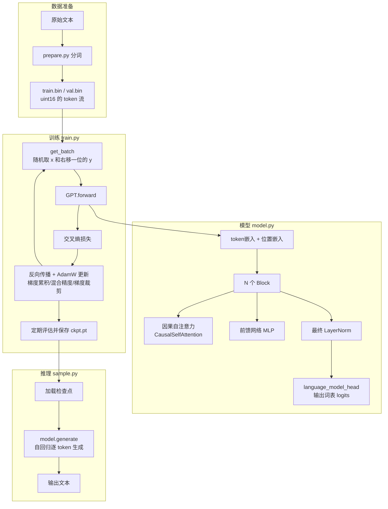

# nanoGPT · 面试准备

> 目标岗位：Coding Agent 研发工程师（以通用软件工程师能力为基础）
> 生成时间：2026-09-04
> 说明：本资料由 interview-prep 自动生成，全部内容基于对 `/home/xyz/nanoGPT` 真实源码的研读。**这是 Andrej Karpathy 的开源项目，你是"研读学习"，不是原创作者**——所有话术都按"我读懂了它、跟着跑通了、学到了什么"来组织，绝不要包装成自己设计的。面试前请自己过一遍，尤其注意标了"⚠️需确认"的地方。

---

## 一、项目概览

- **一句话定位**：nanoGPT 是 Andrej Karpathy 写的一个**极简、可读、能真正跑起来**的 GPT（GPT-2 级别）训练 / 微调 / 推理仓库。整个模型定义只有约 300 行（`model.py`），训练循环也只有约 300 行（`train.py`），却能在 8 卡 A100 上约 4 天从零复现出 GPT-2 124M。它的定位是"教学 + 实战两不误"——既能让初学者看懂 GPT 到底怎么搭、怎么训，又是真能出结果的工程代码。

- **你和这个项目的关系（务必如实说）**：你是**研读者**，不是作者。你做的事情是：把源码逐行读懂、把英文注释翻成中文、把缩写变量名（`n_layer`、`n_embd`、`wte` 等）全部改成完整全称（`number_of_layers`、`embedding_dimension`、`word_token_embedding` 等）以便自己理解，并**跟着源码从零训练跑通了一个 GPT**。简历上的原话是："学习了自注意力 / 下一 token 预测与训练全流程；跟随源码从零训练出 GPT-2。"面试时就照这个说，别揽成"我设计了 XX"。

- **核心功能**：
  - **从零训练**：`python train.py config/train_shakespeare_char.py` 就能在几分钟内训一个字符级的"莎士比亚小 GPT"。
  - **复现 GPT-2**：`torchrun --nproc_per_node=8 train.py config/train_gpt2.py` 在多卡上复现 GPT-2 124M。
  - **加载 OpenAI 预训练权重**：`GPT.from_pretrained('gpt2-xl')` 把 HuggingFace 上的 GPT-2 权重搬进本项目的模型结构。
  - **微调（finetune）**：从预训练权重出发、用小学习率在新数据上接着训。
  - **采样 / 推理**：`python sample.py` 让训练好的模型自回归地续写文本。

- **最主要的一条执行链路**：
  准备数据（`data/*/prepare.py` 把原始文本切成 token、存成 `train.bin`）→ 训练（`train.py` 反复"取一批 token → 前向算 loss → 反向传播 → 更新参数"，中间定期评估、存检查点）→ 采样（`sample.py` 加载检查点，用 `model.generate()` 一个 token 一个 token 地生成文本）。

- **我在其中的角色 / 主要工作**：研读、注释、重命名变量以吃透原理，并实际跑通了训练与采样全流程。⚠️需你补充：你到底在**哪种数据集、哪台机器**上跑通的（是字符级莎士比亚小模型，还是别的？CPU 还是 GPU？），面试被问"你自己跑出来了什么"时要能报出真实的 loss 数值和样本效果。

---

## 二、架构与技术栈讲解【板块①】

### 2.1 目录 / 模块结构

```
nanoGPT/
├── model.py          # 【核心】GPT 模型定义：自注意力、MLP、Block、GPT 主类、加载预训练权重、生成
├── train.py          # 【核心】训练主循环：数据加载、DDP、梯度累积、混合精度、学习率调度、存检查点
├── sample.py         # 推理 / 采样脚本：加载检查点，自回归生成文本
├── configurator.py   # "穷人版"配置器：用 exec 把命令行 / 配置文件里的值覆盖进全局变量
├── bench.py          # 性能基准测试：只保留训练循环最核心的部分，用来测速 / profiling
├── config/           # 各种现成的配置文件（改写全局超参数）
│   ├── train_shakespeare_char.py  # 字符级莎士比亚小模型（调试 / 玩耍用）
│   ├── train_gpt2.py              # 复现 GPT-2 124M 的配置
│   ├── finetune_shakespeare.py    # 从 gpt2-xl 微调
│   └── eval_gpt2*.py              # 只评估、不训练，拿 OpenAI 权重做基线
└── data/             # 各数据集的准备脚本
    ├── shakespeare_char/prepare.py  # 字符级：直接把每个字符映射成整数
    ├── shakespeare/prepare.py       # 用 GPT-2 的 BPE 分词
    └── openwebtext/prepare.py       # 大规模：OpenWebText + BPE，产出约 90 亿 token
```

**每个主要模块一句话职责**：
- `model.py` 是"模型长什么样"；`train.py` 是"怎么把它训出来"；`sample.py` 是"训好后怎么用它生成"。这三个文件是全部重点，其余都是配套（配置、数据准备、测速）。

### 2.2 核心数据流 / 执行链路

**训练时的一步（一次迭代）具体发生了什么**（这是最该讲清的一条链路）：

1. `get_batch('train')` 从 `train.bin`（用 `numpy.memmap` 内存映射，不真正读进内存）里**随机挑若干个起点**，各截 `block_size` 长度的一段 token 作为输入 `x`，把**同一段整体右移一位**作为目标 `y`（这就是"下一 token 预测"的监督信号）。
2. `x` 进入 `GPT.forward`：先查 **token 嵌入** + **位置嵌入**相加，然后过 N 个 `Block`（每个 Block = 因果自注意力 + MLP，都带残差和 Pre-LN），最后过一层 LayerNorm。
3. 用 `language_model_head` 把每个位置的向量投影成整个词表上的分数（logits），和目标 `y` 算**交叉熵损失**。
4. 反向传播算梯度（中间用梯度累积模拟大 batch、用混合精度加速、用梯度裁剪防爆炸），AdamW 更新参数。
5. 每隔一段迭代在训练 / 验证集上评估 loss，好于历史最优就把权重存成检查点 `ckpt.pt`。



### 2.3 技术栈

| 技术 | 在本项目里干嘛 | 为什么用它（选型理由） |
|---|---|---|
| **Python** | 全项目唯一语言，写模型、训练、推理 | 深度学习生态的事实标准，PyTorch / HuggingFace 都是 Python |
| **PyTorch** | 定义模型（`torch.nn`）、自动求导、优化器、训练 | 动态图、调试直观、社区最大；本项目还用到 2.0 的 `torch.compile` 和 Flash Attention |
| **PyTorch DDP** (`DistributedDataParallel`) | 多卡 / 多机并行训练 GPT-2 | 数据并行里最成熟的方案，每张卡跑一份模型副本、只在反向时同步梯度 |
| **torch.compile**（PyTorch 2.0） | 一行代码把模型编译加速 | 把迭代时间从约 250ms 降到约 135ms，几乎白捡的提速 |
| **Flash Attention**（`scaled_dot_product_attention`） | 高效算注意力 | PyTorch ≥ 2.0 内置的融合 CUDA 核，省显存、更快；不可用时回退到手写注意力 |
| **AMP 混合精度**（autocast + GradScaler） | 用 bfloat16 / float16 训练 | 省显存、提速；float16 下用 GradScaler 防止小梯度下溢 |
| **NumPy**（`memmap`） | 数据加载：把 GB 级 token 文件内存映射进来 | `memmap` 不把整个文件读进内存，按需从磁盘取，省内存 |
| **tiktoken** | GPT-2 的 BPE 分词器 | OpenAI 官方的快速 BPE 实现，和真 GPT-2 词表完全一致 |
| **HuggingFace transformers** | 加载 OpenAI 的 GPT-2 预训练权重 | 权重现成、格式统一，`from_pretrained` 直接拉下来 |
| **HuggingFace datasets** | 下载 + 预处理 OpenWebText | 大规模数据集的标准加载库，支持多进程 `.map()` |
| **wandb**（可选） | 训练指标可视化 | 云端看 loss / 学习率 / MFU 曲线，默认关闭 |

> 面向初学者补一句：这里几乎没有"自研框架"，nanoGPT 的哲学就是**能用成熟库就用**、把代码压到最少最透明。面试时这点本身就是一个能讲的观点——"它教会我大道至简，模型主干加起来不过几百行"。

---

## 三、针对本项目的面试题 + 参考答案【板块②】

> 每题标：难度（基础/进阶/深挖）· 考察点。因为这是研读项目，出题侧重"你学到了什么、它是怎么实现的、你跑通了什么"，而不是"你为什么这么设计"。参考答案都能背能复述。

### 3.1 项目整体类

**Q1.（基础 · 表达能力）请简单介绍一下 nanoGPT 这个项目，以及你在里面做了什么。**
参考答案：nanoGPT 是 Karpathy 写的一个极简 GPT 训练仓库，核心就两个文件——`model.py` 用约 300 行定义了一个 GPT-2 级别的 Transformer，`train.py` 用约 300 行写了完整的训练循环。它小到能一口气读完，又强到能在多卡上真的复现出 GPT-2 124M。我不是它的作者，我是拿它来**系统学习大模型底层**的：我把源码逐行读懂、英文注释翻成中文、还把所有缩写变量名改成完整全称帮自己理解，并**跟着它从零训练跑通了一个 GPT、用 `sample.py` 生成了文本**。通过这个项目我把"自注意力怎么算、下一 token 预测是什么、一个 GPT 从数据到训练到推理的全流程"这套东西彻底吃透了。

**Q2.（基础 · 表达能力）这个项目最核心解决的问题是什么？**
参考答案：它解决的是"**怎么用最少、最可读的代码，把一个能用的 GPT 训出来**"。市面上像 HuggingFace 那样的框架功能强但层层封装，初学者很难看清 GPT 内部到底发生了什么。nanoGPT 把这些抽象全剥掉，让你能直接看到嵌入、注意力、损失、反向传播每一步，同时又保留了 DDP、混合精度这些真实工程里必须的东西。所以它既是教材也是脚手架。

**Q3.（进阶 · 整体理解）从一段原始文本到一个能生成文字的模型，中间要经过哪几大步？**
参考答案：三大步。第一步**数据准备**：`prepare.py` 把原始文本切成 token（字符级就是每个字符映射成一个整数，正式版用 GPT-2 的 BPE 分词），存成一长串 `uint16` 的 `train.bin`。第二步**训练**：`train.py` 反复地"随机取一批 token → 前向算出下一 token 的预测和损失 → 反向传播 → AdamW 更新参数"，每隔一段评估一次并把最好的权重存成检查点。第三步**采样**：`sample.py` 加载检查点，用 `generate()` 从一个起始提示开始，一个 token 一个 token 地往后续写。

### 3.2 技术理解类（原"技术选型"，研读项目侧重理解而非自己选型）

**Q4.（进阶 · 分词理解）项目里有两种数据准备方式，字符级和 BPE，它们有什么区别？**
参考答案：字符级（`shakespeare_char/prepare.py`）就是把出现过的每个字符去重排序，直接编号，莎士比亚数据集一共才 65 个不同字符，所以词表只有 65。好处是简单、词表极小，坏处是一个"词"要拆成很多字符、序列变长、模型要花容量去学拼写。BPE（`openwebtext/prepare.py` 用 `tiktoken` 的 gpt2 编码）是"子词"分词，常见词是一个 token、生僻词拆成几块，GPT-2 的词表是 50257，能用更短的序列表达同样的文本，是真 GPT-2 用的方案。项目里字符级是拿来快速调试玩耍的，BPE 是拿来正经复现 GPT-2 的。

**Q5.（进阶 · 数值理解）配置里词表大小写的是 50304，可 GPT-2 的 BPE 词表是 50257，为什么？**
参考答案：50304 是把 50257 **向上取整到 64 的倍数**得到的。多出来的那几十个 token 永远不会被用到，但让词表大小变成 64 的整数倍能让 GPU 上的矩阵运算对齐得更好、跑得更快。这是个纯粹为了效率的小技巧，源码注释里明确写了"rounded up for efficiency"。

**Q6.（深挖 · 优化器理解）为什么 AdamW 里要把参数分成"衰减"和"不衰减"两组？**
参考答案：`configure_optimizers` 里把所有**二维及以上的参数**（矩阵乘法的权重、嵌入表）归到"做权重衰减"这组，把**一维参数**（各种 bias、LayerNorm 的缩放和平移）归到"不做权重衰减"这组。原因是权重衰减本质是 L2 正则、防止权重过大导致过拟合，它对承担大量表达的权重矩阵有意义；但 bias 和 LayerNorm 的参数数量少、作用是平移 / 缩放，对它们做衰减反而会干扰归一化的正常工作、几乎没有正则收益。这是 GPT 系训练的常规做法。

### 3.3 实现细节类（核心，考你是不是真读懂了）

**Q7.（深挖 · 自注意力实现）因果自注意力在代码里具体是怎么算的？请顺着 `CausalSelfAttention.forward` 讲。**
参考答案：输入 `x` 形状是（批, 序列长度, 嵌入维度）。第一步，用一个 `combined_query_key_value_projection`（一个把宽度放大 3 倍的 Linear）**一次性**算出 Q、K、V，再 `split` 成三份——把 Q/K/V 打包成一次矩阵乘法是为了效率。第二步，把每个的最后一维拆成"多个头 × 每头维度"，并把头那一维换到前面，变成（批, 头数, 序列, 每头维度），这样每个头就能独立算注意力。第三步算注意力：`Q @ K 转置` 得到每个位置对每个位置的相关性分数，除以 `sqrt(每头维度)` 做缩放，然后**用因果掩码把每个位置右边（未来）的分数置成负无穷**，再 softmax 变成权重，最后 `权重 @ V` 得到输出。第四步把多头结果拼回去、过一个输出投影 `output_projection`。项目里如果 PyTorch ≥ 2.0，这一整套用一行 `scaled_dot_product_attention`（Flash Attention）搞定；否则走手写版本。

**Q8.（深挖 · 因果掩码）"因果"两个字体现在哪？为什么必须有这个掩码？**
参考答案：因果 = 每个位置只能看它自己和它左边的 token，不能偷看右边（未来）。代码里手写版本用一个下三角矩阵 `causal_mask`，把上三角（未来位置）对应的注意力分数 `masked_fill` 成负无穷，softmax 之后这些位置权重就变成 0。用 Flash Attention 时则是传 `is_causal=True` 让底层核自动做这件事。之所以必须有它，是因为 GPT 的训练目标是"根据前文预测下一个词"，如果模型在预测第 t 个词时能看到第 t 个甚至后面的词，那就等于抄答案，训出来的模型推理时根本不能用——推理时未来还没生成呢。

**Q9.（进阶 · 下一 token 预测）"下一 token 预测"在数据和损失上具体怎么落地的？**
参考答案：数据上，`get_batch` 取一段长为 `block_size` 的 token 作为输入 `x`，把**同一段整体右移一位**作为标签 `y`——也就是 `x` 的第 i 个位置，它的标签就是原文里紧跟其后的那个 token。模型 `forward` 对每个位置输出整个词表上的分数 logits，然后用**交叉熵**把"模型预测的下一 token 分布"和"真实的下一 token"对齐。所以一次前向，序列里**每个位置都在同时被训练去预测它的下一个 token**，监督信号非常密集，这也是语言模型能高效自监督学习的关键。

**Q10.（进阶 · Block 结构）一个 Transformer Block 内部是什么结构？残差和 LayerNorm 怎么放的？**
参考答案：一个 Block 有两个子层——先是因果自注意力，后是 MLP（前馈网络）。代码里是 `x = x + attention(LN(x))`，再 `x = x + mlp(LN(x))`。两个要点：一是**残差连接**（那个 `x +`），让梯度能直接抄近路传回去，缓解深层网络梯度消失；二是 **Pre-LN**（LayerNorm 放在子层之前、残差之外），这比原始 Transformer 的 Post-LN 训练更稳定，是 GPT-2 的做法。MLP 内部是"升维到 4 倍 → GELU 激活 → 降回原维度"，负责逐个位置地把信息加工得更深。

**Q11.（进阶 · 生成过程）`model.generate` 是怎么一步步生成文本的？temperature 和 top_k 是干嘛的？**
参考答案：`generate` 是个循环，每轮做四件事：把当前序列喂给模型、只取**最后一个位置**的 logits、按规则挑一个 token、把它拼到序列末尾再进入下一轮——这就是"自回归"。挑 token 时：先把 logits 除以 `temperature`（温度），温度小于 1 会让分布更尖锐、生成更保守稳定，大于 1 更平、更随机；`top_k` 是只保留概率最高的 k 个候选、其余置成负无穷，避免采到长尾的乱词；最后 softmax 成概率、用 `multinomial` **随机采样**一个。另外如果序列长度超过 `block_size`，会把最前面截掉只留最近的一段。

**Q12.（深挖 · 权重共享）什么是权重共享（weight tying）？项目里哪里用了？**
参考答案：代码里 `word_token_embedding.weight = language_model_head.weight`，把**输入的 token 嵌入表**和**输出层（预测词表分数的那个 Linear）的权重**设成同一个张量。直觉是：输入端"把 token 变成向量"和输出端"把向量变回 token 分数"本质是一件事的正反两面，让它们共享一套参数既省下一大块参数量（词表 50304 × 维度 768，几千万参数），实践中效果也往往更好。这是 GPT-2 就在用的标准技巧。

**Q13.（深挖 · 权重加载）`from_pretrained` 是怎么把 HuggingFace 的 GPT-2 权重塞进本项目模型的？有什么坑？**
参考答案：思路是"按名字和形状逐个对齐拷贝"。它先按 model_type 建一个同样结构的空模型，再从 HuggingFace 加载 GPT-2，然后遍历权重一个个 `copy_` 过来。两个坑：一是**命名不同**，HuggingFace 用的是缩写旧键名（`wte`、`c_attn` 等），本项目改成了全称，所以有一张映射表做键名翻译；二是**Conv1D 的转置**——OpenAI 原版某些层用的是 `Conv1D` 而不是普通 `Linear`，权重矩阵是转置存的，所以这几个特定权重拷贝时要先 `.t()` 转置一下，否则形状对不上。全程还用 `assert` 校验数量和形状，对不上直接报错。

### 3.4 训练工程 / 难点类

**Q14.（进阶 · 大 batch）显存装不下大 batch 怎么办？项目里的梯度累积是怎么做的？**
参考答案：用**梯度累积**。真实想要的 batch 很大（GPT-2 配置里总 batch 约 50 万 token），单卡显存放不下，就把它拆成很多个"微批"（micro-batch），每个微批照常前向反向、但**不立刻更新参数**，梯度会自动在 `.grad` 上累加，攒够 `gradient_accumulation_steps` 个微批后才 `optimizer.step()` 更新一次。有个细节：因为损失最后要对这些微批求平均，代码里把每个微批的 loss 先除以累积步数再反向，这样累加起来正好等于平均梯度。效果上等于用小显存模拟了大 batch。

**Q15.（进阶 · 多卡）项目怎么做多卡训练的？DDP 大概原理是什么？**
参考答案：用 PyTorch 的 DDP（DistributedDataParallel），靠 `torchrun` 启动多个进程、每个进程绑一张卡。原理是**数据并行**：每张卡上有一份完整的模型副本，各自吃不同的数据算各自的梯度，然后在反向传播时通过 all-reduce 把所有卡的梯度**求平均并同步**，保证每张卡更新后参数还是一致的。项目里有个小优化：梯度累积时只在**最后一个微批**才同步梯度（中间的微批不用同步，省通信），是通过手动切 `require_backward_grad_sync` 这个开关实现的。另外只有主进程（rank 0）负责打日志和存检查点。

**Q16.（深挖 · 混合精度）混合精度训练是什么？为什么 float16 要用 GradScaler 而 bfloat16 不用？**
参考答案：混合精度就是训练时用 16 位浮点代替 32 位来算，省显存、提速，靠 `torch.autocast` 自动在合适的算子上切换精度。float16 和 bfloat16 的区别在于：float16 表示范围窄，很小的梯度容易**下溢变成 0**，所以要用 `GradScaler` 先把 loss 放大一个倍数、反向后再把梯度缩小回去，避免小梯度丢失；bfloat16 的指数位和 float32 一样多、动态范围大，基本不会下溢，所以不需要 GradScaler。项目里根据硬件是否支持 bf16 自动选，代码里 GradScaler 只在 float16 时 `enabled=True`。

**Q17.（进阶 · 学习率）项目用的学习率是固定的吗？调度策略是什么？**
参考答案：不是固定的，用的是"**带预热的余弦衰减**"。前 `warmup_iterations` 步学习率从 0 **线性升**到设定的最大值（预热，避免一开始梯度乱、参数被带偏）；之后按**余弦曲线平滑地降**到一个最小学习率（约为最大值的十分之一）；再往后就固定在最小值。预热 + 余弦衰减是 GPT 类训练的标配，`get_learning_rate` 函数把这三段逻辑写得很清楚。

**Q18.（进阶 · 稳定性）训练里做了哪些防止"训崩"的措施？**
参考答案：至少四个。一是**梯度裁剪**（`clip_grad_norm_`），把梯度范数限制在 1.0 以内，防止偶发的超大梯度把参数一步带飞。二是**学习率预热**，开头小步走。三是**残差 + Pre-LN** 的结构本身就利于稳定训练。四是**残差投影层的特殊初始化**——按 GPT-2 论文，输出投影层的初始化标准差要额外除以 `sqrt(2 × 层数)`，因为残差会不断累加，层数越深越要把每层贡献调小，否则激活值会随深度爆炸。

### 3.5 延伸拷打类（往底层 / LLM 八股钻，衔接板块③）

**Q19.（深挖 · 缩放）注意力分数为什么要除以 sqrt(每头维度)？**
参考答案：Q 和 K 做点积时，维度越高、点积的数值方差越大，值会很大。如果直接送进 softmax，大的值会让 softmax 变得极度尖锐（接近 one-hot），梯度就非常小、几乎学不动。除以 `sqrt(每头维度)` 是把点积的方差重新归一化到合理范围，让 softmax 不至于饱和，梯度健康。这就是 "Scaled Dot-Product Attention" 里 "Scaled" 的由来。（详见板块③自注意力部分。）

**Q20.（深挖 · 多头）为什么要"多头"注意力，而不是一个大注意力？**
参考答案：多头就是把嵌入维度切成若干份，每份独立算一套注意力，最后拼起来。好处是不同的头可以**关注不同的模式**——比如有的头盯着语法上邻近的词、有的头盯着长距离的指代关系，相当于集成了多个不同视角的注意力，表达力更强。而总的计算量和单头是差不多的（因为每头维度变小了）。项目里 `number_of_attention_heads` 就是头数，必须能整除嵌入维度。

**Q21.（深挖 · 位置信息）Transformer 本身不知道词的顺序，nanoGPT 怎么告诉模型位置？**
参考答案：靠**位置嵌入**（`word_position_embedding`）。自注意力对输入是"置换不变"的——打乱顺序算出来一样，所以必须额外注入位置信息。nanoGPT 用的是**可学习的绝对位置嵌入**：为 0 到 block_size-1 每个位置学一个向量，和 token 嵌入**相加**后再进 Transformer。这是 GPT-2 的原始做法。（补一句加分项：更新的模型如 LLaMA 用的是旋转位置编码 RoPE，README 的 todo 里也提到想引入 rotary / alibi，说明绝对位置嵌入是相对老的方案。）

**Q22.（深挖 · 效率）Flash Attention 为什么能又快又省显存？**
参考答案：普通注意力要显式地把那个（序列 × 序列）的注意力权重大矩阵**存进显存**，序列一长这个矩阵就爆炸（显存和序列长度成平方）。Flash Attention 的核心是**不把完整的大矩阵落地**——它用分块（tiling）的方式，在 GPU 的高速片上内存里一块一块地算注意力并累加结果，避免了对慢速显存的大量读写。所以它省显存（不存 N×N 矩阵）、也更快（减少显存搬运，而注意力本来就是"搬数据"瓶颈而非"算"瓶颈）。项目里通过 `scaled_dot_product_attention` 一行就用上了。⚠️需确认：底层实现细节（如 online softmax）如果被追问，坦白说"我知道它是分块 + 不落地大矩阵，更细的核函数实现我没深入"，别硬编。

### 3.6 改进 / 反思类

**Q23.（进阶 · 局限）nanoGPT 相比现在主流的大模型，有哪些"过时"或简化的地方？**
参考答案：几个明显的。位置编码用的是老的**绝对位置嵌入**，现在主流是 **RoPE**；归一化用的是 **LayerNorm**，现在很多模型用更省的 **RMSNorm**；激活用 **GELU**，新模型常用 **SwiGLU**；注意力是标准多头，没有 **GQA / MQA** 这类推理省显存的变体；也没有 KV Cache 加速推理（`generate` 每步都重算整个前缀）。另外它的定位就是教学 + 复现 GPT-2，没有指令微调 / RLHF 这些让模型"会聊天"的后训练环节。README 顶部作者也说了它已经比较老、有个新版叫 nanochat。

**Q24.（进阶 · 推理优化）如果让你优化 `generate` 的推理速度，你会想到什么？**
参考答案：最直接的是加 **KV Cache**。现在 `generate` 每生成一个新 token，都要把**整个已生成的前缀**重新前向一遍，里面 K、V 被反复重算，非常浪费。KV Cache 的思路是把每一步算过的 K、V 存下来，下一步只需要为**新的那一个 token**算 Q、K、V，再和缓存的历史 K、V 做注意力，把每步的计算从"随序列长度线性"降到"接近常数"。这是所有推理框架的标配优化。⚠️需确认：nanoGPT 原版 `generate` 确实没有实现 KV Cache（我读到的代码里每步都重跑整个前缀），面试可以据此答"它没做，但我知道该怎么加"。

**Q25.（基础 · 反思）通过研读这个项目，你最大的收获是什么？**
参考答案：最大的收获是"**把 LLM 从一个黑盒变成了看得见内部的白盒**"。以前我只会调 API，读完 nanoGPT 之后，自注意力到底怎么算、下一 token 预测的监督信号从哪来、一个模型从数据到训练到推理每一步在干什么，我都能画出来讲出来。而且它让我体会到工程上的"大道至简"——真正的核心逻辑其实很短，复杂度更多来自并行、混合精度这些工程优化。作为想做 Coding Agent 的人，理解模型底层能力边界（比如上下文长度限制、为什么会幻觉、推理成本从哪来）对我设计上层 Agent 很有帮助。

---

## 四、通用知识点深挖【板块③】

> 只覆盖本项目真实用到的技术。每点：是什么 → 为什么 → 常见陷阱 → 面试官会怎么追问。这是 Coding Agent 岗最可能拷打的一块，重点背。

### 4.1 自注意力（Self-Attention）与 Transformer

**是什么**：自注意力是一种让序列里**每个位置都能"看"其他位置、并按相关性加权汇聚信息**的机制。每个 token 生成三个向量：Query（我想找什么）、Key（我是什么）、Value（我能提供什么信息）。用我的 Q 去和所有位置的 K 做点积得到"相关性分数"，softmax 归一化成权重，再用这些权重去加权求和所有位置的 V，就得到了"融合了上下文的新表示"。

**为什么**：在它之前主流是 RNN，必须一个词一个词顺序处理、长距离依赖会衰减、还不能并行。自注意力一步就让任意两个位置直接交互（长距离依赖不衰减），而且整个序列可以**并行**计算，这是 Transformer 能训得又大又快的根本原因。

**几个关键细节**（面试高频）：
- **为什么除以 sqrt(d)**：见 Q19，防止点积过大导致 softmax 饱和、梯度消失。
- **多头**：见 Q20，切成多份关注不同模式，表达力更强、计算量不变。
- **因果掩码**：见 Q8，GPT 这类生成模型只能看左边，靠下三角掩码把未来位置置负无穷。
- **计算复杂度**：注意力是序列长度 N 的 **平方** 复杂度（要算 N×N 的分数矩阵），这也是为什么长上下文这么贵、Flash Attention 这么重要。

**常见陷阱**：把"自注意力"和"注意力"混为一谈（自注意力是 Q/K/V 都来自同一个序列；还有 cross-attention 是 Q 来自一个序列、K/V 来自另一个）；忘了位置信息要单独注入。

**会怎么追问到底**：自注意力复杂度多少 → 怎么优化长序列（Flash Attention / 稀疏注意力 / 线性注意力）→ 多头的头数怎么定 → 手写一下注意力公式 `softmax(QKᵀ/√d)V`。

### 4.2 下一 token 预测与语言模型训练目标

**是什么**：GPT 是**自回归语言模型**，训练目标就一句话——**根据前面所有 token，预测下一个 token**。模型对每个位置输出一个覆盖整个词表的概率分布，用交叉熵损失去逼近"真实的下一个 token"。

**为什么这么强**：它是**自监督**的——不需要人工标注，任何一段文本，把它右移一位就天然构成了"输入 → 标签"对。而且一次前向里序列每个位置都在被训练（监督信号密集）。海量无标注文本 + 这个简单目标，就能让模型学到语法、事实、推理等一大堆能力，这就是"预训练"。

**常见陷阱**：把语言模型的 loss（交叉熵）和"准确率"搞混——LM 关心的是整个分布，常用 **perplexity（困惑度，等于 loss 取指数）** 衡量；以为预测下一个词很"低级"，其实要预测对下一个词往往需要理解全文语义。

**会怎么追问到底**：交叉熵损失公式 → 什么是 perplexity → 预训练和微调 / 指令微调 / RLHF 的关系 → 为什么 next-token prediction 能涌现出推理能力（开放题，答"密集自监督 + 规模效应"即可）。

### 4.3 GPT 训练全流程（预训练视角）

把 nanoGPT 里读到的串成一条完整的训练认知：

1. **数据 → token**：原始文本经分词器（BPE）变成整数序列，拼成一个大 `.bin`。
2. **取批**：随机截取定长片段，输入 `x` 和右移一位的标签 `y`。
3. **前向**：token 嵌入 + 位置嵌入 → N 层 Transformer Block → 输出每个位置的词表 logits。
4. **算损失**：logits 和 y 做交叉熵。
5. **反向 + 更新**：反向传播算梯度，AdamW 更新参数。中间叠加**梯度累积**（模拟大 batch）、**混合精度**（省显存提速）、**梯度裁剪**（防爆炸）、**DDP**（多卡并行）。
6. **调度**：学习率带预热的余弦衰减。
7. **评估 + 存档**：定期在验证集上评 loss，最优时存检查点。

**常见陷阱 / 高频追问**：
- **AdamW vs Adam**：AdamW 把权重衰减和梯度更新解耦，正则更干净，是 Transformer 标配。
- **为什么要 warmup**：开头模型随机、梯度噪声大，大学习率容易把参数带崩，先小步预热。
- **梯度累积 vs 真大 batch**：数学上近似等价（都是平均更多样本的梯度），区别是累积用时间换显存。
- **过拟合**：小数据集（如字符级莎士比亚）会过拟合，靠 dropout、只在验证 loss 变好时存档来缓解。

### 4.4 分词（Tokenization）与 BPE

**是什么**：把文本切成模型能处理的最小单元（token）。BPE（Byte Pair Encoding，字节对编码）是一种"**子词**"分词：从字符开始，反复把最高频的相邻组合合并成一个新单元，最终常见词是一个 token、生僻词拆成几块。

**为什么**：字符级序列太长、单词级词表太大又处理不了没见过的词；子词是二者的折中，既能覆盖任意文本（罕见词拆开）、序列又不会太长。GPT-2 用的就是 BPE，词表 50257。

**常见陷阱**：token 不等于"词"也不等于"字符"，一个英文单词可能是 1 个 token、一个中文字可能是 2-3 个 token——这直接关系到**上下文长度和 API 计费**（都是按 token 算）。这对 Coding Agent 岗尤其相关：代码里的缩进、符号都会吃 token。

**会怎么追问到底**：为什么不用字符级或词级 → BPE 怎么训出来的 → 中文为什么费 token → 上下文窗口和 token 的关系。

### 4.5 混合精度、DDP、torch.compile（训练工程三件套）

**混合精度**：见 Q16。核心记住 float16 需要 GradScaler 防下溢、bfloat16 动态范围大不需要。追问点：bf16 和 fp16 的位分布区别、什么算子必须保持 fp32（如 softmax、loss 累加）。

**DDP（数据并行）**：见 Q15。核心记住"每卡一份模型副本、反向时 all-reduce 同步平均梯度"。追问点：DDP vs 模型并行 / 张量并行 / 流水线并行（数据并行是复制模型切分数据，模型并行是切分模型本身，超大模型放不下单卡时才需要）；DDP vs 老的 DataParallel（DDP 多进程、更快，DP 单进程多线程、受 GIL 限制）。

**torch.compile**：PyTorch 2.0 把动态图**编译**成优化后的核函数（算子融合、减少 Python 开销），一行代码把迭代时间从约 250ms 降到约 135ms。追问点：编译为什么第一次很慢（要 trace + 编译）、什么情况会触发重新编译（输入形状变化）。

### 4.6 Python 相关（岗位基础，可能被顺带问）

- **`numpy.memmap`（内存映射）**：把磁盘文件当数组用但**不一次性读进内存**，按需从磁盘取页。项目用它加载 GB 级 token 文件。追问点：为什么每次取 batch 都重建 memmap（源码注释说是防内存泄漏）。
- **`exec` 动态执行**：`configurator.py` 用 `exec(open(...).read())` 把配置文件 / 命令行参数直接改进全局变量。这是个"反面教材式"的骚操作，作者自己都吐槽"probably a terrible idea"。追问点：`exec` 的风险（不可控、不安全、IDE 无法静态分析）、更好的替代（argparse、dataclass、hydra / OmegaConf 等配置库）。
- **装饰器**：`@torch.no_grad()`（关闭梯度计算，用于推理 / 评估省显存）、`@classmethod`（`from_pretrained`）、`@dataclasses.dataclass`（`GPTConfig` 自动生成 `__init__`）。追问点：装饰器本质是"接收函数、返回新函数"的高阶函数。

---

## 五、亮点与话术包装【板块④】

> 再次强调：这是研读项目，话术全部按"我学到了 / 我读懂了 / 我跑通了"来讲，**不要吹成自己原创设计**。亮点落在"学习深度、能把底层讲清楚、对 Coding Agent 岗有迁移价值"上。

### 5.1 一句话项目介绍（电梯稿）

"nanoGPT 是 Karpathy 那个极简 GPT 训练仓库，核心就两个几百行的文件。我把它当成学习大模型底层的教材，逐行读懂了它的实现——为了吃透还把英文注释翻成中文、把所有缩写变量名改成了完整全称——并跟着源码从零训练跑通了一个 GPT。通过它我把自注意力怎么算、下一 token 预测是什么、GPT 从数据到训练到推理的全流程彻底搞清楚了，现在这些我都能画出来讲出来。"

### 5.2 项目亮点（STAR 话术）

**亮点1：为吃透原理，重构可读性 + 逐行注释**
- S（情境）：我想真正搞懂 GPT 底层，但直接读源码时那些缩写变量名（`wte`、`n_embd`、`c_attn`）很劝退。
- T（任务）：把这份代码彻底读懂到"能给别人讲清楚"的程度。
- A（行动）：我把英文注释逐段翻成中文、把每个缩写变量名改成完整全称（如 `wte → word_token_embedding`、`n_layer → number_of_layers`），并给关键张量标注了形状变化。为了保证改名后代码还能加载官方 GPT-2 权重，我理解并保留了那套"旧键名 → 新键名"的映射兼容逻辑。
- R（结果）：现在整份代码对我是完全透明的，自注意力、权重共享、混合精度这些点我都能对着代码讲原理。这个过程本身就是最好的学习。

**亮点2：把"自注意力 + 下一 token 预测"从概念落到代码**
- S：很多人对自注意力停留在"背公式"。
- T：我要理解它在真实代码里到底怎么跑。
- A：我顺着 `CausalSelfAttention.forward` 把 Q/K/V 的打包投影、多头拆分、缩放点积、因果掩码、softmax 加权每一步都对应到了张量操作；又顺着 `get_batch` 理解了"输入右移一位当标签"就是下一 token 预测的监督信号。
- R：现在给我一段注意力代码我能读懂、给我一个 batch 我能说清每个位置在预测什么。面试里这种"能落到代码"的理解比背概念扎实得多。

**亮点3：跟着源码从零训练跑通 GPT**
- S：光读不练等于没懂。
- T：真的把训练跑起来、生成出文本。
- A：我准备好数据（`prepare.py`）、用配置文件启动 `train.py`、观察 loss 下降和 MFU、再用 `sample.py` 采样。⚠️需你补充具体：你跑的是哪个配置、什么设备、最终 loss 多少、生成效果如何。
- R：我完整走通了"数据 → 训练 → 检查点 → 采样"的闭环，对训练里的梯度累积、混合精度、学习率调度这些工程细节有了实感，而不只是名词。

**亮点4：理解了训练工程的一整套"提速 + 稳定"手段**
- S：GPT 训练不只是"搭个网络"，工程占很大比重。
- T：搞清楚 nanoGPT 里那些工程技巧分别解决什么问题。
- A：我逐个理解了梯度累积（用时间换显存模拟大 batch）、DDP（多卡数据并行、反向 all-reduce）、混合精度（bf16/fp16 + GradScaler）、梯度裁剪、带预热的余弦学习率、torch.compile 提速。
- R：这些是任何训练 / 推理系统的通用地基。对 Coding Agent 岗来说，理解模型训练和推理的成本从哪来（显存、上下文平方复杂度、token 计费），能帮我在设计 Agent 时做出更合理的取舍。

### 5.3 难点应对话术

| 面试官可能的质疑 | 应对话术 |
|---|---|
| "这不是你写的，是 Karpathy 的项目吧？" | 坦诚："对，这是我拿来**系统学习**大模型底层的开源项目，我没有揽成自己原创。我做的是把它读透——翻译注释、重命名变量帮理解、并从零跑通训练。我的价值在于**能把它每一部分的原理讲清楚**，而不是声称设计了它。" |
| "那你到底学到了什么，随便挑一点讲讲？" | 直接讲自注意力或下一 token 预测（板块③/Q7/Q9），顺着代码把 Q/K/V、因果掩码、右移一位标签讲出来——能落到代码就证明是真读懂了。 |
| "这项目很小，能体现什么能力？" | "小正是它的价值——它把 GPT 剥到只剩核心，让我能真正看清而不是面对黑盒。而且它一点不简单：DDP、混合精度、Flash Attention、权重共享这些真实工程手段都在，我都理解了它们解决什么问题。" |
| "现在的大模型跟它差挺远吧？" | 主动答出板块 Q23：位置编码、归一化、激活函数、注意力变体、KV Cache、后训练都有演进——**能说清差距本身就说明我了解前沿**，而不是只知道 nanoGPT。 |
| "你跑通的模型效果怎么样？" | 报真实数字（⚠️需你确认自己的实际结果）。比如字符级莎士比亚小模型官方参考是验证 loss 约 1.47、能生成有莎士比亚腔调但不完全通顺的文本——别夸大成"效果很好"。 |

### 5.4 面试前自测清单

- [ ] 能用 30 秒如实讲清"这是研读项目 + 我学到了什么"（电梯稿）
- [ ] 能对着脑子里的代码讲清 `CausalSelfAttention.forward` 每一步（Q7）
- [ ] 能讲清"下一 token 预测"在数据和损失上怎么落地（Q9）
- [ ] 能解释因果掩码为什么必须有（Q8）
- [ ] 能讲清一个 Transformer Block 的结构、残差、Pre-LN（Q10）
- [ ] 能解释 temperature / top_k / 自回归生成（Q11）
- [ ] 能讲清权重共享、from_pretrained 的键名映射与转置坑（Q12、Q13）
- [ ] 能讲清梯度累积、DDP、混合精度、学习率调度分别解决什么问题（Q14-Q18）
- [ ] 能答自注意力为什么除以 sqrt(d)、为什么多头、位置嵌入（Q19-Q21）
- [ ] 能说清 nanoGPT 相比主流大模型的"过时点"和 KV Cache 优化（Q23、Q24）
- [ ] 板块③每个知识点都能"是什么 + 为什么"讲一遍
- [ ] ⚠️需确认的点都已核对真实代码 / 补上自己的真实经历

---

## 附：待你确认 / 补充的点

> 这些是自动生成时拿不准、或需要结合你真实经历补全的地方，面试前务必处理：

- ⚠️ **你自己到底跑通了什么**：哪个配置（字符级莎士比亚？还是别的）、什么设备（CPU / GPU / 什么卡）、训练多久、最终 train/val loss 是多少、生成的文本长什么样。面试被问"你跑出来了什么"时这些必须是真数字，别用本文档里的官方参考值冒充自己的结果。
- ⚠️ **你有没有真的从零复现 GPT-2 124M**：那个需要 8 卡 A100 约 4 天，成本很高。如果你没跑过完整的 GPT-2 复现（很可能没有），简历那句"从零训练出 GPT-2"要小心措辞——诚实说法是"跟着源码从零训练出了一个 GPT（GPT-2 结构的小模型）并跑通了全流程"，别让面试官以为你复现了完整的 124M。这点被追问算力 / 时间时最容易露馅，提前想好怎么说。
- ⚠️ **Flash Attention 的底层核实现**（Q22）：你能说清"分块 + 不落地 N×N 矩阵"即可，被追问 online softmax 等更细的核函数细节时，坦白"没深入到 kernel 级"，别硬编。
- ⚠️ **KV Cache**（Q24）：本文档基于源码判断原版 `generate` **没有** KV Cache（每步重跑整个前缀）。面试可据此答"它没做，但我知道原理和该怎么加"——回答前你最好自己再扫一眼 `model.py` 的 `generate` 确认一下。
- ⚠️ **变量重命名是否影响加载官方权重**：你把变量名改成了全称，`model.py` 里有一套 `LEGACY_TO_CURRENT_*` 映射来兼容旧键名（含 HuggingFace 权重）。如果面试展示代码，确认你改名后 `from_pretrained` 和加载旧检查点仍然能跑通（源码逻辑上是兼容的，但如果你本地实测过就更有底气）。
