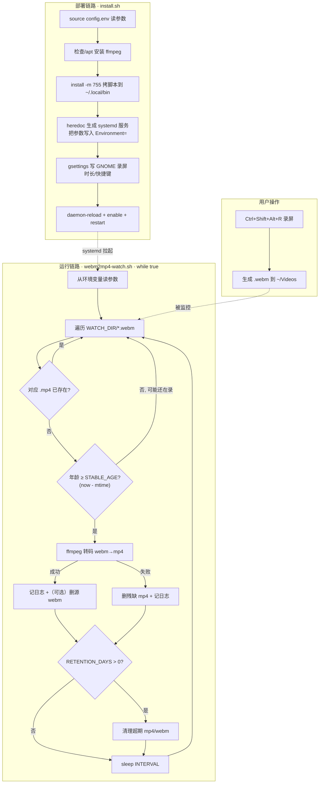

# webm2mp4-autoconvert · 面试准备

> 目标岗位：Coding Agent 研发工程师（以通用软件工程师能力为基础，侧重 Linux 系统编程 / Bash / 工程化）
> 生成时间：2026-09-04
> 说明：本资料由 interview-prep 流程针对真实代码生成，面试前请自己过一遍，**尤其注意标了「⚠️需确认」的地方**——那几处是简历口径和代码实现之间可能对不上、最容易被追问翻车的点。

---

## 一、项目概览

- **一句话定位**：一个跑在 Linux（Ubuntu + GNOME）桌面上的**常驻后台小工具**，补齐「用快捷键快速录屏 → 自动得到 mp4」这条闭环。GNOME 自带录屏只能输出 `.webm`，本工具用一个 systemd 用户服务常驻盯着录屏目录，录完就自动用 ffmpeg 转成通用性更好的 `.mp4`，并可选按保留期清理旧视频。

- **核心功能**：
  1. **目录监控**：以 5 秒粒度轮询 `~/Videos`，发现新的 `.webm`。
  2. **稳定性判断**：文件「一段时间没再变化」才认为录制结束，避免录到一半就转（防转半截）。
  3. **自动转码**：调用 ffmpeg 把 webm 转成 mp4（H.264 + AAC），转码成功后可选删除源 `.webm`。
  4. **保留期清理**：可选地删除监控目录里超过 N 天的视频，控制磁盘占用。
  5. **常驻与自恢复**：用 systemd 用户服务托管——开机自启 + 崩溃自动重启。
  6. **一键装/卸**：`install.sh` / `uninstall.sh` 把「装依赖 → 装脚本 → 生成服务 → 写 GNOME 设置 → 启动」整套自动化，且可重复运行（幂等）。

- **最主要的一条执行链路**：
  `Ctrl+Shift+Alt+R 录屏 → GNOME 生成 .webm 到 ~/Videos → webm2mp4-watch.sh 每 5s 扫描 → 检测文件稳定（修改时间 ≥ STABLE_AGE 秒没变）→ ffmpeg 转码为 .mp4 →（可选）删原 webB →（可选）清理超期视频 → sleep 5 循环`。

- **我在其中的角色 / 主要工作**：这是**你自己原创**的小工具，整套脚本（监控逻辑、安装/卸载自动化、配置中心、文档）都是你写的。⚠️需你补充：是否真的长期部署在自己机器上跑过、大概处理过多少段录屏、有没有踩过坑后改进——这些真实使用细节能让项目讲起来更可信。

- **项目规模（老实说）**：这是个**小而完整**的工具类项目，核心就 3 个 Bash 脚本 + 1 个配置文件 + 2 份文档，总代码量几百行。面试时**不要硬吹成大项目**，定位应该是「用 Linux 原生能力干净利落地解决一个真实的日常痛点，体现了对 systemd / Bash / ffmpeg / 桌面环境的综合工程掌控」。

---

## 二、架构与技术栈讲解【板块①】

### 2.1 目录 / 模块结构

```
webm2mp4-autoconvert/
├── config.env            # 配置中心：所有可调参数集中在这一个文件
├── webm2mp4-watch.sh     # 核心：常驻循环脚本（监控 + 转码 + 可选清理）
├── install.sh            # 一键安装：装依赖→装脚本→生成 systemd 服务→写 GNOME 设置→启动
├── uninstall.sh          # 一键卸载：停服务→删文件→（可选）恢复 GNOME 设置
├── README.md             # 项目说明
├── USAGE.md              # 面向初学者的完整使用指南
└── .gitignore            # 忽略 *.log 等运行时/临时文件
```

各模块一句话职责：

| 文件 | 职责 | 在整个项目里的作用 |
|---|---|---|
| `config.env` | 存放所有可调参数（监控目录、扫描间隔、稳定阈值、删/留开关、保留天数、GNOME 录屏时长与快捷键） | **单一配置源**。改行为只改这一个文件，然后重装即可，避免参数散落各处 |
| `webm2mp4-watch.sh` | 一个 `while true` 死循环：扫目录→判稳定→转码→（可选）删源/清理→sleep | **真正干活的进程**，被 systemd 拉起后常驻运行 |
| `install.sh` | 把工具「部署」到系统里，并把 config.env 的值注入服务 | **部署自动化**，让工具能在新机器上一键还原 |
| `uninstall.sh` | 干净移除 install 装的东西 | **可回退**，体现工程完整性 |

> 说人话：`config.env` 是「遥控器」，`webm2mp4-watch.sh` 是「干活的机器人」，`install.sh` 是「把机器人装到工厂里并接上电（systemd）」，`uninstall.sh` 是「把它拆走」。

### 2.2 核心数据流 / 执行链路

分两条线看：**部署链路**（install.sh 干的事）和**运行链路**（watch.sh 干的事）。

**部署链路**：`install.sh` `source config.env` 读入参数 → 检查/安装 ffmpeg → 用 `install -m 755` 把脚本拷到 `~/.local/bin/` → 用 heredoc 生成 `~/.config/systemd/user/webm2mp4.service`（把 config.env 的值写进 `Environment=` 行）→ 用 gsettings 写 GNOME 录屏时长/快捷键 → `daemon-reload` + `enable` + `restart` 启动服务。

**运行链路**：systemd 拉起 `webm2mp4-watch.sh` → 脚本从环境变量读参数 → 进入主循环：
1. 遍历 `WATCH_DIR/*.webm`；
2. 对每个文件：算对应的 `.mp4` 名，若已存在则跳过（幂等/去重）；
3. 用 `stat -c %Y` 取文件最后修改时间，算「年龄 = 现在 - 修改时间」，年龄 < `STABLE_AGE` 说明可能还在写，跳过；
4. 稳定的文件调 `ffmpeg` 转码，成功记日志、（可选）删源 webm；失败则删掉可能残缺的半截 mp4；
5. 若 `RETENTION_DAYS > 0`，清理超期的 mp4/webm；
6. `sleep INTERVAL`，回到步骤 1。



### 2.3 技术栈

| 技术 | 在本项目里干嘛 | 为什么用它（选型理由） |
|---|---|---|
| **Bash** | 写监控循环、安装/卸载逻辑、配置文件 | 任务本质是「文件轮询 + 调外部命令 + 系统集成」，Bash 是 Linux 上做这类「胶水/运维脚本」最直接的语言，零额外依赖，系统自带 |
| **systemd（用户服务）** | 托管常驻进程：开机自启 + 崩溃重启 | 需要一个「永远在后台跑、开机自动起、挂了自动拉起」的守护进程。systemd 是现代 Linux 的标准进程管理器，比自己写 `nohup &` + 看门狗靠谱得多 |
| **ffmpeg** | 真正做 webm→mp4 的转码 | 音视频转码的事实标准工具，命令行、开源、格式支持最全，一条命令搞定 |
| **gsettings** | 安装时写回 GNOME 录屏时长(1800s)、快捷键 | GNOME 桌面设置的官方命令行读写工具，让「录屏这半条链路」也能一键配好 |
| **cron（对比项，未采用）** | —— | 项目**特意没用 cron**：cron 最小粒度是 1 分钟，满足不了「5 秒扫一次」，所以改用「常驻 while 循环 + 自己 sleep 控制节奏」 |
| **stat / date / 文件通配（glob）** | 取修改时间、算时间戳、遍历文件 | Linux 基础命令，做「文件年龄判断」和「稳定性检测」的核心手段 |

> 面试提示：这套技术栈的关键词就是 **Linux 系统编程 + 进程守护 + Shell 工程化**，正好是 Coding Agent 岗（大量涉及在 Linux 环境里跑命令、管进程、处理文件）会重点考察的基本功。把每个技术「为什么用它、不用它的替代方案是什么」讲清楚，比堆功能更加分。

---

## 三、针对本项目的面试题 + 参考答案【板块②】

> 每题标：难度（基础/进阶/深挖）· 考察点。参考答案已结合本项目真实代码，尽量口语化、能背能复述。

### 3.1 项目整体类

**Q1.（基础 · 表达能力）请用一分钟介绍一下这个项目。**
参考答案：这是我自己写的一个 Linux 桌面小工具，解决一个具体痛点：GNOME 系统自带录屏很方便，一个快捷键就能录，但它**只能输出 webm 格式**，兼容性不如 mp4，很多播放器和剪辑软件不太认。我做的事情就是补上「录完自动转 mp4」这最后一环。技术上，我用一个 Bash 脚本写了个常驻循环，每 5 秒扫一次录屏目录，发现录完的 webm 就用 ffmpeg 转成 mp4；这个脚本用 systemd 用户服务托管，实现开机自启和崩溃自动重启。另外我配了一套 config.env + install.sh，把「装依赖、装脚本、生成服务、配 GNOME 快捷键」全自动化，在新机器上一条命令就能还原整套工作流。项目不大，但它把 Bash、systemd、ffmpeg、桌面环境集成这些 Linux 工程能力串成了一个干净的闭环。

**Q2.（基础 · 动机）你为什么要做这个项目？它解决的问题真实吗？**
参考答案：非常真实，是我自己录屏时天天遇到的麻烦。我经常要录屏做演示/记录，GNOME 录屏快捷键很顺手，但每次录完拿到的是 webm，我还得手动开 ffmpeg 敲一长串命令转 mp4，重复又烦。所以我干脆把这个动作自动化成后台服务，录完几秒钟 mp4 就自动出来了，我完全不用管。做这个还有个附带目的是练手——把 systemd 服务、Bash 健壮性、ffmpeg 参数这些平时零散接触的东西，用一个完整项目串起来吃透。

**Q3.（进阶 · 边界认知）这个项目你觉得最大的难点/最花心思的地方是什么？**
参考答案：技术上没有惊天动地的难点，它就是个小工具。但真正要做「稳」，有两个点我花了心思：一是**怎么判断「录制真的结束了」**——不能一看到 webm 就转，否则会转到一段还在录、只写了一半的文件。我的做法是判断文件「一段时间没再被修改」才动它。二是**守护进程的健壮性**——它要 7×24 常驻，不能因为某一次转码失败就整个挂掉，也要能开机自启、崩溃自恢复，这块是靠 systemd + 脚本里对失败的容错处理配合做的。

### 3.2 技术选型类

**Q4.（进阶 · 选型）为什么用 systemd 服务，而不是用 cron 定时任务？**
参考答案：核心原因是**粒度**。我要每 5 秒扫一次目录，而 cron 的最小调度粒度是 1 分钟，根本做不到 5 秒。所以我换了个思路：不让调度器反复拉起脚本，而是**脚本自己写一个 `while true` 死循环、内部 `sleep 5` 控制节奏**，一直常驻；然后把「常驻」这件事交给 systemd 管——它负责开机自动启动（`WantedBy=default.target`）和崩溃自动重启（`Restart=on-failure`）。这样既拿到了 5 秒粒度，又拿到了守护进程该有的自启和自恢复能力。cron 适合「每隔较长时间跑一次性任务」，我这个是「持续监控」，天然更适合常驻服务模型。

**Q5.（进阶 · 选型）为什么用 ffmpeg？webm 和 mp4 到底差在哪，为什么非转不可？**
参考答案：ffmpeg 是音视频转码的事实标准，命令行、开源、几乎什么格式都支持，一条命令就能转，没必要造轮子。至于为什么非转不可：webm 和 mp4 是两种**容器格式**，里面装的**编码**也不同——webm 通常是 VP8/VP9 视频 + Opus/Vorbis 音频，mp4 通常是 H.264 视频 + AAC 音频。很多播放器、剪辑软件、以及一些平台对 H.264/mp4 的兼容性明显更好，webm 有时候打不开或者不能直接剪。所以我转成 mp4 是为了通用性。我的 ffmpeg 命令是 `-c:v libx264 -crf 20 -preset fast -c:a aac -b:a 192k`：视频用 H.264、画质参数 crf 20（越小越清晰，20 已经很清晰）、preset fast 是编码速度和压缩率的折中，音频转 AAC、码率 192k。

**Q6.（深挖 · 选型追问）为什么用「用户级」systemd 服务（`systemctl --user`），而不是系统级服务？**
参考答案：因为这个工具**天生是跟着「我这个登录用户 + 图形会话」走的**。第一，它监控的是我家目录下的 `~/Videos`，配的是我个人的 GNOME 录屏快捷键，这些都是用户私有的东西；用系统级服务反而要处理「哪个用户、哪个家目录」的麻烦。第二，录屏本身就需要我登录着图形界面才能发生，所以服务只在我登录期间跑就够了。用户级服务装在 `~/.config/systemd/user/`，不需要 root 权限，更安全也更贴合场景。代价是：默认我注销登录后服务会停——但因为录屏也需要登录，所以没影响；真要注销后还跑，可以 `loginctl enable-linger` 打开。

### 3.3 实现细节类

**Q7.（进阶 · 核心逻辑）你是怎么判断「一个 webm 录制完成了、可以转了」的？**
参考答案：我的判断标准是「文件**在一段时间内没有再被修改**」。具体做法：每轮循环里，对每个 webm 用 `stat -c %Y` 取它的**最后修改时间**（一个 Unix 时间戳），再用 `date +%s` 取当前时间，两者相减得到文件的「年龄」（秒）。如果年龄小于阈值 `STABLE_AGE`（默认 8 秒），说明它最近还在被写、可能还在录，我就跳过、下一轮再看；只有年龄 ≥ 8 秒，我才认为它稳定了、录完了，才开始转。这样能有效避免「录到一半就去转一个残缺文件」。
> ⚠️需确认：你简历里写的是「文件**大小**稳定检测」，但代码里实际用的是「**修改时间**稳定检测」（`stat -c %Y` 取的是 mtime，不是文件大小）。这俩思路都对、都能判稳定，但**口径不一致，面试被追问细节容易露馅**。建议二选一对齐：要么把简历改成「修改时间/mtime 稳定检测」，要么解释成「通过文件修改时间不再变化来判断大小已稳定」。**面试前一定要统一说法。**

**Q8.（进阶 · 幂等/去重）脚本怎么保证同一个文件不会被重复转码？**
参考答案：靠两道判断。第一，转之前先算出目标 mp4 的文件名（把 `.webm` 后缀换成 `.mp4`），如果这个 mp4 **已经存在**，就直接 `continue` 跳过——说明之前转过了。第二，转码**失败**时我会 `rm -f` 掉那个可能只写了一半的残缺 mp4，避免它留在那里、下一轮被误判成「已经转好了」而永远不再重试。这两条合起来，保证「成功的不重转、失败的能重试」。

**Q9.（深挖 · Shell 陷阱）`for f in "$WATCH_DIR"/*.webm` 这行，如果目录里一个 webm 都没有会发生什么？你怎么处理的？**
参考答案：这是 Bash 一个经典坑。默认情况下，如果通配符 `*.webm` 一个都匹配不到，Bash **不会**返回空，而是把 `*.webm` 这个**字面字符串原样**赋给 `f`。如果不处理，脚本就会拿着一个叫「`*.webm`」的不存在文件去 stat、去转码，报一堆错。我的处理是循环体第一行就写 `[ -e "$f" ] || continue`——判断这个文件是不是真实存在，不存在就跳过。这样即使目录为空也安全。（另一种更彻底的办法是开 `shopt -s nullglob`，让不匹配时直接得到空列表、根本不进循环，但我这里用 `-e` 判断也够了。）

**Q10.（进阶 · 细节）文件名里有空格会不会出问题？（GNOME 录屏文件名类似 `Screencast from 2026-07-23 21-00-00.webm`）**
参考答案：会，但我处理了。GNOME 录屏的文件名默认就带空格。Shell 里如果变量不加引号，带空格的路径会被拆成好几个词，导致命令识别错文件。所以我在**所有用到文件路径的地方都加了双引号**——`"$f"`、`"$out"`、`"$WATCH_DIR"/*.webm` 等等。加引号后，整个带空格的文件名会被当成一个完整参数传给 stat / ffmpeg / rm，不会被拆开。

**Q11.（进阶 · 配置注入）你在 config.env 改了参数，是怎么让常驻脚本用上新值的？**
参考答案：链路是这样的：`install.sh` 用 `source config.env` 把参数读进自己的 shell，然后用 heredoc 生成 systemd 服务文件时，把这些值一行行写进服务的 `Environment=` 段（比如 `Environment=INTERVAL=5`）。服务启动脚本时，systemd 会把这些环境变量注入进去，脚本里用 `${INTERVAL:-5}` 这种写法从环境变量读。所以「改配置」的正确姿势是：**改 config.env → 重跑 `./install.sh`**（它会 `daemon-reload` + `restart` 让新配置生效）。不是直接改脚本，也不是改了 config.env 就自动生效——必须重装这一步把新值重新注入服务。

**Q12.（进阶 · 安装脚本）install.sh 里 `install -m 755` 是干嘛的？为什么不用 cp？**
参考答案：`install` 是一个专门用来「部署文件」的命令，它能**一步完成「拷贝 + 设权限」**：`-m 755` 表示把目标文件权限设成 rwxr-xr-x（所有者可读写执行、其他人可读可执行）。用它比 `cp` 再单独 `chmod` 更简洁，而且语义上就是「安装一个可执行文件」。因为 `webm2mp4-watch.sh` 要被 systemd 当可执行程序拉起，必须有执行权限，所以这里直接用 `install -m 755` 一步到位。

### 3.4 难点 / 踩坑类

**Q13.（深挖 · 健壮性）为什么你的守护脚本用 `set -u` 而不用 `install.sh` 里那种 `set -euo pipefail`？某次 ffmpeg 转码失败会不会把整个服务搞挂？**
参考答案：这是我特意区分的。`install.sh`、`uninstall.sh` 是**一次性执行的部署脚本**，我希望它们「任何一步出错就立刻停下」，避免带病继续，所以用 `set -euo pipefail`（`-e` 出错即停、`-u` 用未定义变量报错、`-o pipefail` 管道里任一环失败整条算失败）。
但**守护脚本 `webm2mp4-watch.sh` 恰恰不能用 `-e`**：它是个要常驻的服务，主循环里某一次 ffmpeg 转码失败（比如碰到一个损坏的 webm）是**可预期的、局部的**错误，绝不能因为这一次失败就让整个 `set -e` 触发、脚本退出、服务挂掉。我的处理是：**不用 `-e`**（只保留 `set -u` 防手误写错变量名），然后在转码那里用 `if ffmpeg ...; then 成功分支 else 失败分支 fi` **显式接住失败**——失败就记日志、删残缺文件，然后继续下一轮循环。这样服务能扛住个别坏文件、持续运行。这是「一次性脚本」和「常驻服务脚本」在错误处理策略上的本质区别。

**Q14.（深挖 · 自恢复）你说的「崩溃自恢复」具体靠什么？`Restart=on-failure` 和 `Restart=always` 有什么区别，你为什么选前者？**
参考答案：靠 systemd 服务文件里的 `Restart=on-failure` + `RestartSec=5`。意思是：如果脚本进程**异常退出**（退出码非 0，比如被 OOM、段错误、意外崩溃），systemd 等 5 秒后自动把它重新拉起来。这就是「崩溃自恢复」。
`on-failure` 和 `always` 的区别：`on-failure` 只在**非正常退出**时重启，如果进程是正常退出（退出码 0）或者被我手动 `systemctl stop` 停掉，它就**不**重启；`always` 则是不管怎么退出都重启。我选 `on-failure` 是因为——我手动 stop 它的时候，希望它就乖乖停着别自己又起来；只有真的「崩了」才需要自愈。对我这个死循环脚本来说，它正常情况下永远不会主动退出，所以 on-failure 已经覆盖了「崩溃」这个唯一需要自恢复的场景。
> ⚠️需确认：简历用词是「崩溃重启/崩溃自恢复」，和代码 `Restart=on-failure` 一致，没问题。但如果面试官问「那如果脚本自己 `exit 0` 正常退出了会不会重启」——答案是**不会**（on-failure 不管正常退出）。心里有数即可。

**Q15.（进阶 · 数据安全）你这工具会删文件，怎么防止误删用户的视频？**
参考答案：我做了很保守的默认设置。有两个「会删文件」的开关：`DELETE_ORIGINAL`（转完删不删原 webm）和 `RETENTION_DAYS`（超过 N 天自动清理）。仓库里的默认值都是**关**的——`DELETE_ORIGINAL=0`（不删原文件）、`RETENTION_DAYS=0`。而且我把 `RETENTION_DAYS=0` 特意设计成「**关闭清理**」的开关：脚本里是 `if [ "$RETENTION_DAYS" -gt 0 ]` 才执行清理，只要不是正整数就整段跳过，永不自动删。这样默认情况下工具只做「转码」这一件安全的事，绝不碰用户的文件。想省空间的人可以主动把这两个开关打开（比如设成删 webm、保留 7 天）。另外 `uninstall.sh` 也明确「绝不删 `~/Videos` 里的视频」。
> ⚠️需确认：你简历描述的是「转码后自动清理 + 保留期清理」的**激进**行为（这是你**老机器上的实际配置** DELETE_ORIGINAL=1 / RETENTION_DAYS=7），但**仓库里提交的默认 config.env 是保守的 0/0**。这俩不矛盾（默认保守、你自己开了激进），但面试讲「我做了自动清理」时，最好补一句「默认保守关闭，可配置开启，我自己机器上开的是转完删+7 天清理」，逻辑才闭环。

**Q16.（进阶 · 部署健壮性）install.sh 在没有图形界面（比如 SSH）里跑，gsettings 那步会不会报错崩掉？**
参考答案：不会，我做了防御。gsettings 只有在有 GNOME 图形会话（带 DBus）时才能用，纯命令行/SSH 环境里可能没有。所以那一步我先判断：`command -v gsettings` 确认命令存在，并且 `gsettings list-schemas | grep -q ...` 确认对应的配置 schema 真的在，两个条件都满足才去写设置；否则就打印一句提示「当前没有图形环境，已跳过，登录桌面后重跑即可补上」，**跳过而不是报错中断**。这样安装脚本在任何环境下都能顺利跑完，转码这条主线不会被「配不了快捷键」这种次要问题拖垮。

### 3.5 延伸拷打类（往底层钻，接板块③）

**Q17.（深挖 · Linux）`stat -c %Y` 取的是什么时间？Linux 文件的 atime/mtime/ctime 有什么区别？**
参考答案：`%Y` 取的是 **mtime（modification time，内容最后修改时间）**。Linux 每个文件有三个时间：**atime** 是最后访问（读）时间、**mtime** 是内容最后修改时间、**ctime** 是 inode 元数据最后变更时间（改权限、改属主也会更新 ctime）。我用 mtime 是因为「文件内容还在被写入（还在录）」正好体现为 mtime 不断更新，mtime 一段时间不变就说明写入停了。（详见板块③。）

**Q18.（深挖 · Shell）`${WATCH_DIR:-$HOME/Videos}` 和 `${f%.webm}` 这两种写法分别是什么？**
参考答案：`${A:-B}` 是「**默认值**」写法——如果变量 A 有值就用 A，没设置或为空就用 B。我用它给每个参数兜底默认值，这样即使环境变量没注入，脚本也能用合理默认跑起来。`${f%.webm}` 是「**从结尾去掉匹配的后缀**」——把变量 f 末尾的 `.webm` 删掉，我用它把 `xxx.webm` 变成 `xxx`，再拼上 `.mp4` 得到输出名。这些叫 Bash 的「参数扩展（parameter expansion）」，是纯字符串操作，不用额外调用 sed/awk，更快。（详见板块③。）

**Q19.（深挖 · ffmpeg）`-crf 20` 和 `-preset fast` 分别控制什么？如果我想转得更快 / 文件更小该怎么调？**
参考答案：`-crf`（Constant Rate Factor）控制**画质**，范围大致 0~51，**越小越清晰、文件越大**，常用 18~23，我用 20 已经很清晰。`-preset` 控制**编码速度和压缩效率的权衡**，从 ultrafast 到 veryslow 一档档，**越慢压得越狠（同画质文件更小），越快则文件偏大**，我用 fast 是折中。想转更快：把 preset 往 ultrafast/veryfast 调；想文件更小：crf 调大一点（比如 23~26）或 preset 调慢一点（medium/slow）。crf 和 preset 是两个独立维度，可以组合。

**Q20.（深挖 · ffmpeg）转码为什么要重新编码，不能像合并那样 `-c copy` 直接拷流更快吗？**
参考答案：不能，因为这里是**真的要换编码**。`-c copy` 是「只换容器、不重新编码」，前提是里面的编码流目标容器也支持。但 webm 里通常是 VP8/VP9 + Opus，而我要的 mp4 里放的是 H.264 + AAC，编码根本不一样，必须**解码再用 H.264/AAC 重新编码**，所以 `-c copy` 不适用，只能老老实实重编码（这也是转码比较耗 CPU、需要几秒到几十秒的原因）。（详见板块③。）

**Q21.（深挖 · systemd）`WantedBy=default.target` 是什么意思？`enable` 和 `start` 有什么区别？**
参考答案：`WantedBy=default.target` 定义了「这个服务应该在什么时候被自动拉起」——`default.target` 大致对应「用户默认登录后的正常运行状态」，所以它保证了**开机（登录）自启**。`enable` 和 `start` 是两码事：`start` 是**现在立刻启动**服务（本次有效，重启机器就没了）；`enable` 是**设置开机自启**（创建从 default.target 到本服务的软链接，靠的就是 `WantedBy`），但它不会马上启动。所以我 install 时是 `enable`（管开机自启）+ `restart`（管当下立刻起来）两个都做，才能既现在能用、重启后也能用。（详见板块③。）

### 3.6 改进 / 反思类

**Q22.（进阶 · 反思）现在让你重做，轮询（每 5 秒扫一次）这个方式有什么缺点？有更好的做法吗？**
参考答案：轮询的缺点是**不够实时也略费资源**——它固定每 5 秒醒一次，哪怕没有任何新文件也要扫一遍目录，而且新文件最坏要等约 5 秒（加上 8 秒稳定判断）才被发现。更优雅的做法是用 Linux 的 **inotify** 机制（比如 `inotifywait` 命令或 `inotify` API）做**事件驱动**：内核在文件被创建/写完（`CLOSE_WRITE` 事件）时主动通知我，我就不用一直空转轮询了，既实时又省 CPU。我当初用轮询是因为实现最简单、依赖最少（不用装 inotify-tools），对「录屏」这种低频场景 5 秒延迟完全能接受。但如果要监控高频、大量文件，我会改成 inotify 事件驱动。

**Q23.（进阶 · 反思）你说文件「8 秒没变化」就算录完，这个判断有没有可能误判？**
参考答案：有两种边界情况。一是**误转**：假设录屏软件写文件时中间卡顿超过 8 秒没写数据，我可能会把还没录完的文件当成录完了去转——不过 GNOME 录屏是持续写的，实际很少发生，把阈值设成 8 秒也是留了余量。二是**延迟**：录完之后还要再等最多约 8 秒（加轮询间隔）才开始转，不是瞬间的。要更稳，最好的办法还是前面说的 inotify 的 `CLOSE_WRITE` 事件——文件被关闭（写完）时精确通知，比「猜多久没变化」更准。所以「时间稳定检测」是个简单可靠的近似，但不是最精确的方案。

**Q24.（进阶 · 扩展）如果要支持多种输入格式、或者转码任务很多需要排队/限并发，你会怎么改？**
参考答案：几个方向。①**多格式**：现在只匹配 `*.webm`，可以把匹配和转码参数抽成一张「格式→ffmpeg 参数」的表，循环里按后缀查表。②**并发控制**：现在是串行一个个转，如果任务多，可以引入一个简单的「并发闸门」——比如用后台任务 + `wait`、或限制同时运行的 ffmpeg 数量（避免一次起太多把 CPU 打满）。③**任务持久化**：现在靠「mp4 存不存在」隐式记录进度，重了就是重扫；任务量大时可以维护一个待办队列/状态文件，崩溃恢复后能接着干。不过对我这个个人录屏场景，串行 + 轮询已经够用，这些是「量级上去之后」才需要的改造。

**Q25.（基础 · 反思）这个项目这么小，你觉得它体现了你什么能力？**
参考答案：我不会把它吹成大项目，它就是个小工具，但我觉得它体现了几点我看重的工程习惯：一是**从真实痛点出发、用最合适的原生手段解决**，没有过度设计；二是**健壮性意识**——区分一次性脚本和守护脚本的错误处理、处理空目录/带空格文件名/无图形环境这些边界、默认参数保守防误删；三是**工程完整性**——不光有能跑的脚本，还配了配置中心、一键装/卸、幂等安装、面向初学者的文档，是「能交付给别人用」的完整度。对 Coding Agent 这种大量在 Linux 环境里跑命令、管进程、处理文件的岗位来说，这些系统层面的基本功和「把事做干净」的习惯，我觉得比项目大小更重要。

---

## 四、通用知识点深挖【板块③】

> 只覆盖本项目真实用到的技术。每点：是什么 → 为什么 → 常见陷阱 → 面试官会怎么追问。

### 4.1 Bash 严格模式：`set -e` / `set -u` / `set -o pipefail`

- **是什么**：三个让脚本「更严格、出错更早暴露」的开关。`set -e`：任何命令返回非 0（失败）就立即退出脚本；`set -u`：使用未定义的变量就报错退出（防手误打错变量名）；`set -o pipefail`：管道 `a | b | c` 里只要有一环失败，整条管道就算失败（默认 Bash 只看最后一个命令的退出码）。常合写成 `set -euo pipefail`。
- **为什么**：默认 Bash 很「宽容」，一条命令失败了还会继续往下跑，容易「带病执行」造成更大破坏。严格模式让脚本「快速失败（fail fast）」，问题早暴露。
- **常见陷阱**：①`set -e` 有很多例外——出现在 `if`、`while`、`&&/||` 条件里的命令失败**不会**触发退出（这其实是本项目 watch.sh 里 `if ffmpeg ...` 能优雅接住失败的原因）。②**守护/循环型脚本不适合用 `set -e`**：一次可预期的失败就会把整个进程干掉，正是本项目 watch.sh **只用 `set -u` 不用 `-e`** 的原因。③`set -u` 下访问可能不存在的变量要用 `${VAR:-默认}` 兜底。
- **面试官会怎么追问**：「你项目里守护脚本为什么不用 `set -e`？」→ 就是 Q13 的答案：常驻服务不能因单次转码失败而退出，改用显式 `if/else` 接住失败。「pipefail 不加会怎样？」→ 管道中间命令失败会被掩盖，最终退出码只看最后一环，可能把失败误判成成功。

### 4.2 Bash 参数扩展与通配（glob）

- **是什么**：`${A:-B}`（A 没值就用默认 B）、`${f%.webm}`（去掉结尾后缀）、`${f#前缀}`（去掉开头）这类**纯字符串操作**，以及 `*.webm` 这种文件名通配（glob）。
- **为什么**：能不调用外部命令（sed/awk/basename）就完成取默认值、改后缀、遍历文件，**更快、更少依赖**。
- **常见陷阱**：①**空 glob 陷阱**——通配没匹配到任何文件时，Bash 默认把通配符字符串原样保留（`*.webm` 变成字面量），需要 `[ -e "$f" ] || continue` 或 `shopt -s nullglob` 兜底（本项目用了前者，见 Q9）。②**不加引号**——带空格/特殊字符的文件名会被拆词，必须给变量加双引号（见 Q10）。③`%` 是最短匹配、`%%` 是最长匹配，别用混。
- **面试官会怎么追问**：「目录为空你的 for 循环会怎样？」→ Q9。「文件名有空格呢？」→ Q10。「不 fork 外部命令改后缀，你怎么做？」→ `${f%.webm}.mp4`。

### 4.3 Linux 文件时间戳 atime / mtime / ctime

- **是什么**：每个文件在 inode 里记三个时间。**atime**=最后被访问（读）的时间；**mtime**=文件**内容**最后被修改的时间；**ctime**=inode **元数据**最后变更时间（改内容、改权限、改属主、改文件名都会更新 ctime）。`stat -c %X/%Y/%Z` 分别取 atime/mtime/ctime。
- **为什么（本项目）**：录屏软件持续写文件时，mtime 会不断被更新；一旦录完停止写入，mtime 就不再变。所以「now - mtime ≥ 阈值」正好近似表达「文件已经稳定、写完了」。
- **常见陷阱**：①很多系统为性能默认用 `relatime` 挂载，atime 不会每次读都更新，所以**别拿 atime 判活跃**，判「内容是否还在写」要用 mtime。②`ctime` 不是 create time（创建时间），是「change time（元数据变更）」，这是经典误解点。
- **面试官会怎么追问**：「`stat -c %Y` 是哪个时间？」→ mtime。「为什么不用 atime / 文件大小？」→ atime 不可靠；文件大小也能判但要记住上一轮大小做对比，mtime 一次 stat 就够、更简单。「有没有更准的判完成方式？」→ inotify 的 `CLOSE_WRITE` 事件（Q23）。

### 4.4 systemd 用户服务（本项目守护进程的地基）

- **是什么**：systemd 是现代 Linux 的**初始化系统和服务管理器**，负责开机启动各种服务、管理它们的生命周期。一个「服务」用一个 `.service` unit 文件描述。`systemctl --user` 管理的是**当前用户级**的服务（装在 `~/.config/systemd/user/`，无需 root）。
- **unit 文件三大段（本项目实际内容）**：
  - `[Unit]`：描述信息（`Description=`）、依赖关系。
  - `[Service]`：怎么跑这个服务。本项目：`Type=simple`（ExecStart 拉起的进程就是主进程，最常用）、`ExecStart=脚本路径`、`Restart=on-failure`（崩溃才重启）、`RestartSec=5`（重启前等 5 秒）、`Environment=KEY=VALUE`（注入环境变量给脚本，参数就是这么传进去的）。
  - `[Install]`：`WantedBy=default.target`——决定 `enable` 时把服务挂到哪个目标下实现自启。
- **关键命令**：`daemon-reload`（改了 unit 文件后让 systemd 重新读取）、`enable`（设开机自启，本质是建软链接）、`start/stop/restart`（当下起停）、`status`（看状态）、`enable-linger`（允许用户服务在用户注销后仍运行）。
- **为什么**：把「常驻、开机自启、崩溃自恢复、日志、生命周期管理」这些脏活交给 systemd，比自己写 `nohup &` + 看门狗脚本可靠且标准得多。
- **常见陷阱**：①改了 unit 文件不 `daemon-reload`，systemd 还用旧的。②`enable` ≠ `start`，一个管开机自启、一个管当下启动，要都做（Q21）。③用户服务默认**注销即停**，需要 `enable-linger` 才能长期后台跑。④`Type=simple` 下 systemd 认为 ExecStart 一拉起就算启动成功，不等真正就绪。
- **面试官会怎么追问**：「怎么实现开机自启和崩溃重启？」→ `WantedBy` + `Restart=on-failure`。「`on-failure` vs `always`？」→ Q14。「改了配置怎么生效？」→ 重新注入 Environment + daemon-reload + restart（Q11）。「用户服务和系统服务区别？」→ Q6。

### 4.5 ffmpeg：容器、编码器与转码参数

- **是什么**：ffmpeg 是开源音视频处理工具。理解它先分清两层概念：**容器格式**（webm、mp4、mkv……是「盒子」，决定文件外壳和能装什么）和**编码/编解码器 codec**（H.264、VP9、AAC、Opus……是「盒子里视频/音频用什么方式压缩」）。webm 常见 = VP8/VP9 视频 + Opus/Vorbis 音频；mp4 常见 = H.264 视频 + AAC 音频。
- **本项目命令拆解**：`ffmpeg -y -i "$f" -c:v libx264 -crf 20 -preset fast -c:a aac -b:a 192k "$out"`
  - `-y`：输出已存在就覆盖，不交互询问（脚本里必须无人值守）。
  - `-i "$f"`：输入文件。
  - `-c:v libx264`：视频编码器用 libx264（编 H.264）。
  - `-crf 20`：画质，越小越清晰（Q19）。
  - `-preset fast`：编码速度/压缩率权衡（Q19）。
  - `-c:a aac -b:a 192k`：音频编码 AAC、码率 192k。
- **为什么要重编码**：webm 和 mp4 的编码不同，不能 `-c copy` 只换壳，必须解码再重新编码（Q20），这也是转码耗 CPU 的原因。
- **常见陷阱**：①脚本里调 ffmpeg 一定要加 `-y`，否则遇到已存在文件它会停下来等你输入 y/n，服务就卡死了。②转码失败可能留下**半截残缺文件**，要主动删掉（本项目失败分支 `rm -f "$out"`，否则下轮被误判已转好）。③crf 和码率是两套控制画质的思路（crf 是「恒定质量」，`-b:v` 是「恒定码率」），别混着乱设。
- **面试官会怎么追问**：「crf/preset 调大调小啥效果？」→ Q19。「为什么不能 `-c copy`？」→ Q20。「脚本里调 ffmpeg 要注意啥？」→ `-y` 免交互 + 失败清残缺文件。

### 4.6 轮询 vs 事件驱动（inotify）

- **是什么**：本项目用**轮询**——`while true` + `sleep 5`，每隔固定时间主动扫一遍目录看有没有新文件。对立面是**事件驱动**：Linux 内核的 **inotify** 机制能在文件被创建、修改、关闭时主动通知你（命令行工具 `inotifywait`，关注 `CLOSE_WRITE` 等事件）。
- **为什么（本项目选轮询）**：实现最简单、零额外依赖，录屏是低频场景，5 秒延迟无所谓。
- **常见陷阱 / 权衡**：轮询**费一点 CPU（空转）、有固定延迟**；事件驱动**实时、省资源**但要装/用 inotify、代码稍复杂，且要处理事件丢失、大量文件时的队列等。
- **面试官会怎么追问**：「为什么用轮询不用 inotify？量大了怎么办？」→ Q22。「怎么更精确判断文件写完？」→ inotify 的 `CLOSE_WRITE`（Q23）。

### 4.7 cron vs 常驻服务（守护进程模型）

- **是什么**：cron 是「按时间表**周期性拉起一次性任务**」的调度器（最小粒度 1 分钟）；守护进程（daemon）是「**一直常驻**在后台运行」的进程。
- **为什么（本项目选常驻）**：要 5 秒粒度，cron 的 1 分钟满足不了，所以改成「脚本自己死循环 + sleep 5」常驻，由 systemd 托管（Q4）。
- **常见陷阱**：①cron 环境变量很少、PATH 很短，脚本在 cron 里常因「找不到命令」失败（本项目不受影响，因为没用 cron）。②常驻脚本必须自己处理健壮性（别崩、别内存泄漏），否则常驻反而是负担——本项目靠 set -u + if/else 容错 + systemd 重启兜底。
- **面试官会怎么追问**：「为什么不用 cron？」→ 粒度（Q4）。「常驻脚本崩了怎么办？」→ systemd `Restart=on-failure` 自恢复（Q14）。

---

## 五、亮点与话术包装【板块④】

### 5.1 一句话项目介绍（电梯稿）

> 「我写了一个 Linux 桌面小工具，补齐 GNOME『快捷键录屏 → 自动转 mp4』的闭环：一个 Bash 常驻脚本以 5 秒粒度监控录屏目录，检测到录制稳定后自动用 ffmpeg 把 webm 转成 mp4，整个进程用 systemd 用户服务托管，实现开机自启和崩溃自恢复；还配了一套配置中心 + 一键幂等安装脚本，新机器一条命令就能还原整套工作流。项目不大，但把 systemd、Bash 健壮性、ffmpeg、桌面集成这些 Linux 工程能力串成了一个干净可交付的闭环。」

### 5.2 项目亮点（STAR 话术）

**亮点1：用「常驻服务 + systemd」正确解决了 cron 满足不了的 5 秒粒度监控**
- S（情境）：GNOME 录屏只出 webm，需要一个后台程序高频盯着目录、录完就转。
- T（任务）：既要 5 秒级的监控粒度，又要开机自启、崩溃自恢复。
- A（行动）：判断 cron 最小 1 分钟粒度不够，改用「`while true` + `sleep 5` 自控节奏的常驻脚本」，并写了 systemd 用户服务 unit（`Restart=on-failure`/`RestartSec=5` 管自恢复，`WantedBy=default.target` 管开机自启），把「常驻」这件事交给 systemd。
- R（结果）：拿到了 5 秒粒度 + 守护进程该有的自启和自愈，我日常录完屏完全不用管，几秒后 mp4 自动出现。

**亮点2：区分「一次性脚本」和「守护脚本」的错误处理策略，把服务做「稳」**
- S（情境）：守护脚本要 7×24 常驻，难免碰到个别损坏/异常的 webm。
- T（任务）：不能因为某一次转码失败就让整个服务挂掉。
- A（行动）：安装/卸载这类一次性脚本用 `set -euo pipefail` 快速失败；而守护脚本**特意不用 `-e`**，改用 `if ffmpeg ...; then ... else ...` 显式接住失败——失败就记日志、删残缺 mp4、继续下一轮循环；再叠加 systemd 的崩溃重启兜底。
- R（结果）：服务能扛住个别坏文件持续运行，个别失败只影响单个文件、可在后续重试，不影响整体。

**亮点3：稳定性检测 + 幂等去重，避免「转半截」和「重复转」**
- S（情境）：文件还在写就去转会得到残缺视频；已经转过的不该再转。
- T（任务）：准确判断「录完了」，并保证每个文件只成功转一次。
- A（行动）：用「文件修改时间（mtime）超过 STABLE_AGE 秒没变」判定录制结束；转前检查目标 mp4 是否已存在（存在就跳过）；转码失败删掉残缺 mp4，让它下轮能重试。
- R（结果）：稳定避免了转半截文件，成功的不重转、失败的能自愈重试。
  > ⚠️ 讲这条时注意：代码是「mtime 稳定检测」，简历写的是「文件大小稳定检测」，务必对齐口径（见 Q7）。

**亮点4：工程完整性——配置中心 + 一键幂等安装 + 防误删默认 + 初学者文档**
- S（情境）：想让这个工具能在新机器一键还原、也能安全地交给别人用。
- T（任务）：把「部署、配置、卸载、防误删、文档」做完整，而不只是一个能跑的脚本。
- A（行动）：把所有参数收进 `config.env` 单一配置源；`install.sh` 幂等（可重复跑，用最新配置覆盖）、自动装 ffmpeg、生成服务、配 GNOME、无图形环境自动跳过 gsettings；两个删文件开关**默认保守关闭**、`RETENTION_DAYS=0` 当关闭开关防误删；配了 README + USAGE 两份面向初学者的文档。
- R（结果）：新机器一条 `./install.sh` 就还原整套工作流，默认零风险，别人也能照文档用起来。

### 5.3 难点应对话术

| 面试官可能的质疑 | 应对话术 |
|---|---|
| 「这不就是调个 ffmpeg 吗，有什么技术含量？」 | 转码确实是调库，我的价值不在转码本身，而在**把它做成一个稳的常驻服务**：怎么判断录完（稳定检测）、怎么不重复转（幂等）、单次失败怎么不拖垮整个服务（守护脚本的错误处理）、怎么开机自启崩溃自愈（systemd）、怎么让新机器一键还原（幂等安装）。这些系统工程的点才是重点。 |
| 「这项目太小了吧？」 | 我不会把它包装成大项目，它就是个小工具。但我做它是想**把 systemd、Bash 健壮性、ffmpeg、桌面集成这些平时零散的 Linux 能力用一个完整闭环吃透**，并且做到「能交付、别人能用」的完整度。对需要大量在 Linux 里跑命令、管进程的岗位，这种基本功和把事做干净的习惯我觉得比堆规模更实在。 |
| 「轮询每 5 秒扫一次，太土了吧？」 | 我清楚更优雅的是 inotify 事件驱动（`CLOSE_WRITE` 精确通知、实时又省 CPU）。这里选轮询是权衡——录屏低频、5 秒延迟无所谓、零额外依赖、实现最简单。如果是高频大量文件的场景，我会换成 inotify。（体现「知道更好的方案 + 有意识地做了权衡」。） |
| 「你怎么保证不误删用户视频？」 | 两个删文件开关默认全关，`RETENTION_DAYS=0` 被我特意设计成「关闭清理」的开关，脚本 `-gt 0` 才清理；卸载也绝不碰 `~/Videos`。默认只做转码这一件安全的事，想省空间的人才主动开激进模式。 |

### 5.4 面试前自测清单

- [ ] 能 1 分钟讲清项目：GNOME 录屏只出 webm → 常驻脚本 5s 监控 → 稳定后 ffmpeg 转 mp4 → systemd 托管自启自愈。
- [ ] 能说清「为什么用 systemd 不用 cron」（5 秒粒度 vs 1 分钟）。
- [ ] 能说清「守护脚本为什么不用 `set -e`、怎么用 if/else 接住 ffmpeg 失败」。
- [ ] 能说清「怎么判断录完」——**并已对齐简历口径（mtime 稳定 vs 文件大小稳定）**。⚠️
- [ ] 能说清 `Restart=on-failure` 与 `always` 的区别、为什么选前者。
- [ ] 能说清配置怎么从 config.env 注入到服务（source → Environment= → 环境变量 → 重装生效）。
- [ ] 能解释 ffmpeg 那几个参数（-y / -crf / -preset / -c:v -c:a）和「为什么不能 -c copy」。
- [ ] 能答空 glob 陷阱、带空格文件名、无图形环境跳过 gsettings 这几个边界处理。
- [ ] 板块③六七个知识点都能用大白话讲一遍。
- [ ] 所有 ⚠️ 需确认点都已核对真实代码 / 想好说法。

---

## 附：待你确认 / 补充的点

> 这些是生成时拿不准、或需要结合你真实经历补全的地方，面试前务必处理：

- ⚠️ **【最重要】稳定检测口径不一致**：简历写「文件**大小**稳定检测」，但代码实际是「文件**修改时间(mtime)**稳定检测」（`stat -c %Y` + `now - mtime ≥ STABLE_AGE`，与文件大小无关）。两者都能判稳定，但口径不统一、被追问细节容易翻车。**面试前二选一对齐说法**（改简历，或统一解释成「靠修改时间不再变化判断已稳定」）。
- ⚠️ **默认配置 vs 你老机器的实际配置**：仓库默认 `DELETE_ORIGINAL=0` / `RETENTION_DAYS=0`（保守、不删不清理），而你简历描述的「转完删 webm + 超 7 天清理」是你**老机器上手动开的激进配置**。讲「自动清理」亮点时补一句「默认保守关闭、可配置开启、我自己开的是 1/7」，逻辑才闭环。
- ⚠️ **真实使用数据**：你是否真的长期在自己机器上部署跑过？大概处理过多少段录屏、有没有真实踩过坑后改进过脚本？——补上真实使用细节（哪怕是「自己用了几个月、转过几十段」）会让项目可信度大增，也能挡住「你到底跑过没有」的追问。
- ⚠️ **enable-linger 是否开启**：README 提到默认注销即停、可选 `enable-linger`。你实际有没有开？被问「注销后还转吗」时按真实情况答。
- ⚠️ **是否发布到 GitHub / 给别人用过**：USAGE.md 里有 GitHub 克隆地址（`git@github.com:1505860074/...`）。若真开源了/有人用，是个加分点；若只是自用，别硬说「很多人在用」。
- ⚠️ **运行环境**：本机 ffmpeg 为 4.2.7（Ubuntu 20.04）。若换机器/较新 GNOME，快捷键 schema、录屏默认目录、录屏格式（新版 GNOME 也可能变化）可能不同，被问兼容性时心里有数。
