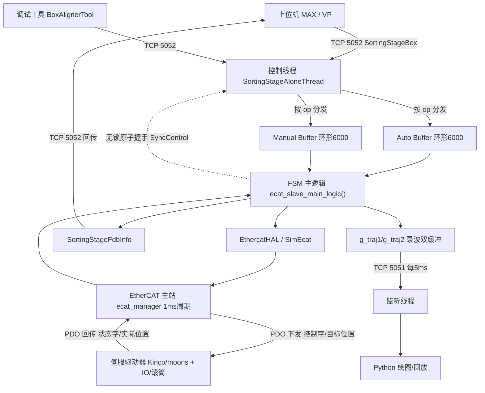

# xyz-box-aligner（理料台 C++ 控制系统）· 面试准备

> 目标岗位：Coding Agent 研发工程师（以通用软件工程师能力为基础）
> 生成时间：2026-09-04
> 说明：本资料由 interview-prep 流程自动生成。**架构与技术讲解基于对"核心链路"的抽样精读**（项目约 1459 个源码文件、C++ 头文件上千个，未逐文件通读），聚焦你简历点名的模块：controller 控制主循环、EtherCAT 主从站、Kinco/moons/MotionLinx 多驱动适配、上位机 socket、缓推逻辑、编译期 log 开关、一键部署。
> ⚠️ 凡标了"⚠️需确认"的地方，是涉及你真实投入/量化数字/未抽样到的细节，**面试前必须自己核对真实代码或经历**，别照背。

---

## 〇、一句话先声明（非常重要，面试第一原则）

这是一个**大型团队项目**。git 作者统计显示：底层 EtherCAT 抽象框架（`ecat_base.h` 等）作者是 Beck Pang，理料台线程/主入口（`sortingstage_thread.cpp`、`sortingstage_main.cpp`）作者是 Xiaohua Zhang，而你（yaojinmeng / 姚金盟）有约 50~60 次提交，**集中在理料台业务功能开发与现场维护**。

所以面试讲这个项目时的黄金分寸：
- **整体架构**：可以讲清楚（证明你读懂了系统），但用"我们这套系统"的口吻，不要说"整个架构是我设计的"。
- **我负责的部分**：缓推缓释参数链路、MotionLinx-Ai 滚筒线 EtherCAT 接入、编译期高频 log 开关、FSM 机构联动细节、config 体系化注释+迁移脚本、Kinco 调参、双禾川 IO 扩位、从站掉 INIT/超速/服务 crash 等现场排查——**这些要能讲到函数、参数、对象字典地址级别的细节**。
- 被追问到你没做的底层实现时，老实说"这块是团队既有框架，我在它之上做功能开发/维护，我理解它的接口和调用方式是……"——**比硬编一个细节被拆穿强一百倍**。

---

## 一、项目概览

- **一句话定位**：理料台（Box Aligner / Sorting Stage）是装卸车机器人工作站里的一个**下位机实时控制系统**。它跑在工控机上，通过 **EtherCAT 总线**驱动"前后左右四块推板电机 + 喂料滚筒 + 理料台内滚筒 + 皮带机 + 远程 IO"，把上游送来的纸箱**推正、对齐、夹紧到指定位置**，供机械臂抓取（装车）或配合卸车吐箱；同时通过 **TCP socket** 与上位机 MAX/VP 及调试工具通信。它作为**独立进程**运行，不依赖 ROS。

- **核心功能**：
  - 自动装车理料（左/右）、卸车吐箱、手动 IO/位置控制、在线改配置——由一个 **FSM 有限状态机**在 ~1ms 实时周期里驱动。
  - EtherCAT 主站管理多类从站：伺服驱动器（Kinco/moons）、数字量 IO 模块（禾川）、滚筒调速模块（MotionLinx-Ai）。
  - 缓推缓释运动控制：推板接近目标时减速，避免硬顶把纸箱挤变形。
  - 高频录波（光电+FSM+推板速度写 `.bin`），供 Python 工具回放分析。

- **最主要的一条执行链路**：
  上位机 MAX 通过 **TCP 5052** 下发一个 `SortingStageBox`（op + 4 个 uint16 参数）→ 监听线程按 op 把它塞进 **auto/manual 两个环形 buffer** → 控制线程每个 EtherCAT 周期从 buffer 取任务、跑 **FSM** 算出各推板目标位置/速度/控制字 → 通过 **EtherCAT PDO** 下发给伺服驱动器 → 读回状态字/实际位置组成 `SortingStageFdbInfo` → 每次 recv 后经 5052 回传给 MAX；另有 **TCP 5051** 高频推送录波数据给绘图工具。

- **我在其中的角色 / 主要工作**：见上文"〇、一句话先声明"及板块④。⚠️需确认：你的真实入职时间、在本项目投入的时长/占比、具体交付了哪些现场（意大利 Dematteis、法国 Blondel、德国 K+N、日本 Logis-Tech 等）——这些数字面试官爱问，按你简历/真实经历回答。

---

## 二、架构与技术栈讲解【板块①】

### 2.1 目录 / 模块结构

项目根目录下真正的 C++ 控制系统在 `controller/`，其余是配套的 Python 工具/测试/仿真：

```
xyz-box-aligner/
├── controller/                     # ★ C++ 实时控制系统主体
│   ├── source/ + include/
│   │   ├── sortingstage_main.cpp   # 进程入口：读 YAML、建双 buffer、起线程
│   │   ├── sortingstage_thread.cpp # TCP 5051/5052 收发线程
│   │   ├── sorting_stage_buffer.h  # ★ 协议结构体 + 枚举 + 环形 buffer + 原子同步
│   │   ├── sortingstage/
│   │   │   ├── sorting_stage.cpp/.h # ★ FSM 主逻辑、光电、滚筒/皮带、缓推
│   │   │   ├── hal_ecat.cpp         # EtherCAT 硬件抽象层(真实)
│   │   │   └── sim_ecat.cpp         # 仿真 EtherCAT(无硬件联调)
│   │   ├── ethercat/               # ★ EtherCAT 从站抽象与各厂商驱动
│   │   │   ├── ecat_base.h         #   从站基类 EthercatBase(虚接口 + CiA402 宏)
│   │   │   ├── ecat_manager.cpp    #   主站/域/从站装配、实时循环
│   │   │   ├── motor/              #   ecat_kinco_driver / ecat_moons_driver / ...
│   │   │   └── external_device/    #   ecat_io / ecat_sorting_line / _new(MotionLinx)
│   │   └── config/                 # SortingStageConfig 结构体 + YAML 读写
│   ├── box_aligner_config.yaml     # 现场配置(电机ID/Home位/速度/光电阈值)
│   ├── docs/sorting_stage_design.md# ★ 团队维护的设计文档(强烈建议通读)
│   └── third_party/                # Eigen/glog/gflags/yaml-cpp/xenomai/ruckig...
├── py_box_aligner/                 # 上位机工具(DearPyGui 调试台/PySide2 运维/录波回放)
├── tools_box_aligner/              # convert_config.py 配置迁移 + 一键部署脚本
├── conanfile.py + CMakeLists.txt   # Conan 依赖 + CMake 构建
├── justfile                        # just v/x/a/b/f/i 命令封装
└── knowledge-base/                 # 你自建的学习/排查笔记库
```

> 说人话记忆法：**一个入口** 起 **三个线程**（听 5051、听 5052+跑控制、主线程清日志）；控制线程里是 **一个 FSM** 循环，FSM 通过 **一层 EtherCAT 抽象**去驱动**各种品牌的电机/IO**。整个系统就这四块。

### 2.2 核心数据流 / 执行链路

三线程模型（来自项目 CLAUDE.md + 真实代码 `sortingstage_main.cpp`）：

1. **监听线程** `SortingStageAloneListenThread`（`sortingstage_thread.cpp`）：端口 **5051**，每 5ms 把 `g_traj1/g_traj2` 双缓冲里的高频录波数据推给绘图工具。
2. **控制线程** `SortingStageAloneThread`：端口 **5052**，收 `SortingStageBox` 命令→按 op 分发进 auto/manual buffer，并在每次 recv 后回传 `SortingStageFdbInfo`。真正的 EtherCAT 1ms 周期在 `hal_ecat` / `ecat_manager` 里跑 `receive → ecat_slave_main_logic → transmit`。
3. **主线程** `main`：初始化 HAL、`std::async` 拉起上面两个线程、循环清理旧日志与录波、处理信号退出。

关键实时性设计（真实代码）：**热路径不加锁**——两个 6000 容量的环形 buffer + 一个 `alignas(64)` 缓存行对齐的原子状态机 `SyncControl` 在 socket 线程和 EtherCAT 线程之间做无锁握手（`WRITING → READ_REQUEST → WRITE_PAUSED → DATA_READY`），避免锁竞争破坏 Xenomai 实时周期。



### 2.3 技术栈

| 技术 | 在本项目里干嘛 | 为什么用它（选型理由） |
|---|---|---|
| **C++17** | 实时控制主体语言；`if constexpr`、`std::array`、`std::atomic`、`std::async`、`std::unique_ptr` 大量使用 | 工业实时控制要求确定性延迟、贴近硬件、零 GC；C++ 能做到无 runtime 停顿 |
| **EtherCAT（IgH/etherlab 主站）** | 工业实时现场总线，主站周期性和伺服/IO 从站交换 PDO | 微秒级同步、菊花链布线、天然适配多轴运动控制；`third_party/etherlab` 说明用的是 IgH EtherLab 主站 |
| **CiA402** | 伺服运动控制标准状态机（控制字 0x6040 / 状态字 0x6041 / 操作模式 0x6060） | 行业标准，Kinco/moons 都遵循，一套状态机逻辑可复用到不同品牌驱动 |
| **Xenomai** | 实时内核框架（`alchemy/task.h`），保证控制线程按 1ms 周期硬实时调度 | 普通 Linux 调度抖动大，工业控制需要硬实时保证 |
| **TCP socket** | 与上位机 MAX（5052 命令+反馈）、绘图工具（5051 高频流）通信 | 简单可靠、跨机器、二进制定长包解析快 |
| **yaml-cpp** | 把 `box_aligner_config.yaml` 解析成 `SortingStageConfig` | 现场参数（电机ID/Home位/速度/光电阈值）要能改而不重编译 |
| **glog / gflags** | 日志（`LOG(INFO/WARNING/ERROR)`）与命令行参数（`--log_path`） | Google 成熟库，日志分级 + 自动轮转 |
| **CMake + Conan** | 构建系统 + C++ 依赖包管理；`just` 封装常用命令 | 大型 C++ 工程跨平台（VIRTUAL/X86/AARCH 三种 MODE）、依赖多，需要包管理器 |
| **Eigen** | 矩阵运算（底盘/机械臂模块用得多，理料台推板运动用得少） | C++ 事实标准线性代数库 |
| **Python（DearPyGui/PySide2）** | 上位机调试台、现场运维 UI、录波回放 | 快速开发 GUI，和 C++ 固件通过 socket 解耦 |

> ⚠️需确认：EtherCAT 主站到底是 IgH EtherLab 还是 SOEM——`controller/third_party/etherlab` 目录和代码里的 `ecrt.h`、`ec_master_t` 强烈指向 **IgH EtherLab**（`ecrt.h` 是 IgH 的头文件）。面试若被问，按 IgH 回答并说"用的是 `ecrt` 系列 API"。

---

## 三、针对本项目的面试题 + 参考答案【板块②】

> 每题标：难度（基础/进阶/深挖）· 考察点。参考答案结合本项目真实代码，能背能复述。

### 3.1 项目整体类

**Q1.（基础 · 表达能力）一分钟介绍一下这个理料台项目。**
参考答案：理料台是装卸车机器人工作站里的下位机实时控制系统，我参与它的 C++ 固件开发和现场维护。它跑在工控机上，通过 EtherCAT 总线控制四块推板电机、滚筒线、皮带机和 IO，把上游送来的纸箱推正对齐夹紧，供机械臂抓取或配合卸车。软件上是一个独立进程，起三个线程：两个 socket 线程和上位机通信，一个 EtherCAT 实时控制线程按 1ms 周期跑一个有限状态机，驱动伺服。它支持 Kinco、moons、MotionLinx 三种驱动器，用 CMake+Conan 构建，能编到仿真、x86 工控机、ARM 三种目标。我主要做功能开发（缓推缓释、MotionLinx 滚筒调速接入、编译期日志系统）和现场缺陷排查（从站掉线、伺服超速、服务崩溃）。

**Q2.（基础 · 系统边界）理料台在整个装卸车系统里是什么位置？为什么单独做一个进程？**
参考答案：它是"下位机"，上面有个"上位机"MAX/VP 做视觉、规划、调度。MAX 通过 TCP 5052 给理料台下发任务（往哪推、推几个、多宽），理料台负责把这些高层意图翻译成对伺服的实时控制，并把状态回传。单独做进程是因为它有硬实时要求（1ms 周期不能被别的任务打断），跑在专门的工控机 + Xenomai 实时内核上，和上位机物理隔离、通过 socket 解耦，任何一边挂了另一边不受牵连。

**Q3.（进阶 · 抓重点）这个项目你觉得最核心/最难的一块是什么？**
参考答案：我会讲"实时性和多品牌硬件适配的平衡"。实时性上，控制线程不能加锁——热路径用两个环形 buffer + 一个缓存行对齐的原子状态机在 socket 线程和 EtherCAT 线程之间做无锁握手。硬件适配上，EtherCAT 从站被抽象成一个基类 `EthercatBase`，每个品牌（Kinco/moons/MotionLinx）继承实现自己的 PDO 布局和 CiA402 状态机，业务层不用关心底层是哪家的驱动。我自己做的最有代表性的是 MotionLinx 滚筒调速接入——用一个编译期兼容开关让新硬件不破坏老设备。

### 3.2 技术选型类

**Q4.（进阶 · 总线选型）为什么用 EtherCAT，而不是 CAN 总线或普通 Modbus？**
参考答案：理料台要同步控制四个推板伺服 + IO + 滚筒，对**周期性和同步性**要求高。EtherCAT 的特点是"飞速处理"——一帧报文流经所有从站，每个从站在数据流过时就地读写自己那段，主站 1ms 一个周期能同步刷新几十个轴，抖动在微秒级。CAN 带宽低（1Mbps）、多轴同步差；Modbus 是请求-应答、实时性更弱，我们只在个别非实时外设上用。所以运动控制主干选 EtherCAT。追问"CoE 是什么"就答：CANopen over EtherCAT，即在 EtherCAT 上跑 CiA402 那套对象字典（0x6040 控制字等）。

**Q5.（进阶 · 构建选型）为什么用 CMake + Conan？大型 C++ 工程管理依赖的痛点是什么？**
参考答案：C++ 没有官方包管理器，大项目依赖 Eigen、glog、yaml-cpp、osqp、ruckig 等一堆第三方库，手动编译版本地狱。Conan 是 C++ 的包管理器，负责把这些依赖按平台/编译器版本拉下来、编好、给 CMake 用；CMake 负责实际编译。我们还封装了 `just`：`just v` 配置仿真模式、`just x` 配置 x86、`just b` 编译，把 `cmake -DMODE=X86 -DCMAKE_BUILD_TYPE=Release` 这种长命令收敛成一条，降低现场同事的上手成本。⚠️需确认：Conan 版本是 1.x（`conanfile.py` 里 `from conans import ConanFile` 是 Conan 1.x 写法）。

**Q6.（进阶 · 抽象设计）你们支持 Kinco、moons、MotionLinx 三种驱动，代码上怎么组织的？为什么这么设计？**
参考答案：核心是"面向接口而非实现"。`EthercatBase` 定义了一套虚函数——`ecat_slave_domain_init`（注册从站到总线）、`init_domain_registers`（登记 PDO 在共享内存的偏移）、`ecat_slave_receive/transmit`（每周期读写过程数据）、`GetControlWord`（跑 CiA402 状态机）。每个品牌的驱动（`ecat_kinco_driver`、`ecat_moons_driver`）继承它，实现自己的 PDO 结构体布局和参数。业务层（FSM）只调统一接口，不管底层是哪家。这样加一个新品牌（比如我做的 MotionLinx）只需新增一个子类实现，不动业务逻辑，还能用编译/配置开关控制启用——**开闭原则**的实战。

### 3.3 实现细节类

**Q7.（深挖 · 你的主线功能）讲讲缓推缓释是怎么实现的？为什么要缓推？**
参考答案：纸箱是软的，推板如果全速怼到目标位置，会把箱子挤变形，导致回传的箱宽测量不准，也可能压坏货物。所以推板接近目标时要**减速**（缓推），到位保持时用小电流夹（缓释/保持力）。我做的是把这一套运动参数的**读取全链路打通**：`BoxReleaseDistance`（缓推触发距离，还剩多远开始减速）、`BoxReleaseDeceleration`（缓推减速度）、`MaxVelocity`（速度上限）、`PusherClampDistance/FittingCoef`（过量夹紧偏移和编码器换算系数）。这些参数从 YAML → `SortingStageConfig` → FSM 使用，我梳理并接通了整条链路，还把 `BoxReleaseDistance` 从"接口可在线改"收敛成"只读 config"，做配置权限收敛，防止现场误改。FSM 里对应还有一个 `FSM_SWITCH_TO_HOLD_FORCE` 状态，夹到位后切小电流。⚠️需确认：具体缓推减速的算法是线性降速还是 S 曲线，看 `sorting_stage.cpp` 缓推段真实代码再补。

**Q8.（深挖 · 你的亮点）编译期高频日志开关是什么？为什么用 `if constexpr` 而不是运行时 if？**
参考答案：理料台要高频录波（光电、FSM 状态、推板速度，1ms 一个点，缓冲约 60 万点），字段多但现场往往只关心其中几个。我设计了一排 `constexpr bool ENABLE_G1...ENABLE_PUSHER_*` 编译期开关，配合 `if constexpr` 使用。关键在于 **`if constexpr` 是编译期分支**：开关为 false 的字段，那段采集代码在编译期就被**整段剔除**，不进内存、不占磁盘、零运行开销；改回 true 重新 `just b` 就恢复，非破坏式。而且我用编译期求和 `LOG_FIELD_COUNT = ENABLE_G1 + ENABLE_G2 + ...` 让存储数组 `std::array<uint16_t, LOG_FIELD_COUNT>` 随开关自动伸缩，关掉的字段连数组槽都不占。再配一个 `BuildLogHeader()` 把"这次采了哪些字段、什么类型、什么顺序"写进 `.bin` 文件头，Python 读脚本据此动态解析，不用写死列。追问"和普通 if 区别"就答：普通运行时 if 那个字段变量和判断始终存在、每周期都要判一次，在 1ms 热路径上白白耗时耗内存；`if constexpr` 直接让编译器把死分支删掉。

**Q9.（进阶 · 协议）上位机和固件的通信协议长什么样？怎么保证二进制兼容？**
参考答案：命令包是定长结构体 `SortingStageBox`：一个 `uint16_t op`（操作码，如 AUTOLOADING_LEFT/UNLOADING/CONFIG_SET）+ 一个 `std::array<uint16_t,4> value`（4 个通配参数，含义随 op 变，比如装车时 value[0]=箱宽、value[3]=批次 bit-field）。反馈包 `SortingStageFdbInfo` 包含状态位、故障码、四个推板实际位置、左右推板间距、已理箱数、16 路 DI/DO 快照、两个 buffer 的运行状态。二进制兼容的关键陷阱是：**改这两个结构体的字段会破坏 5052 客户端的定长解析**，所以新增字段要谨慎、C++ 和 Python 端枚举要手动同步（项目里没做自动生成，历史上出过编号漂移的坑）。

**Q10.（深挖 · MotionLinx 接入）MotionLinx-Ai 滚筒线你是怎么接进 EtherCAT 的？增量兼容开关怎么设计的？**
参考答案：背景是理料台内滚筒原来用禾川/速达 IO 直接输出 DO 开关量，只能开/关，新需求要**调速**，纯 DO 做不到，得换成走 EtherCAT 的 MotionLinx-Ai 模块（2 个模块驱 4 组滚筒 MDR）。我参照现有 Kinco 伺服的写法，用厂商自定义对象字典 + PDO/SDO 实现了新的从站类（`ecat_sorting_line_new.cpp`）。为了不影响已经在现场跑的老设备，我设计了增量兼容开关 `EnableMotionLinxRoller`（config 里，缺省 false，回退旧 DO 逻辑），配套 `PushMotorType`、`MotionLinxRatedSpeed`、`ReverseSpitBoxDelay` 等成员，只有开关为 true 时才在 Kinco 总线末尾追加注册这 2 个从站。我还主动对接了供应商，起草技术采购邮件索要 ESI 文件（EtherCAT Slave Information，从站描述 .xml）。这体现的是"给运行中的系统加新硬件时，用开关做灰度、绝不破坏存量"的工程意识。

### 3.4 难点 / 踩坑类

**Q11.（深挖 · 你的硬核 debug）你排查过一个"从站偶发掉 INIT"的问题，讲讲过程。**
参考答案：现象是 3 号 EtherCAT 从站运行中偶发从 OP 态直接掉到 INIT，驱动器面板无报警码，主站复位时报 "No response" + 总线报文超时。我的排查思路是**先软件后硬件、分层排除**：先确认不是运动类故障（面板没报警码、不是过流过载），再结合"OP→INIT 是通信层被打断而非运动层报错"这个特征，判断是**驱动器主控/通信芯片瞬时复位**，而不是电机报故障。据此我起草了给供应商的技术咨询：控制电源几十到几百毫秒瞬断是否会导致通信芯片复位而面板不记录、Fault History 能否记录这类事件、能否通过 EtherCAT CoE 对象实时读取控制/母线电压来抓现行。价值在于：把一个"偶发、无报警、难复现"的现场问题，用系统性排除法定位到通信芯片层，并推动跨团队/供应商协作。⚠️需确认：最终根因是否确认、供应商怎么回复的，按你真实经历讲。

**Q12.（深挖 · 伺服超速 bug）你修过一个 0xFF38 伺服超速报错，根因是什么？**
参考答案：这是真实代码里能看到的（`sorting_stage.cpp` 里有"[超速门槛解耦试验]"注释）。moons 驱动器的 0xFF38 是超速报警。原来的缓推实现里，为了让推板减速，同时压低了两个对象：`Target_velocity`（0x60FF，目标速度）和 `Max_profile_velocity`（0x607F，最大轮廓速度）。问题是 **0x607F 同时也是驱动器的"超速门槛"**——运动过程中把门槛压低，而电机实际速度还没降下来，实际速度就瞬间超过了被压低的门槛，触发 0xFF38。解决办法是**解耦**：缓推时只降 `Target_velocity`（0x60FF）让它减速，**不再压** `Max_profile_velocity`（0x607F 超速门槛），避免"自己把门槛降到脚下再踩线"。这题很能体现你对 CiA402 对象字典语义的理解——同一个对象在不同厂商可能身兼两职。⚠️需确认：这是你独立定位的还是团队一起，按实情说；"解耦试验"说明当时还在验证，讲的时候可以说"我们通过解耦这两个对象来规避"。

**Q13.（进阶 · 服务崩溃）服务反复 crash & restart 失败，你怎么定位的？**
参考答案：`DRNile.service`（systemd 服务）反复崩溃重启还起不来。我的定位手段是 `journalctl` 跟踪服务日志 + 看固件自己的日志文件（`box_aligner_node.*.log`）。systemd 服务排查的标准套路：`systemctl status` 看退出码、`journalctl -u 服务名 -f` 跟实时日志、看是不是依赖没起来/端口被占/配置文件路径不对/崩溃在初始化阶段。⚠️需确认：这个 crash 的真实根因（是配置、是段错误、还是资源），按你当时定位到的讲，别编。

**Q14.（进阶 · IO 位溢出）双禾川 IO 扩位那个 bug 是什么？**
参考答案：一个禾川远程 IO 模块 = 一个从站 = 16 位数字量输出。现场信号数量涨到需要 32 位，原来只挂一个模块，bit 16~31 没地方放就溢出/丢了。我加了**第二个禾川 IO 模块**承载 bit 16~31，在 `box_aligner_adapter` 里暴露 `digital_input_ext / digital_output_ext` 两个扩展字段（你能在 `SortingStageFdbInfo` 里看到这两个成员），log 也支持同时显示两段 DI/DO。本质是"硬件位宽不够就横向扩一个从站，软件同步暴露扩展通道"。

### 3.5 延伸拷打类（往底层钻，接八股）

**Q15.（深挖 · C++）你说热路径不加锁，那 socket 线程和 EtherCAT 线程之间怎么安全传数据？**
参考答案：用无锁的原子状态机做握手。代码里是一个 `alignas(64)` 缓存行对齐的 `SyncControl`，里面两个原子变量：`std::atomic<SyncState> state` 和 `std::atomic<bool> data_updated`。socket 线程要读反馈时，走一个四步状态流转：先把 state 置 `READ_REQUEST`，然后自旋等 EtherCAT 线程把它切到 `WRITE_PAUSED`（用 `compare_exchange_weak` + `PAUSE()` 自旋指令降功耗），确认写线程暂停后置 `DATA_READY` 安全读，读完置回 `WRITING` 恢复写线程。这样避免了互斥锁——因为锁会让 EtherCAT 实时线程被 socket 线程阻塞、破坏 1ms 周期。追问"为什么 alignas(64)"就答：避免伪共享（false sharing），让这个原子变量独占一条缓存行，别的变量改动不会让它的缓存行失效。追问内存序就答：用了 `memory_order_acquire/release` 做成对的获取-释放语义，保证跨线程可见性和顺序，比默认的 `seq_cst` 开销小。

**Q16.（深挖 · C++）项目里 RAII 和智能指针用在哪？为什么实时系统更要注意内存？**
参考答案：`sortingstage_main.cpp` 里 EthercatHAL 和两个 buffer 都用 `std::unique_ptr` + `std::make_unique` 管理，独占所有权、离开作用域自动释放，不会泄漏也不会 double free。RAII 的核心是"资源获取即初始化，析构自动回收"——socket、文件、锁都该这么管。实时系统尤其要注意：**热路径上绝不能 new/delete**，因为动态内存分配耗时不确定（可能触发系统调用、堆锁），会破坏实时性。所以录波缓冲用的是**预分配的定长 `std::array`**（编译期定大小），不是运行时动态增长的 vector。这就是为什么编译期日志开关要让 `std::array` 大小在编译期确定。

**Q17.（进阶 · 网络）5051 和 5052 两个端口为什么分开？TCP 粘包怎么处理？**
参考答案：分开是因为两条流性质不同：5052 是**命令-反馈**，低频、请求驱动、要可靠；5051 是**高频录波流**（每帧几千字节、连续推），是单向广播式的。混在一个端口会互相干扰（高频流把命令淹了）。TCP 粘包：TCP 是字节流没有消息边界，我们的协议全是**定长二进制结构体**，收发两端用 `sizeof(结构体)` 精确收满一个包（代码里 `RecvAll`/`SendAll` 循环收发直到收满指定字节数），所以不存在粘包歧义——这也是为什么不能随便改结构体大小。

**Q18.（深挖 · CiA402）解释一下伺服从上电到能动，状态机怎么走？控制字/状态字是什么？**
参考答案：CiA402 定义了一套标准状态机。驱动器通过对象 0x6041 上报 16 位**状态字**（每个 bit 是一个含义：bit0 ready to switch on、bit1 switched on、bit2 operation enabled、bit3 fault、bit10 target reached…），主站通过 0x6040 下发 16 位**控制字**去命令它切状态。流程大致是：Switch On Disabled → Ready to Switch On → Switched On → Operation Enabled（真正能动）。代码里 `GetControlWord(enable_flag, status_word, control_word_ptr)` 就是读状态字、算出下一步该发的控制字，一步步把驱动器推到"运行使能"。故障时发复位控制字（0x86 之类）清故障。操作模式用 0x6060 设：1=轮廓位置模式 PP（给目标位置，理料台推板主要用这个）、3=速度模式、6=回零、8=CSP 周期同步位置。

### 3.6 改进 / 反思类

**Q19.（进阶 · 反思）这个环形 buffer 代码里有个 TODO 说"写满后重 0，待优化"，你会怎么改？**
参考答案：现在的 `SetSortingStageBox` 用 `current_write_index = (write+1) % size`，配一个 `box_state[]` 标志位判断槽是否可写，写满（对应槽还没被读走）时直接返回 false 丢弃。改进方向：一是明确**满/空判定**——经典环形缓冲用"留一个空槽"或单独维护 count 来区分满和空，避免读写指针相等时的歧义；二是丢弃策略要明确（丢最老还是拒绝最新），命令类不能随便丢；三是 6000 的容量是否合理、要不要背压通知上位机。⚠️需确认：真实场景下 buffer 会不会真的写满（命令频率没那么高的话其实是过设计）。

**Q20.（进阶 · 测试）设计文档说 utest 里没有理料台专用单元测试，你怎么看？会怎么补？**
参考答案：实时控制代码大量依赖硬件，确实难做传统单测，项目主要靠仿真模式（`EnableSimulationMode` 走 SimEcat）+ Python 工具做集成验证。但有一批**纯逻辑函数**是可以也应该单测的：批次模式的 bit-field 编解码（`NormalizeBitField`/`ParseBatchesFromBitField`）、光电去抖滤波、缓推距离/编码器换算这些纯计算。我会用 gtest 给这些函数补单测，把硬件相关的部分用仿真兜。这样能在改动时快速回归纯逻辑，不用每次都上真机。

**Q21.（深挖 · 成长）如果重做，你觉得这个系统哪里可以更好？**
参考答案：三点。一是 **C++/Python 枚举手动同步**是个持续的坑（协议 op、API 表编号两边靠人维护，历史上漂移过），可以用一份 IDL 或代码生成器自动生成两端枚举。二是**协议用裸定长结构体**，改字段就破坏兼容，可以引入版本号字段或用带 schema 的序列化（但要权衡实时开销）。三是**配置项爆炸**——现场参数几十上百个靠 YAML 平铺，容易改错，可以做分组校验和权限分级（我已经在做 config 注释体系化和权限收敛这个方向）。反思的落点是：这些都是"大型长期演进项目"的典型技术债，我在维护中已经在往收敛的方向做。

---

## 四、通用知识点深挖【板块③】

> 只覆盖本项目真实用到的技术。每点：是什么 → 为什么 → 常见陷阱 → 会怎么被追问到底。

### 4.1 C++ RAII 与智能指针
- **是什么**：RAII = Resource Acquisition Is Initialization，把资源（内存/文件/锁/socket）的生命周期绑到一个栈对象上，构造时获取、析构时自动释放。`std::unique_ptr`（独占所有权）、`std::shared_ptr`（引用计数共享）、`std::weak_ptr`（打破循环引用）是标准库对 RAII 的封装。
- **为什么**：手动 new/delete 容易漏（泄漏）或重复删（崩溃），异常路径上更难保证释放。RAII 让释放"自动且异常安全"。本项目 `std::make_unique<EthercatHAL>()` 就是典型。
- **常见陷阱**：`unique_ptr` 不能拷贝只能 `std::move`；`shared_ptr` 循环引用导致永不释放（用 weak_ptr 破环）；`shared_ptr` 的引用计数是原子操作、有开销，热路径慎用；别用裸指针再包一层导致 double delete。
- **会怎么追问**：unique 和 shared 区别 → shared 计数线程安全吗（计数原子安全，但指向的对象不安全）→ 循环引用怎么办 → make_unique 比 new 好在哪（异常安全 + 不写两遍类型）。

### 4.2 C++ 多线程与内存序、无锁编程
- **是什么**：`std::thread`/`std::async` 起线程，`std::mutex` 加锁，`std::atomic` 做无锁原子操作。内存序（memory order）规定原子操作前后的读写能不能被 CPU/编译器重排。
- **为什么**：本项目实时线程不能被锁阻塞，所以用原子变量 + acquire/release 内存序做无锁握手（见 Q15）。`release` 保证之前的写对拿到该值的 `acquire` 线程可见，是最常用的成对语义，比 `seq_cst`（全局顺序、最强也最慢）开销小。
- **常见陷阱**：无锁不等于简单，ABA 问题、内存序用错导致偶发 bug 极难查；伪共享（多个线程改同一缓存行的不同变量导致缓存来回失效）——本项目用 `alignas(64)` 规避；自旋等待要配 `_mm_pause()`/`yield` 降低功耗和总线压力。
- **会怎么追问**：什么是伪共享 → memory_order 几种区别 → 自旋锁 vs 互斥锁怎么选（临界区极短且不能睡眠用自旋）→ volatile 能不能做线程同步（不能，volatile 不保证原子性和内存序，项目里 `volatile bool thread_finished` 只是防编译器优化掉、不是同步原语）。

### 4.3 C++ 虚函数、多态、`if constexpr`
- **是什么**：虚函数 + 继承实现运行时多态（基类指针调子类实现，靠虚表 vtable 分派）。`if constexpr`（C++17）是**编译期**分支，条件为假的分支根本不编译。
- **为什么**：本项目 `EthercatBase` 用虚函数让业务层统一驱动各品牌驱动器（运行时多态）；编译期日志开关用 `if constexpr` 把关掉的字段整段删除（编译期，零运行开销）。两者一个运行时、一个编译期，别混。
- **常见陷阱**：虚函数有 vtable 间接跳转开销、热路径高频调用要评估；构造/析构函数里调虚函数不会多态；忘写 `virtual ~Base()` 导致基类指针删子类对象泄漏（本项目 `virtual ~EthercatBase()` 就是为这个）；`if constexpr` 的条件必须是编译期常量（constexpr）。
- **会怎么追问**：虚函数怎么实现的（vtable）→ 虚析构为什么必要 → 模板和虚函数怎么选（编译期确定用模板/CRTP 省开销，运行时才确定用虚函数）→ if constexpr 和普通 if 生成的汇编差别。

### 4.4 EtherCAT 现场总线
- **是什么**：工业实时以太网总线。主站发一帧报文流经菊花链上所有从站，从站"on the fly"读写属于自己的那段数据，一圈回来主站就完成了所有从站的一次数据交换。PDO（过程数据对象）是实时周期高速交换的数据，SDO（服务数据对象）是非实时的参数配置读写。
- **为什么**：多轴同步、微秒级抖动、布线简单（一根网线串下去），是运动控制主流总线。
- **常见陷阱**：从站状态机 INIT→PREOP→SAFEOP→OP，掉到非 OP 就不工作（本项目排查过偶发掉 INIT）；分布式时钟 DC 做全网时间同步，相位偏移配不好会抖；PDO 映射（哪个对象放报文哪个偏移）配错就读到错数据；实时周期（1ms）内主逻辑不能超时，否则丢周期。
- **会怎么追问**：PDO 和 SDO 区别 → 从站状态机几个态 → DC 分布式时钟干嘛 → CoE 是什么（CANopen over EtherCAT，在 EtherCAT 上跑 CiA402 对象字典）→ 掉线了怎么诊断。

### 4.5 CiA402 伺服运动控制
- **是什么**：CANopen 的运动控制子协议，定义伺服的标准对象字典和状态机：控制字 0x6040、状态字 0x6041、操作模式 0x6060、目标位置 0x607A、目标速度 0x60FF、最大轮廓速度 0x607F、轮廓加减速 0x6083/0x6084 等。
- **为什么**：不同厂商驱动器都遵循，一套控制逻辑可跨品牌复用（本项目 Kinco/moons 共用一套 CiA402 状态机代码）。
- **常见陷阱**：同一个对象在不同厂商可能语义微妙不同（本项目 0x607F 在 moons 上既是最大速度又是超速门槛，导致 0xFF38，见 Q12）；PP（轮廓位置）模式和 CSP（周期同步位置）模式适用场景不同；回零（Homing 模式）流程各家有别；故障码（Error code 0x603F 等）厂商私有，要查手册建对照表。
- **会怎么追问**：控制字状态字各 bit → 从上电到使能状态机怎么走 → PP 和 CSP 区别 → 回零怎么做 → 某个故障码什么意思。

### 4.6 socket / TCP 编程
- **是什么**：TCP 是可靠、面向连接、字节流的传输层协议。本项目用它做上位机通信（5052 命令、5051 高频流）。
- **为什么**：可靠有序、跨机器、成熟；对定长二进制协议解析简单快。
- **常见陷阱**：**粘包/拆包**——TCP 是字节流无消息边界，要靠定长或分隔符或长度前缀切包（本项目用定长结构体 + 收满 sizeof）；`SIGPIPE`——对端关闭还写会收到 SIGPIPE 崩掉，本项目 `signal(SIGPIPE, SIG_IGN)` 忽略它；短读短写——一次 recv/send 不保证收发完整，要循环（RecvAll/SendAll）；大小端/结构体对齐影响跨平台二进制兼容。
- **会怎么追问**：粘包怎么解决 → TCP 三次握手四次挥手 → TCP 和 UDP 区别、实时数据为什么这里还用 TCP 不用 UDP（局域网可靠、量不大、要有序）→ 阻塞和非阻塞 IO。

### 4.7 CMake + Conan 构建
- **是什么**：CMake 是跨平台构建系统生成器（写 CMakeLists.txt，生成 Makefile/Ninja）；Conan 是 C++ 包管理器（管依赖的下载、编译、版本）。
- **为什么**：大型 C++ 工程依赖多、要跨平台（本项目 VIRTUAL/X86/AARCH 三 MODE），手动管依赖不现实。
- **常见陷阱**：Conan 1.x 和 2.x 语法不兼容（本项目是 1.x，`from conans import`）；不同编译器版本/ABI 的包不能混用（`-s compiler.version=9`）；`compile_commands.json` 给 clangd 用做代码跳转（本项目根目录软链到 build 下）；构建类型 Debug/Release 差异大。
- **会怎么追问**：CMake 里 target/link 怎么写 → Conan 怎么管理传递依赖 → 交叉编译到 ARM 怎么配 → 为什么要 compile_commands.json。

---

## 五、亮点与话术包装【板块④】

### 5.1 一句话项目介绍（电梯稿）

"我在 XYZ Robotics 参与理料台 C++ 实时控制系统的固件开发和海外现场维护。这是装卸车机器人工作站的下位机，跑在 Xenomai 实时内核 + 工控机上，通过 EtherCAT 总线按 1ms 周期控制推板伺服、滚筒、皮带和 IO 把纸箱推正对齐，通过 TCP 和上位机通信。我在这个大型 C++ 工程（CMake+Conan、上千个源文件、多人协作）里负责功能开发和现场排障：做过缓推缓释运动参数链路、MotionLinx 滚筒调速的 EtherCAT 接入、编译期高频日志系统，也定位修复过从站偶发掉线、伺服超速、服务崩溃等现场问题。这段经历让我熟悉了大型 C++ 控制系统的架构、实时控制原理和现场交付的完整闭环。"

### 5.2 项目亮点（STAR 话术）

**亮点1：MotionLinx-Ai 滚筒调速的 EtherCAT 接入（增量兼容设计）**
- S（情境）：理料台内滚筒原来用 IO 直接输出 DO 开关量，只能开/关；新需求要能调速，纯 DO 做不到，得换成走 EtherCAT 的 MotionLinx-Ai 模块。但现场已有大量老设备在跑，不能因为加新功能把它们搞挂。
- T（任务）：在不破坏存量老设备的前提下，把 2 个 MotionLinx 模块（4 组滚筒）接进现有 EtherCAT 主站。
- A（行动）：参照现有 Kinco 伺服的从站写法，用厂商自定义对象字典 + PDO/SDO 实现了新从站类 `ecat_sorting_line_new`；设计增量兼容开关 `EnableMotionLinxRoller`（缺省 false 回退旧 DO），配 `PushMotorType`/`MotionLinxRatedSpeed` 等成员，只有开关为真才在总线末尾追加注册这 2 个从站；主动对接供应商起草采购邮件索要 ESI 从站描述文件。
- R（结果）：新硬件以"灰度开关"方式接入，老设备零影响。⚠️需确认：上线到了哪些现场、实际调速效果/节拍收益的量化数字，按你真实情况补。

**亮点2：编译期高频日志开关系统（零运行开销的可裁剪录波）**
- S（情境）：理料台要 1ms 高频录波光电/FSM/推板速度做现场问题分析，字段多、缓冲约 60 万点，但不同现场只关心其中几个字段，全采既占内存又拖 1ms 热路径。
- T（任务）：让录波字段"想采哪个采哪个"，且关掉的字段**零运行开销、零内存占用**。
- A（行动）：用一排 `constexpr bool ENABLE_*` 开关 + `if constexpr` 编译期分支，关掉的字段采集代码在编译期整段剔除；用编译期求和 `LOG_FIELD_COUNT` 让存储 `std::array` 大小随开关自动伸缩；配 `BuildLogHeader()` 把字段清单写进 `.bin` 文件头，Python 读脚本据此动态解析，不写死列。
- R（结果）：改一排 true/false 重编即生效，非破坏式；关掉的字段不进内存/磁盘/文件头，不占实时预算。体现对 C++17 编译期计算和实时系统零开销抽象的理解。

**亮点3：伺服超速 0xFF38 的根因定位与解耦修复**
- S（情境）：缓推过程中 moons 驱动器偶发 0xFF38 超速报警，推板停下、任务中断。
- T（任务）：定位为什么"缓推减速反而触发超速"这个反直觉现象。
- A（行动）：结合 CiA402 对象字典分析，发现原实现缓推时同时压低了 `Target_velocity`(0x60FF) 和 `Max_profile_velocity`(0x607F)，而 0x607F 在 moons 上**同时是超速门槛**——运动中把门槛压到实际速度之下就触发报警。修复方案是解耦：缓推只降 0x60FF 目标速度，不再压 0x607F 门槛。
- R（结果）：从根上规避了缓推触发超速。⚠️需确认：代码注释写的是"[超速门槛解耦试验]"，说明当时在验证阶段，讲的时候如实说"我们通过解耦这两个对象来规避"，别夸成已彻底闭环。

**亮点4：从站偶发掉 INIT 的系统性排查（跨供应商推动）**
- S（情境）：3 号 EtherCAT 从站运行中偶发 OP→INIT 掉线，面板无报警码，主站复位报 No response + 报文超时，难复现。
- T（任务）：定位这个偶发、无报警、跨软硬件的问题根因。
- A（行动）：用"先软件后硬件、分层排除"的方法，先排除运动类故障（无报警码、非过流过载），据"OP→INIT 是通信层被打断"的特征判断为驱动器通信芯片瞬时复位；起草给供应商的 CoE 技术咨询（控制电源瞬断是否致通信芯片复位、Fault History 能否记录、能否用 EtherCAT CoE 对象实时读母线电压抓现行）。
- R（结果）：把偶发难题定位到通信芯片层并推动供应商协作。⚠️需确认：最终结论按你真实经历讲。

**亮点5（可选）：config 体系化与配置迁移工具**
- S/T：理料台现场参数几十上百个平铺在 YAML 里，容易改错，且有旧格式配置要批量迁移。
- A：体系化重写 config 注释（按"硬件基础/推板电机-接线与 Home"分区），成为团队复用模板；写 `convert_config.py` 把旧格式批量转成新 YAML；把关键参数从"接口可改"收敛为"config 只读"做权限收敛。
- R：降低现场改配置出错率，注释模板被同事反复复用。⚠️需确认："被 XZ Li、Felix 复用"这类是否要点名，按场合。

### 5.3 难点应对话术

| 面试官可能的质疑 | 应对话术 |
|---|---|
| "这不就是在别人搭好的框架上填代码吗？" | 坦诚：底层 EtherCAT 抽象和线程框架确实是团队既有的，我在其上做功能开发和维护。但"在大型存量系统上安全地加功能/修 bug"本身是核心工程能力——比如 MotionLinx 接入要保证不破坏老设备、0xFF38 要理解 CiA402 对象字典语义、掉 INIT 要跨软硬件分层排查，这些都不是"填代码"。 |
| "你一个测试工程师，怎么讲控制系统开发？" | 我岗位是测试，但实际深度参与了理料台固件的功能开发和现场排障（git 上有我几十次提交）。测试背景反而让我更关注边界、异常流、可观测性——比如编译期日志系统就是为了让问题在现场可复现可分析。 |
| "1459 个文件你都懂？" | 不敢说都懂。这是大型团队项目，我熟的是理料台这条线：FSM、EtherCAT 从站适配、缓推、日志、config、socket 协议。底盘/机械臂那些模块我知道大致结构但没深入，面试我只讲我真做过、能讲透的部分。 |
| "缓推缓释不就是减速吗，有什么技术含量？" | 减速是表象，难点在参数链路和硬件耦合：一串运动参数从 YAML 到 FSM 的读取链路要打通、要做配置权限收敛防误改；更关键的是减速方式和驱动器超速门槛耦合，压错对象就触发 0xFF38——这正是我修的 bug。 |
| "你对 EtherCAT 的理解有多深？" | 应用层足够：PDO/SDO 区别、从站状态机、CiA402 控制字状态字、CoE 对象字典、掉线诊断我都实操过。协议栈内部（比如主站怎么组帧、DC 时钟硬件同步细节）我了解原理但没改过底层，这块诚实说是我的边界。 |

### 5.4 面试前自测清单

- [ ] 能 1 分钟讲清项目是什么、我做了什么（区分"我的"和"团队的"）
- [ ] 能画出三线程 + 双 buffer + FSM + EtherCAT 的数据流图
- [ ] 能解释缓推缓释、MotionLinx 接入、编译期日志三个亮点到代码细节
- [ ] 能讲清 0xFF38 超速 bug 的 CiA402 根因（0x607F 既是最大速度又是超速门槛）
- [ ] 能答 EtherCAT 的 PDO/SDO、从站状态机、CoE
- [ ] 能答 CiA402 控制字/状态字/操作模式、从上电到使能的状态流转
- [ ] 能答 C++ 无锁握手（原子 + acquire/release + alignas 防伪共享）
- [ ] 能答 TCP 粘包、SIGPIPE、定长协议二进制兼容
- [ ] 能答 CMake+Conan 为什么用、三种 MODE
- [ ] ⚠️所有标"需确认"的点都已核对真实代码/经历
- [ ] 准备好"这块是团队既有框架"的诚实边界话术，不硬编细节

---

## 附：待你确认 / 补充的点

> 这些是自动生成时拿不准、或需结合你真实经历/代码补全的地方，面试前务必处理：

- ⚠️ **你的真实参与度与投入时长**：本项目是多人团队项目（底层框架作者 Beck Pang、线程/入口作者 Xiaohua Zhang，你有约 50~60 次提交集中在业务功能）。面试严格区分"我做的"（缓推链路、MotionLinx、编译期日志、FSM 机构联动、config 工具、现场排障）和"团队既有的"（EtherCAT 抽象框架、三线程架构、socket 框架、CiA402 基础实现）。
- ⚠️ **量化数字**：交付了哪些海外现场、投入多少天、缓推/MotionLinx 带来的节拍或稳定性收益——报告里没有可靠数字，按你简历/真实经历填，别编。
- ⚠️ **0xFF38 超速修复**：代码注释是"[超速门槛解耦试验]"（验证阶段），确认是否已彻底闭环、是你独立还是团队一起。
- ⚠️ **从站掉 INIT / 服务 crash / IO 扩位**的最终根因和结论，按你当时真实定位到的讲。
- ⚠️ **EtherCAT 主站实现**：代码强指向 IgH EtherLab（`ecrt.h`/`ec_master_t`），但请你确认一下（也可能封装过），别被追问 SOEM 时答错。
- ⚠️ **缓推减速的具体算法**（线性 vs S 曲线）、**FSM 各状态迁移条件的细节**——这些在 `sorting_stage.cpp`（5000+ 行，本次未逐行精读），被深挖时看真实代码再答。
- ⚠️ **Conan 版本**：`conanfile.py` 是 Conan 1.x 写法，确认现场用的版本。
- ⚠️ 本报告架构基于对核心链路的抽样精读（sorting_stage_buffer.h、ecat_base.h、sortingstage_thread.cpp、sortingstage_main.cpp、设计文档、各驱动头文件、编译期开关等），**未逐文件通读 1459 个文件**；底盘/机械臂/OTG 等模块仅知大致结构，面试别往那些方向硬扯。
